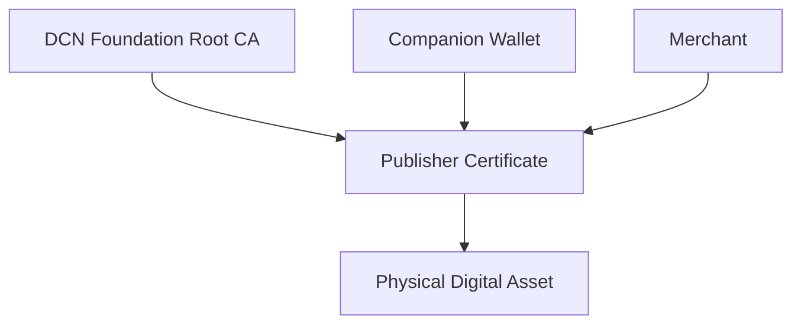
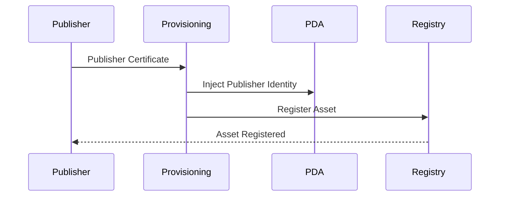
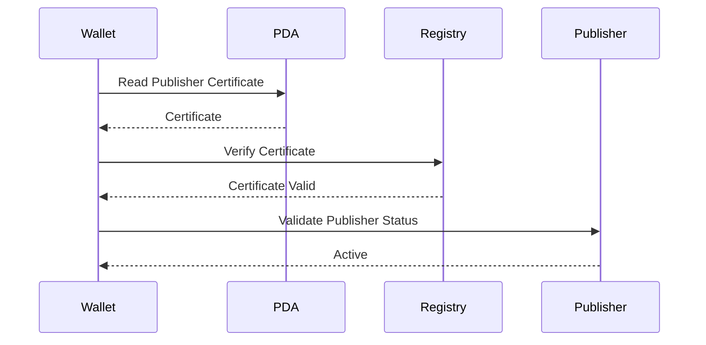
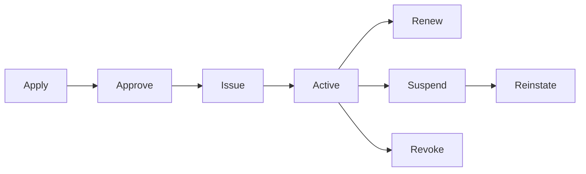

# Publisher Certificates

> _Publisher Certificates establish trust in the organizations that issue Physical Digital Assets. They allow wallets, merchants, verification services, and users to verify that an asset originated from an authorized Publisher and complies with the DCN Standard._

***

## Introduction

One of the defining principles of the DCN Standard is that **any qualified organization can become a Publisher**.

A Publisher may be:

* A stablecoin issuer
* A commercial bank
* A central bank issuing CBDCs
* A government agency
* A university
* A transit operator
* An event organizer
* A retailer
* A loyalty platform
* A gaming company
* An enterprise
* A digital identity provider

If anyone can publish Physical Digital Assets, the ecosystem must provide a mechanism to distinguish **authorized Publishers** from malicious or counterfeit issuers.

This is the role of the **Publisher Certificate**.

A Publisher Certificate is a cryptographically signed digital certificate that proves the identity and authority of a Publisher within the DCN ecosystem.

***

## Purpose

Publisher Certificates are designed to:

* Identify Publishers
* Authenticate issued assets
* Establish trust
* Prevent unauthorized issuance
* Support verification services
* Enable ecosystem interoperability
* Support governance and certification
* Build confidence for users and merchants

***

## Why Publisher Certificates?

Without Publisher Certificates:

* Anyone could claim to issue official DCN assets.
* Wallets could not distinguish trusted assets from fake ones.
* Merchants could not validate the issuing organization.
* Governments and enterprises would have no reliable trust framework.

Publisher Certificates solve these problems by creating a verifiable chain of trust.

***

## Publisher Trust Model



Trust flows from the DCN Root Certificate Authority to the Publisher and finally to the issued Physical Digital Asset.

***

## Who Can Become a Publisher?

The DCN Standard is intentionally open.

Examples of Publishers include:

| Publisher Type      | Example Assets          |
| ------------------- | ----------------------- |
| Stablecoin Issuer   | Stablecoin Notes        |
| Central Bank        | CBDC Notes              |
| Commercial Bank     | Payment Assets          |
| Government          | Identity & Benefits     |
| University          | Diplomas & Certificates |
| Event Organizer     | Tickets                 |
| Retail Brand        | Gift Cards              |
| Enterprise          | Employee Credentials    |
| Transport Authority | Transit Passes          |
| Gaming Platform     | Digital Collectibles    |

The DCN Standard defines **how** assets are issued, not **who** is allowed to innovate.

***

## Certificate Contents

A Publisher Certificate may contain:

| Field                         | Description                 |
| ----------------------------- | --------------------------- |
| Publisher ID                  | Unique Publisher identifier |
| Organization Name             | Legal entity name           |
| Certificate Serial Number     | Unique certificate number   |
| Public Key                    | Publisher verification key  |
| Supported DCN Version         | Protocol compatibility      |
| Authorized Asset Profiles     | DCN-S, DCN-R, DCN-P, DCN-C  |
| Certificate Validity          | Issue and expiry dates      |
| Issuing Certificate Authority | Root or Intermediate CA     |
| Digital Signature             | Certificate authenticity    |

Additional fields may be defined for regulated deployments.

***

## Publisher Identity

Each Publisher receives a globally unique identity.

Example:

```
Publisher ID:
dcn.publisher.cardaxo

Organization:
Cardaxo Technologies Ltd.

Authorized Profiles:
DCN-S
DCN-R
DCN-P

Status:
Active
```

This identity becomes part of every Physical Digital Asset issued by that Publisher.

***

## Asset Issuance

During manufacturing or provisioning, the Publisher Certificate is associated with the Physical Digital Asset.



After issuance, every wallet can determine which organization issued the asset.

***

## Verification Process

When a wallet scans a Physical Digital Asset, it verifies the Publisher Certificate.



Only after successful verification should the wallet trust the Publisher.

***

## Publisher Capabilities

Publisher Certificates may specify the capabilities of the issuing organization.

Examples include:

* Issue Assets
* Reload Assets
* Suspend Assets
* Revoke Assets
* Transfer Ownership
* Update Metadata
* Manage Recovery
* Issue Firmware Updates

Capabilities are enforced through policy and certificate validation.

***

## Publisher Categories

Not every Publisher has the same responsibilities.

| Category                | Typical Use       |
| ----------------------- | ----------------- |
| Commercial Publisher    | Consumer assets   |
| Enterprise Publisher    | Internal assets   |
| Government Publisher    | National services |
| Financial Institution   | Payment assets    |
| Educational Institution | Certificates      |
| Event Publisher         | Tickets           |
| Identity Provider       | Credentials       |

Each category may follow different governance requirements.

***

## Certificate Lifecycle

Publisher Certificates follow a defined lifecycle.



Changes in certificate status affect trust throughout the ecosystem.

***

## Certificate Revocation

A Publisher Certificate may be revoked if:

* The Publisher is compromised.
* Security requirements are violated.
* Certification expires.
* Governance rules are breached.
* The organization ceases operation.

Revoked Publishers cannot issue new trusted Physical Digital Assets.

***

## Relationship with the Asset Registry

The Asset Registry stores public Publisher information.

Typical records include:

* Publisher ID
* Organization Name
* Certificate Status
* Supported Asset Profiles
* Supported Networks
* Certification Level

Wallets query this information during verification.

***

## Security Considerations

Publisher Certificates protect against:

* Fake issuers
* Counterfeit assets
* Unauthorized issuance
* Publisher impersonation
* Fraudulent provisioning
* Rogue manufacturing

Trust is established through cryptographic verification rather than brand recognition.

***

## Future Governance

Future versions of the DCN Standard may introduce:

* Multiple trusted Root CAs
* Regional certification authorities
* Government-operated certificate hierarchies
* Industry-specific Publisher accreditation
* Cross-certification between ecosystems

This allows the ecosystem to scale globally while maintaining interoperability.

***

## Design Principles

Publisher Certificates follow five core principles.

#### Open

Any qualified organization can become a Publisher.

#### Trusted

Certificates provide cryptographic proof of authority.

#### Interoperable

Publisher identity is recognized across the DCN ecosystem.

#### Scalable

Supports millions of Publishers worldwide.

#### Governed

Publisher participation follows transparent certification policies.

***

## Summary

Publisher Certificates establish trust in the organizations responsible for issuing Physical Digital Assets.

By providing cryptographically verifiable identities, standardized capabilities, and lifecycle management, they allow wallets, merchants, governments, enterprises, and users to distinguish genuine assets from unauthorized or counterfeit issuances.

Together with Device Certificates and the DCN Certificate Infrastructure, Publisher Certificates create the trust framework that enables an open global ecosystem where **any qualified organization can securely publish Physical Digital Assets**.
