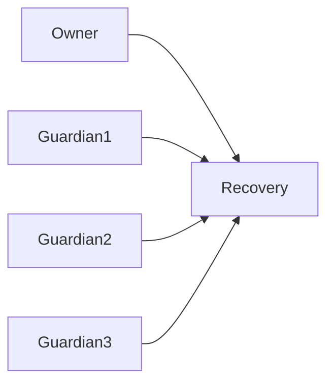
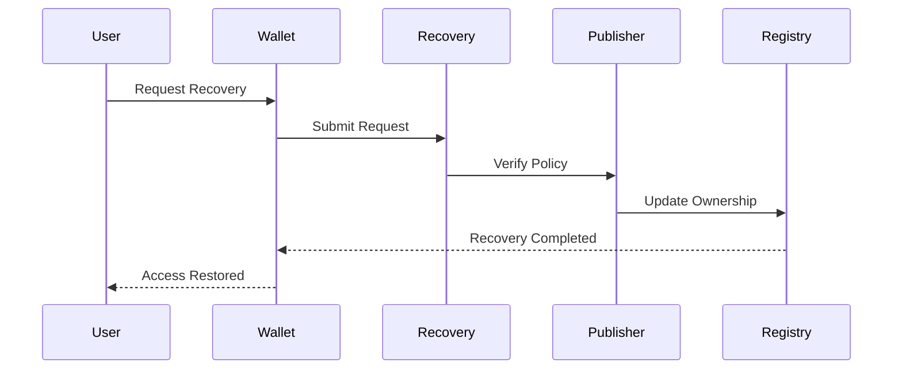

# Recovery

> _Recovery enables the legitimate owner of a Physical Digital Asset to regain control after loss, theft, damage, or device failure. The DCN Standard provides a policy-driven recovery framework that balances user ownership, security, privacy, and regulatory requirements._

***

## Introduction

One of the biggest concerns with digital assets is the possibility of permanent loss.

Users may:

* Lose a Physical Digital Asset
* Damage the Secure Element
* Forget wallet credentials
* Lose their mobile device
* Become victims of theft
* Accidentally destroy the asset

Traditional blockchain wallets often provide only one recovery mechanism—a seed phrase.

If the seed phrase is lost, the assets are permanently inaccessible.

The DCN Standard introduces a more flexible approach.

Recovery is **not a single mechanism**, but a **policy defined by the Publisher**.

This allows different asset types to adopt recovery models appropriate for their purpose while maintaining interoperability across the ecosystem.

***

## Purpose

The Recovery architecture is designed to:

* Restore legitimate ownership
* Prevent permanent asset loss
* Protect against fraudulent recovery
* Support multiple recovery models
* Preserve user privacy
* Support enterprise and government deployments
* Maintain auditability

Recovery should always prioritize security over convenience.

***

## Recovery Principles

Every recovery mechanism should follow these principles.

#### Legitimate Ownership

Recovery should restore access only to the legitimate owner.

#### Policy Driven

Recovery procedures are defined by the Publisher.

#### Secure

Recovery requires strong verification.

#### Auditable

Recovery events should be recorded.

#### Flexible

Different asset profiles may implement different recovery models.

***

## Recovery Architecture

Recovery involves multiple trusted participants.

The exact workflow depends on the Publisher's recovery policy.

***

## Recovery Models

The DCN Standard supports several recovery models.

| Recovery Model       | Typical Assets           |
| -------------------- | ------------------------ |
| Self Recovery        | Personal assets          |
| Guardian Recovery    | Family assets            |
| Publisher Recovery   | Gift cards, vouchers     |
| Enterprise Recovery  | Corporate credentials    |
| Government Recovery  | National identity, CBDCs |
| Multi-Party Recovery | Institutional assets     |

Publishers choose the recovery model appropriate for each asset profile.

***

## Self Recovery

Self Recovery allows the owner to restore access independently.

Possible mechanisms include:

* Recovery phrase
* Backup wallet
* Recovery key
* Secondary trusted device

This model is commonly used for self-custody assets such as DCN-S Stored Value notes.

***

## Guardian Recovery

Owners may nominate trusted guardians.

Examples include:

* Family members
* Business partners
* Trusted organizations

Recovery is completed only after the required number of guardians approve the request.

***

## Publisher Recovery

Some Physical Digital Assets require Publisher involvement.

Typical examples:

* Gift Cards
* Payroll Assets
* Loyalty Cards
* Event Tickets
* Subscription Cards

The Publisher verifies the recovery request according to its published policy before restoring access.

***

## Enterprise Recovery

Enterprise-owned assets generally belong to the organization rather than the employee.

Examples include:

* Employee Payment Assets
* Corporate Access Cards
* Equipment Credentials
* Treasury Assets

Recovery may require administrator approval and internal audit procedures.

***

## Government Recovery

Government-issued Physical Digital Assets may follow legally defined recovery procedures.

Examples include:

* National Identity
* Driver Licenses
* Social Benefit Cards
* CBDC Wallets

Recovery may require official identity verification before ownership is restored.

***

## Recovery Workflow

A typical recovery process follows these stages.

***

## Recovery Verification

Recovery requests should be verified using one or more mechanisms.

Examples include:

* Government-issued identity
* Guardian approval
* Publisher authorization
* Enterprise administrator approval
* Recovery keys
* Secure authentication
* Multi-signature approval

Publishers determine the required verification level.

***

## Asset Replacement

In many situations, the original Physical Digital Asset cannot be recovered.

Instead, a replacement asset may be issued.

The replacement receives:

* New Device Identity
* New Secure Element
* New Hardware Root of Trust
* New Device Certificate

while preserving:

* Asset ownership
* Asset metadata
* Blockchain association
* Publisher relationship
* Recovery policy

This ensures that compromised hardware is never reused.

***

## Lost vs Stolen Assets

The DCN Standard distinguishes between different recovery scenarios.

| Scenario              | Typical Response                |
| --------------------- | ------------------------------- |
| Lost Asset            | Suspend → Recover               |
| Stolen Asset          | Suspend → Investigate → Replace |
| Damaged Hardware      | Replace Device                  |
| Forgotten Credentials | Authenticate → Restore          |
| Expired Asset         | Reissue where permitted         |

Different events may require different approval processes.

***

## Recovery and Revocation

Recovery is closely linked with lifecycle management.

When ownership is successfully recovered:

* Previous authorizations may be revoked.
* Old device certificates may be invalidated.
* The original asset may be suspended or destroyed.
* Replacement assets become active.

This prevents duplicate active ownership.

***

## Privacy

Recovery should protect user privacy.

Only the information required for the selected recovery model should be collected.

Recovery services should avoid unnecessary storage of personal information and comply with applicable privacy regulations.

***

## Audit Trail

Recovery events should generate an audit trail.

Examples include:

* Recovery requested
* Recovery approved
* Recovery rejected
* Replacement asset issued
* Previous asset revoked
* Recovery completed

Audit records improve transparency and support security investigations.

***

## Security Considerations

Recovery systems should defend against:

* Identity fraud
* Social engineering
* Unauthorized recovery
* Insider abuse
* Replay attacks
* Duplicate recovery requests
* Stolen recovery credentials

Recovery should always require stronger verification than ordinary payments.

***

## Asset-Type Examples

| Asset Type          | Recovery Model          |
| ------------------- | ----------------------- |
| DCN-S Stored Value  | Self or Guardian        |
| DCN-R Reloadable    | Publisher or Self       |
| DCN-P Programmable  | Policy Based            |
| DCN-C Collectible   | Optional                |
| Gift Card           | Publisher               |
| Identity Credential | Government              |
| Payroll Card        | Employer                |
| Transit Pass        | Operator                |
| CBDC                | Government Policy       |
| Tokenized Security  | Custodian / Institution |

The recovery model is selected by the Publisher according to the intended use of the asset.

***

## Relationship to Ownership

Recovery does **not** create new ownership.

Its purpose is to **restore the legitimate owner's authority** after successful verification.

Ownership remains continuous throughout the recovery process.

***

## Design Principles

The Recovery architecture follows five principles.

#### Secure

Recovery requires strong verification.

#### Flexible

Supports multiple recovery models.

#### User Focused

Reduces the risk of permanent asset loss.

#### Auditable

Recovery events are traceable.

#### Policy Driven

Publishers define appropriate recovery procedures.

***

## Summary

Recovery completes the Ownership & Trust architecture by ensuring that legitimate owners can regain control of Physical Digital Assets without compromising security.

Through policy-driven recovery models, replacement assets, strong authentication, and auditable workflows, the DCN Standard balances self-custody with practical usability across consumer, enterprise, and government deployments.
