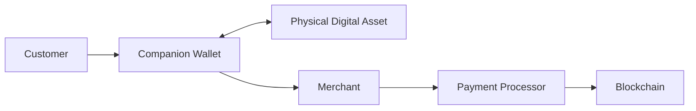

# 11. Payment Protocol

> _The DCN Payment Protocol defines how Physical Digital Assets are used to securely exchange digital value between participants. It provides a standardized, blockchain-neutral payment framework that supports consumer, merchant, enterprise, and government payment scenarios._

***

## Introduction

The ability to **pay by simply handing over or tapping a Physical Digital Asset** is one of the defining capabilities of the DCN Standard.

Unlike conventional cryptocurrency wallets, where users scan QR codes, manually enter addresses, and manage gas fees, the DCN Payment Protocol provides a payment experience similar to physical cash or contactless cards while preserving blockchain security.

The protocol is intentionally **blockchain-neutral**.

Whether the underlying asset represents:

* Bitcoin
* Ethereum assets
* Stablecoins
* CBDCs
* Tokenized securities
* Loyalty points
* Gift cards
* Transit credits

the payment experience remains consistent.

The DCN Payment Protocol standardizes how payments are initiated, authorized, verified, settled, and completed across the entire ecosystem.

***

## Purpose

The Payment Protocol is designed to:

* Standardize digital asset payments
* Simplify user interaction
* Enable secure merchant acceptance
* Support peer-to-peer transfers
* Enable enterprise payments
* Support online and offline payment models
* Remain blockchain independent
* Ensure interoperability across all DCN-compatible assets

***

## Payment Principles

The DCN Payment Protocol follows five principles.

#### Simple

Payments should be as easy as tapping a card or handing over cash.

#### Secure

Every payment must be cryptographically authorized.

#### Interoperable

Payments work across all DCN-compliant wallets, merchants, and Publishers.

#### Multi-Chain

The protocol operates independently of the underlying blockchain.

#### Extensible

Future payment capabilities can be added without redesigning the protocol.

***

## Payment Participants

Every payment involves one or more participants.

| Participant            | Responsibility                        |
| ---------------------- | ------------------------------------- |
| Customer               | Initiates payment                     |
| Physical Digital Asset | Authorizes payment                    |
| Companion Wallet       | Coordinates payment                   |
| Merchant               | Requests payment                      |
| Payment Processor      | Optional routing and processing       |
| Publisher              | Applies asset policies where required |
| Blockchain             | Final settlement                      |
| Verification Service   | Optional authenticity validation      |

The exact participants depend on the payment scenario.

***

## Payment Architecture

The Companion Wallet provides the user experience, while the Physical Digital Asset provides trusted authorization.

***

## Supported Payment Models

The DCN Payment Protocol supports multiple payment models.

| Payment Type       | Example                    |
| ------------------ | -------------------------- |
| Peer-to-Peer       | Person-to-person transfer  |
| Retail Payment     | Merchant purchase          |
| Online Payment     | E-commerce                 |
| Enterprise Payment | Corporate expenses         |
| Government Payment | Benefits and services      |
| Machine Payment    | IoT and autonomous systems |

Each model uses the same underlying protocol.

***

## Payment Lifecycle

Every payment follows a common lifecycle.

Each stage performs a specific security function before value is transferred.

***

## Online and Offline Payments

The protocol supports different connectivity models.

**Online Payments**

* Blockchain available
* Real-time verification
* Immediate settlement
* Live risk checks

**Offline Payments (Future Research)**

* Temporary offline authorization
* Limited transaction values
* Deferred settlement
* Additional risk controls

Offline payment mechanisms are described separately within the DCN roadmap.

***

## Payment Security

Every payment should include:

* Mutual authentication
* Secure session establishment
* Asset verification
* Transaction authorization
* Certificate validation
* Replay protection
* Policy evaluation

Security should remain transparent to ordinary users.

***

## Asset Independence

The Payment Protocol operates independently of asset type.

Examples include:

* DCN-S Stored Value
* DCN-R Reloadable
* DCN-P Programmable
* DCN-C Collectible (where transferable)
* Stablecoins
* CBDCs
* Gift Cards
* Transit Credits

Each asset follows its own policy while using the same payment framework.

***

## Blockchain Independence

The protocol does not require merchants or users to understand blockchain-specific implementation details.

Blockchain-specific operations are delegated to the appropriate Chain Adapter.

This enables the same payment experience regardless of the underlying settlement network.

***

## Relationship to Following Sections

The Payment Protocol is divided into four sections:

* **Payment Flow** — End-to-end payment lifecycle.
* **Merchant Flow** — Merchant interaction and acceptance.
* **Settlement** — Blockchain and financial settlement.
* **Offline Vision** — Future offline payment architecture.

Together, these sections define how value moves securely through the DCN ecosystem.

***

## Summary

The DCN Payment Protocol provides a standardized method for transferring digital value through Physical Digital Assets.

By separating user experience from blockchain complexity and combining secure authorization, authentication, and multi-chain interoperability, the protocol enables simple, secure, and scalable payments across consumer, enterprise, government, and future autonomous commerce environments.

***

## In this chapter

* [Payment Flow](payment-flow.md)
* [Merchant Flow](merchant-flow.md)
* [Settlement](settlement.md)
* [Offline Vision](offline-vision.md)
