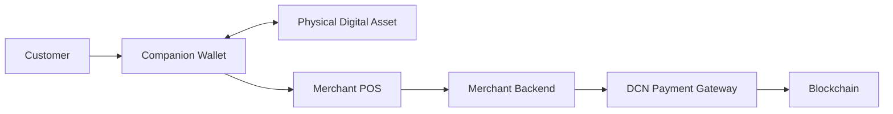
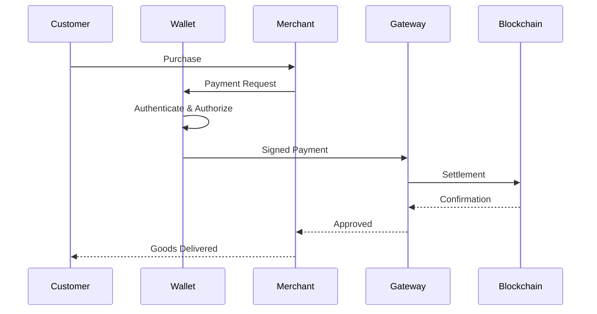

# Merchant Flow

> _The Merchant Flow defines how merchants securely accept Physical Digital Assets for goods and services. The DCN Standard enables any compliant merchant system—from retail POS terminals to mobile devices and e-commerce platforms—to accept multiple asset types through a single, standardized payment workflow._

***

## Introduction

For Physical Digital Assets to achieve mainstream adoption, acceptance must be simple for merchants.

Today, merchants often need different integrations for:

* Credit and debit cards
* QR code payments
* Mobile wallets
* Cryptocurrency wallets
* Gift cards
* Loyalty programs

The DCN Standard simplifies this fragmented landscape.

Instead of integrating with individual payment methods, merchants integrate with the **DCN Payment Protocol**, allowing them to accept a wide range of Physical Digital Assets through one standardized interface.

Whether a customer pays with a Stablecoin Note, CBDC Card, Gift Card, Transit Pass, Loyalty Card, or Digital Cash Note, the merchant experience remains consistent.

***

## Purpose

The Merchant Flow is designed to:

* Simplify merchant acceptance
* Support multiple asset types
* Minimize blockchain complexity
* Enable secure payment authorization
* Support online and offline commerce
* Reduce integration effort
* Improve customer experience

***

## Merchant Architecture

A merchant environment typically consists of the following components.



The merchant interacts with standardized DCN APIs rather than individual blockchain networks.

***

## Merchant Payment Flow

A standard merchant payment follows these steps.



The merchant receives confirmation without interacting directly with blockchain-specific protocols.

***

## Merchant Responsibilities

During the payment process, the merchant typically performs the following functions:

* Generate payment requests
* Display payment amount
* Authenticate with the customer
* Receive payment authorization
* Submit payment for settlement
* Receive confirmation
* Issue receipts
* Handle refunds where supported

The merchant is **not** responsible for managing customer private keys or Secure Elements.

***

## Payment Request

Every payment begins with a standardized payment request.

A request may contain:

| Field             | Description                           |
| ----------------- | ------------------------------------- |
| Merchant ID       | Unique merchant identifier            |
| Terminal ID       | POS or device identifier              |
| Amount            | Amount to be paid                     |
| Currency / Asset  | Requested payment asset               |
| Timestamp         | Request creation time                 |
| Reference ID      | Merchant transaction reference        |
| Optional Metadata | Invoice, order, or customer reference |

The payment request is digitally signed where required to prevent tampering.

***

## Merchant Authentication

Before accepting payment, the merchant may authenticate itself.

Authentication can include:

* Merchant Certificate
* Terminal Certificate
* Secure API credentials
* Organization Identity

This assures the customer that the payment request originates from a legitimate merchant.

***

## Asset Verification

Before completing the transaction, the merchant or payment gateway may verify:

* Device authenticity
* Publisher Certificate
* Asset lifecycle status
* Revocation status
* Ownership validity (where applicable)
* Payment policy compliance

Verification reduces fraud and counterfeit asset acceptance.

***

## Multi-Asset Acceptance

One merchant integration can accept many Physical Digital Assets.

Examples include:

| Asset Type         | Merchant Example   |
| ------------------ | ------------------ |
| DCN-S Stored Value | Coffee shop        |
| Stablecoin         | Online retailer    |
| CBDC               | Government office  |
| Gift Card          | Department store   |
| Loyalty Card       | Restaurant         |
| Transit Pass       | Transport operator |
| Event Ticket       | Stadium entrance   |
| Membership Card    | Gym                |

The merchant does not require separate payment integrations for each asset type.

***

## Multi-Chain Support

The merchant should remain unaware of the underlying blockchain.

Whether settlement occurs on:

* Ethereum
* Bitcoin
* Polygon
* Solana
* Permissioned CBDC network
* Enterprise blockchain

the merchant receives a standardized payment response.

Blockchain-specific processing is performed by the Chain Adapter and Payment Gateway.

***

## Merchant Confirmation

After settlement, the merchant receives a standardized response.

Typical statuses include:

| Status    | Meaning                   |
| --------- | ------------------------- |
| Approved  | Payment successful        |
| Pending   | Awaiting settlement       |
| Declined  | Payment rejected          |
| Expired   | Payment request timed out |
| Cancelled | Customer cancelled        |
| Error     | Processing failed         |

Standardized responses simplify merchant software development.

***

## Receipts

The DCN Standard supports digital payment receipts.

Receipts may include:

* Transaction Identifier
* Merchant Identifier
* Asset Type
* Payment Amount
* Settlement Time
* Blockchain Reference
* Confirmation Status

Receipts provide proof of payment without exposing sensitive information.

***

## Refunds

Where supported by the Publisher, merchants may initiate refunds.

Refund workflows generally include:

1. Verify original transaction.
2. Authenticate merchant.
3. Validate refund policy.
4. Submit refund transaction.
5. Confirm settlement.

Some asset types, such as government benefits or identity credentials, may not support refunds.

***

## Merchant Security

Merchant systems should protect against:

* Fake payment requests
* Counterfeit assets
* Replay attacks
* Unauthorized terminals
* Transaction tampering
* Network interception

The DCN Standard recommends authenticated communication and certificate validation for all merchant interactions.

***

## Merchant Experience

From a merchant's perspective, the payment process is intentionally simple.

```
1. Create Payment Request

2. Customer Taps Physical Digital Asset

3. Payment Authorized

4. Settlement Confirmed

5. Deliver Goods or Services
```

Complex blockchain operations remain hidden behind the DCN infrastructure.

***

## Supported Merchant Channels

The Merchant Flow is designed for multiple channels.

| Channel             | Example           |
| ------------------- | ----------------- |
| Retail POS          | Supermarkets      |
| Mobile POS          | Food trucks       |
| Self-Service Kiosk  | Ticket machines   |
| E-Commerce          | Online stores     |
| Vending Machines    | Automated retail  |
| Government Counters | Public services   |
| Enterprise Systems  | Internal payments |

This enables a consistent payment experience across physical and digital environments.

***

## Future Merchant Capabilities

Future versions of the DCN Standard may support:

* Autonomous checkout
* AI-assisted payment terminals
* IoT commerce
* Vehicle-to-merchant payments
* Smart city infrastructure
* Wearable payments

The Merchant Flow is designed to evolve without changing the core protocol.

***

## Design Principles

The Merchant Flow follows five principles.

#### Simple

One integration for many asset types.

#### Secure

Payments rely on authentication and cryptographic verification.

#### Interoperable

Works with all DCN-compatible assets.

#### Blockchain Neutral

Settlement network is abstracted from the merchant.

#### Scalable

Supports merchants ranging from small retailers to global enterprises.

***

## Summary

The Merchant Flow enables businesses to accept Physical Digital Assets through a single, standardized payment protocol.

By abstracting blockchain complexity, supporting multiple asset types, and integrating secure authentication and verification, the DCN Standard allows merchants to participate in a global ecosystem of Physical Digital Assets with minimal integration effort and a familiar payment experience.
