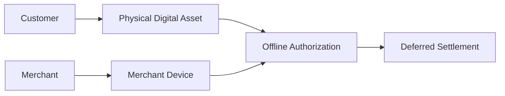

# Offline Vision

> _Offline payments represent one of the most ambitious long-term goals of the DCN Standard. This section outlines the vision and research direction for enabling trusted value exchange when one or more participants are temporarily disconnected from the Internet or blockchain network._

***

## Introduction

Cash works everywhere.

It does not require:

* Internet connectivity
* A payment gateway
* A blockchain node
* Mobile data
* Electricity at the time of exchange

This universal usability is one of the reasons physical cash remains popular around the world.

Digital assets, however, generally require online connectivity to verify balances, prevent double spending, and settle transactions.

The long-term vision of the DCN Standard is to reduce this dependency by researching secure offline payment capabilities for Physical Digital Assets.

**Offline payments are considered a future capability and are not part of the normative requirements of DCN v1.0.**

***

## Why Offline Payments Matter

Offline capability expands the usefulness of Physical Digital Assets in situations where connectivity is limited or unavailable.

Examples include:

* Rural communities
* Underground transit systems
* Aircraft
* Ships
* Disaster recovery
* Military operations
* Remote industrial sites
* Large public events
* Emergency humanitarian aid

Supporting offline transactions increases resilience and accessibility.

***

## Vision

The long-term vision is simple:

> **A user should be able to exchange value using a Physical Digital Asset even when temporarily disconnected from the blockchain, while maintaining an acceptable level of security and risk.**

Achieving this vision requires balancing usability with protection against fraud.

***

## Challenges

Offline payments introduce technical challenges that do not exist in online systems.

These include:

* Double spending
* Balance synchronization
* Transaction ordering
* Fraud detection
* Device compromise
* Risk management
* Settlement reconciliation

These problems cannot be solved by hardware alone and require coordinated protocol design.

***

## Research Principles

Research into offline payments should follow these principles.

#### Security First

Offline convenience must never compromise ecosystem security.

#### Risk Based

Different asset types may allow different levels of offline functionality.

#### Limited Exposure

Potential financial exposure should remain bounded.

#### Deferred Settlement

Offline transactions should eventually synchronize with the settlement network.

#### Policy Driven

Publishers define whether offline payments are permitted.

***

## High-Level Concept

An illustrative offline payment model is shown below.

Both participants complete a locally authorized transaction.

Settlement occurs later when connectivity becomes available.

***

## Offline Transaction Lifecycle

Unlike online payments, authorization and settlement occur at different times.

***

## Risk Controls

If offline payments are supported, Publishers may define risk controls such as:

* Maximum offline balance
* Maximum offline transaction value
* Maximum number of offline transactions
* Expiration period
* Geographic restrictions
* Merchant restrictions
* Mandatory online synchronization interval

These limits reduce financial exposure if fraud occurs.

***

## Offline Balance

Certain asset profiles may support a dedicated offline spending allowance.

For example:

| Total Balance         | Offline Spending Limit |
| --------------------- | ---------------------- |
| 500 USDC              | 50 USDC                |
| 2,000 CBDC            | 200 CBDC               |
| 1,000 Transit Credits | 200 Credits            |

The remaining balance requires online verification.

The exact implementation is defined by the Publisher.

***

## Deferred Settlement

Offline payments do not immediately update the blockchain.

Instead:

1. The payment is locally authorized.
2. Both parties store signed transaction records.
3. Connectivity is restored.
4. Settlement is submitted.
5. Blockchain confirmation finalizes the payment.

This process allows temporary operation without permanent network connectivity.

***

## Secure Hardware

Secure Hardware plays a critical role in offline payments.

Potential responsibilities include:

* Protecting offline balances
* Preventing unauthorized modification
* Storing transaction counters
* Generating cryptographic proofs
* Protecting transaction history

The Secure Element reduces the attack surface but does not eliminate all risks.

***

## Fraud Prevention

Offline systems must consider attacks such as:

* Double spending
* Device cloning
* Replay attacks
* Counterfeit devices
* Transaction modification
* Unauthorized balance changes

Multiple layers of cryptographic protection and policy enforcement are required.

***

## Suitable Asset Types

Not every Physical Digital Asset is suitable for offline payments.

| Asset Type           | Offline Suitability |
| -------------------- | ------------------- |
| DCN-S Stored Value   | High                |
| Transit Pass         | High                |
| Gift Card            | Medium              |
| Loyalty Card         | Medium              |
| CBDC                 | Policy Dependent    |
| Government Benefits  | Limited             |
| Identity Credential  | Not Applicable      |
| Tokenized Securities | Low                 |

Publishers determine offline eligibility based on business and regulatory requirements.

***

## Potential Use Cases

Future offline payments could support:

* Public transportation
* Rural commerce
* Disaster relief
* Humanitarian aid
* Military logistics
* Campus payments
* Festivals and concerts
* Emergency government assistance
* Machine-to-machine transactions

These scenarios demonstrate the potential value of offline capability.

***

## Current Status

For **DCN Specification v1.0**:

* Offline payments are **not standardized**.
* No mandatory protocol is defined.
* No interoperability requirements exist.
* Implementations may conduct experimental deployments at their own risk.

Future versions of the DCN Standard may introduce formal specifications after sufficient research, testing, and industry review.

***

## Relationship with Other Components

Offline payment research builds upon several existing DCN components.

* Secure Hardware
* Cryptography
* Authentication
* Payment Protocol
* Smart Accounts
* Chain Adapters

Rather than replacing these components, offline capability extends them.

***

## Future Research Areas

Potential areas of investigation include:

* Hardware-backed offline value storage
* Secure transaction counters
* Cryptographic offline vouchers
* Trusted merchant authorization
* Cross-device synchronization
* Offline risk scoring
* AI-assisted fraud detection
* CBDC offline settlement models

These topics will guide future versions of the DCN Standard.

***

## Design Principles

Offline payment research follows five principles.

#### Experimental

Not part of the mandatory DCN v1.0 specification.

#### Secure

Security takes precedence over convenience.

#### Controlled

Offline capability operates within defined limits.

#### Interoperable

Future solutions should remain compatible with the DCN architecture.

#### Evolvable

The specification can mature through research and industry collaboration.

***

## Summary

Offline payments represent one of the most significant long-term opportunities for Physical Digital Assets.

While current blockchain systems depend on online connectivity, the DCN Standard establishes a research direction toward secure offline value exchange through trusted hardware, cryptographic authorization, deferred settlement, and policy-based risk management.

Although not part of the normative requirements of DCN v1.0, this vision reinforces the broader goal of making Physical Digital Assets as practical and universally accessible as physical cash.
