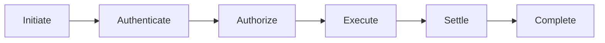
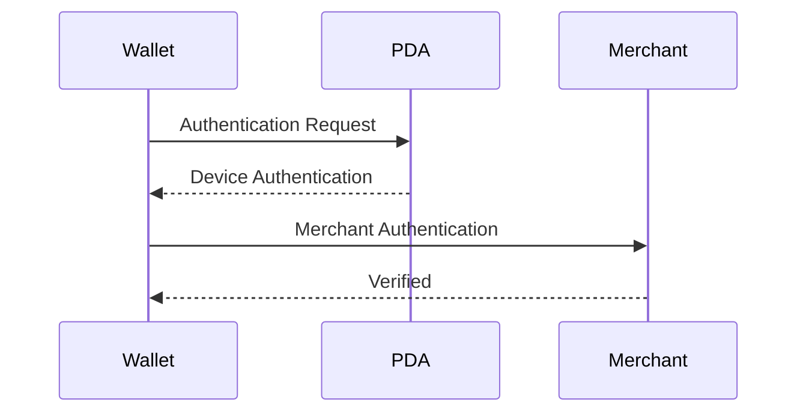
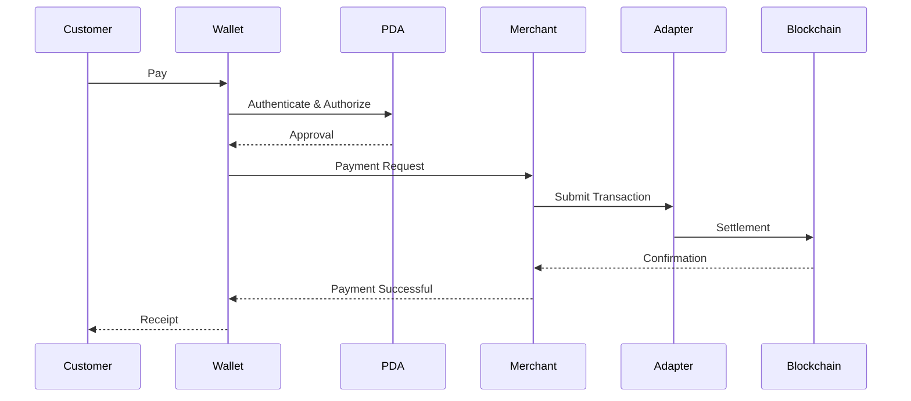

# Payment Flow

> _The Payment Flow defines the standardized sequence of operations required to transfer value using a Physical Digital Asset. Every DCN-compatible payment follows the same logical process regardless of the underlying blockchain, asset type, or payment application._

***

## Introduction

A payment is more than simply moving digital assets from one account to another.

Before value can be transferred, the DCN ecosystem must establish:

* The identity of the participants
* The authenticity of the Physical Digital Asset
* The authority of the owner
* The payment request
* The applicable security policies
* The settlement network

Only after these checks have been successfully completed should a transaction be authorized.

The DCN Payment Flow provides a common sequence that every DCN-compatible wallet, merchant, and Publisher can implement.

This standardized flow ensures that a payment made with a CBDC, stablecoin, digital cash note, gift card, or loyalty asset follows a consistent user experience while allowing different settlement mechanisms behind the scenes.

***

## Payment Objectives

The Payment Flow is designed to:

* Provide a simple user experience
* Authenticate all participants
* Prevent unauthorized transactions
* Support multiple asset types
* Support multiple blockchain networks
* Enable policy enforcement
* Ensure reliable settlement
* Produce verifiable payment records

***

## Standard Payment Flow

The DCN Standard defines six logical payment stages.



Although implementations may differ, these stages remain logically consistent across all DCN-compatible systems.

***

## Stage 1 — Initiate

The payment begins when a customer chooses to pay.

The request may originate from:

* Tapping a Physical Digital Asset
* Scanning a merchant request
* Selecting a merchant within the Companion Wallet
* Machine-to-machine communication
* Online checkout

At this stage, no value has been transferred.

Only the payment request is created.

***

## Stage 2 — Authenticate

Before proceeding, participating entities authenticate each other.

Authentication may include:

* Physical Digital Asset verification
* Companion Wallet authentication
* Merchant authentication
* Publisher verification
* Certificate validation



Only authenticated participants proceed to authorization.

***

## Stage 3 — Authorize

Authorization determines whether the payment is permitted.

The Physical Digital Asset evaluates:

* Ownership
* Spending permissions
* Asset policies
* Transaction limits
* Smart Account rules
* User permissions

If all conditions are satisfied, the Secure Element authorizes the payment.

The private key never leaves the device.

***

## Stage 4 — Execute

Once authorized, the Companion Wallet prepares the transaction.

Typical actions include:

* Building the payment payload
* Selecting the blockchain network
* Applying Publisher policies
* Calculating transaction fees
* Passing the transaction to the appropriate Chain Adapter

Execution remains independent of the underlying blockchain.

***

## Stage 5 — Settle

Settlement records the payment on the selected settlement network.

Depending on the asset, settlement may occur through:

* Public blockchain
* Private blockchain
* CBDC infrastructure
* Enterprise ledger
* Hybrid settlement platform

Settlement confirms the transfer of digital value.

***

## Stage 6 — Complete

Once settlement succeeds:

* The merchant receives confirmation.
* The customer's balance is updated.
* Receipts may be generated.
* Transaction history is updated.
* Lifecycle events are recorded where applicable.

The payment session is then closed.

***

## Complete Payment Sequence



This sequence represents the logical payment flow.

Individual implementations may optimize certain steps while preserving the overall security model.

***

## Payment States

Every payment progresses through defined states.

| State         | Description                     |
| ------------- | ------------------------------- |
| Initiated     | Payment request created         |
| Authenticated | Participants verified           |
| Authorized    | Payment approved                |
| Submitted     | Transaction sent for settlement |
| Pending       | Awaiting confirmation           |
| Confirmed     | Settlement successful           |
| Completed     | Payment finalized               |
| Failed        | Payment unsuccessful            |

Standardized states simplify interoperability across different wallets and payment providers.

***

## Multi-Asset Payments

The same payment flow supports many asset types.

Examples include:

| Asset Type     | Payment Example         |
| -------------- | ----------------------- |
| DCN-S          | Tap-to-pay digital cash |
| DCN-R          | Reloadable payment card |
| Stablecoin     | Merchant payment        |
| CBDC           | Government payment      |
| Gift Card      | Retail purchase         |
| Loyalty Points | Reward redemption       |
| Transit Pass   | Fare payment            |

The payment experience remains familiar even though the underlying assets differ.

***

## Multi-Chain Execution

The user should never need to know which blockchain processes the payment.

The Companion Wallet and Chain Adapter automatically:

* Identify the correct blockchain
* Format the transaction
* Submit it to the appropriate network
* Return a standardized result

This abstraction is one of the key advantages of the DCN Standard.

***

## Payment Policies

Before execution, Publisher policies may be evaluated.

Examples include:

* Maximum transaction amount
* Merchant restrictions
* Geographic limits
* Asset expiration
* Regulatory checks
* Spending schedules
* Enterprise approval requirements

Policies vary according to the asset profile.

***

## Error Handling

If any stage fails:

* The payment is cancelled.
* Ownership remains unchanged.
* Funds remain protected.
* The user receives a clear error message.
* Audit records may be generated.

Partial execution should never result in an inconsistent payment state.

***

## User Experience

From the user's perspective, a payment should require only a few simple steps.

```
1. Tap Physical Digital Asset

2. Authenticate (if required)

3. Confirm Payment

4. Receive Confirmation
```

The complexity of blockchain settlement, authentication, certificates, and routing remains hidden behind the DCN protocol.

***

## Security Considerations

Every payment should provide:

* Mutual authentication
* Replay protection
* Challenge-response verification
* Certificate validation
* Hardware-backed authorization
* Secure communication
* Auditability

These protections ensure that every payment is both secure and verifiable.

***

## Design Principles

The Payment Flow follows five principles.

#### Simple

A familiar user experience.

#### Secure

Hardware-backed authorization.

#### Standardized

Consistent across all DCN implementations.

#### Blockchain Neutral

Independent of settlement network.

#### Extensible

Supports future payment technologies.

***

## Summary

The Payment Flow defines the common operational sequence for transferring value within the DCN ecosystem.

By separating authentication, authorization, execution, and settlement into clearly defined stages, the DCN Standard provides a secure, interoperable, and blockchain-neutral payment framework suitable for Physical Digital Assets of every type—from digital cash and stablecoins to CBDCs, tickets, loyalty programs, and tokenized real-world assets.
