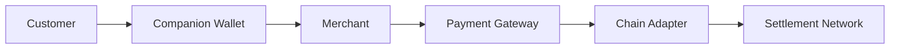
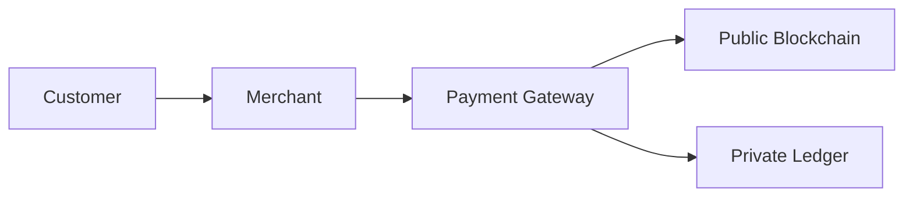
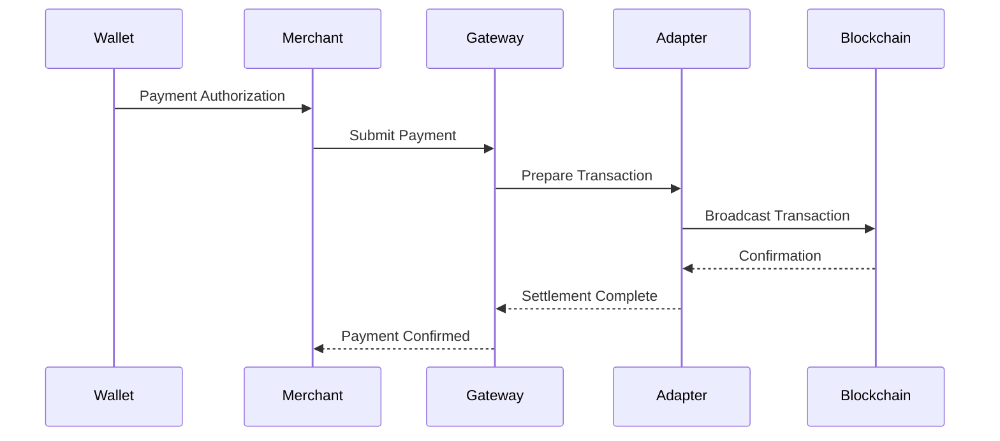

# Settlement

> _Settlement is the process of finalizing a payment by recording the transfer of digital value on the appropriate settlement network. The DCN Standard separates the payment experience from the settlement mechanism, allowing Physical Digital Assets to operate across multiple blockchain networks and future payment infrastructures._

***

## Introduction

When a customer taps a Physical Digital Asset, the payment appears instant.

Behind the scenes, however, the transaction must eventually be settled.

Settlement is the process that permanently records the movement of value between participants.

Unlike traditional payment systems, the DCN Standard does **not** define a single settlement network.

Instead, settlement may occur on:

* Public blockchains
* Permissioned blockchains
* CBDC platforms
* Enterprise ledgers
* Future settlement infrastructures

The Physical Digital Asset always follows the same payment protocol, while the settlement mechanism is selected according to the asset profile and Publisher policy.

This separation is one of the key architectural principles of the DCN Standard.

***

## Purpose

The Settlement architecture is designed to:

* Finalize payments securely
* Record ownership changes
* Support multiple blockchain networks
* Enable different settlement models
* Preserve interoperability
* Support regulatory requirements
* Maintain transaction integrity
* Provide verifiable payment records

***

## Settlement Principles

Every settlement process should follow these principles.

#### Final

Settlement should produce a definitive outcome.

#### Verifiable

Settlement must be independently verifiable.

#### Blockchain Neutral

The protocol is independent of the underlying settlement network.

#### Secure

Settlement must preserve transaction integrity.

#### Auditable

Settlement records should support future verification.

***

## Settlement Architecture

The Payment Gateway and Chain Adapter handle settlement-specific operations while maintaining a consistent payment experience.

***

## Settlement Models

The DCN Standard supports multiple settlement models.

| Settlement Model    | Typical Use                |
| ------------------- | -------------------------- |
| On-Chain            | Public cryptocurrencies    |
| Permissioned Ledger | CBDCs                      |
| Enterprise Ledger   | Corporate systems          |
| Hybrid Settlement   | Multi-network environments |
| Future Models       | Emerging infrastructures   |

The appropriate model is selected by the Publisher.

***

## On-Chain Settlement

Public blockchain settlement records the payment directly on a decentralized blockchain.

Examples include:

* Bitcoin
* Ethereum
* Polygon
* Solana
* Avalanche
* Lycan Chain

Benefits include:

* Transparency
* Independent verification
* Immutable transaction history
* Global interoperability

***

## Permissioned Settlement

Certain assets require regulated settlement.

Examples include:

* CBDCs
* Government payment systems
* Regulated financial assets
* Banking infrastructure

Permissioned networks may restrict participation to authorized organizations while still supporting the DCN Standard.

***

## Enterprise Settlement

Organizations may operate internal settlement platforms.

Examples include:

* Corporate treasury
* Employee expense systems
* Campus payment systems
* Internal loyalty programs

Enterprise settlement may never leave the organization's infrastructure while remaining compatible with DCN.

***

## Hybrid Settlement

Some deployments combine multiple settlement networks.

Example:

Hybrid settlement allows organizations to combine public transparency with private operational requirements.

***

## Settlement Workflow

A typical settlement process follows these stages.

The user is not exposed to blockchain-specific details during this process.

***

## Settlement States

Every payment progresses through standardized settlement states.

| State     | Description                         |
| --------- | ----------------------------------- |
| Submitted | Transaction accepted for processing |
| Pending   | Awaiting network confirmation       |
| Confirmed | Accepted by the settlement network  |
| Finalized | Considered irreversible             |
| Failed    | Settlement unsuccessful             |

These states provide a consistent interface across all supported settlement networks.

***

## Settlement Finality

Different blockchain networks reach finality in different ways.

Examples include:

* Proof-of-Work confirmations
* Proof-of-Stake finalization
* Enterprise approval
* Government validation
* Consortium consensus

The DCN Standard abstracts these differences into a common settlement status model.

***

## Multi-Chain Settlement

Publishers may issue assets across multiple blockchain ecosystems.

Examples:

| Asset          | Settlement Network   |
| -------------- | -------------------- |
| Stablecoin     | Ethereum             |
| Loyalty Points | Polygon              |
| CBDC           | Permissioned Network |
| Tokenized Bond | Enterprise Ledger    |
| Collectible    | Solana               |

Despite different settlement mechanisms, the payment experience remains identical.

***

## Settlement Metadata

Settlement records may include:

* Transaction Identifier
* Asset Identifier
* Merchant Identifier
* Settlement Network
* Timestamp
* Confirmation Status
* Blockchain Reference
* Payment Amount

This information supports auditing and verification.

***

## Failure Handling

Settlement failures may occur because of:

* Network congestion
* Invalid authorization
* Policy rejection
* Insufficient balance
* Smart contract failure
* Connectivity problems

If settlement fails:

* Ownership remains unchanged.
* Funds remain protected.
* Users receive a clear status.
* Merchants are informed.
* Audit events may be generated.

The protocol avoids partial or inconsistent settlement outcomes.

***

## Security

Settlement should provide:

* End-to-end integrity
* Cryptographic authorization
* Certificate validation
* Replay protection
* Immutable transaction records
* Secure communication

Settlement must never bypass the authorization provided by the Physical Digital Asset.

***

## Relationship with Chain Adapters

Settlement depends on Chain Adapters.

The Chain Adapter is responsible for:

* Formatting transactions
* Calculating fees
* Communicating with the blockchain
* Monitoring confirmations
* Returning standardized settlement responses

This separation allows the Payment Protocol to remain blockchain-neutral.

***

## Future Settlement Models

Future versions of the DCN Standard may support:

* Cross-chain settlement
* Instant settlement networks
* Autonomous machine settlement
* AI-optimized routing
* Tokenized bank deposits
* Wholesale CBDC settlement
* Real-world asset clearing networks

The architecture is intentionally extensible.

***

## Design Principles

The Settlement architecture follows five principles.

#### Final

Payments produce definitive outcomes.

#### Secure

Every settlement is cryptographically protected.

#### Blockchain Neutral

Independent of any specific network.

#### Interoperable

Supports multiple settlement infrastructures.

#### Future Ready

Designed for evolving financial systems.

***

## Summary

Settlement transforms an authorized payment into a finalized transfer of value.

By separating payment interaction from settlement infrastructure, the DCN Standard enables Physical Digital Assets to operate seamlessly across public blockchains, enterprise systems, CBDCs, and future financial networks while preserving a consistent user experience.
