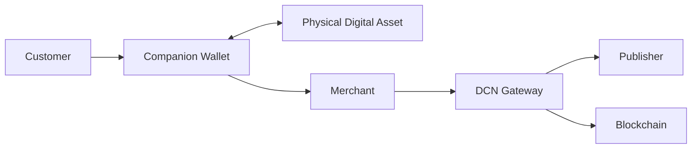

# 12. Merchant Acceptance

### Introduction

> _Merchant Acceptance defines how businesses, organizations, and service providers integrate with the DCN ecosystem to accept Physical Digital Assets. The DCN Standard enables a single acceptance framework that supports retail, e-commerce, enterprise, government, transportation, hospitality, and future commerce platforms._

***

## Introduction

A payment standard succeeds only if it is widely accepted.

Consumers may carry Physical Digital Assets, but without merchants capable of accepting them, their usefulness remains limited.

The DCN Standard addresses this challenge by providing a **unified merchant acceptance framework**.

Instead of requiring merchants to integrate separately with:

* Different blockchains
* Multiple stablecoins
* CBDCs
* Gift card systems
* Loyalty platforms
* Digital identity providers

they integrate once with the **DCN Merchant Acceptance Standard**.

This enables a merchant to accept any compatible Physical Digital Asset regardless of the issuing Publisher or underlying blockchain.

Whether a customer presents a:

* Digital Cash Note (DCN-S)
* Reloadable Payment Card (DCN-R)
* CBDC Card
* Stablecoin Card
* Transit Pass
* Gift Card
* Event Ticket
* Loyalty Card
* Corporate Expense Card
* Digital Identity Credential

the merchant follows the same standardized acceptance workflow.

***

## Purpose

The Merchant Acceptance architecture is designed to:

* Simplify merchant integration
* Support all Physical Digital Asset types
* Support multiple blockchain networks
* Provide consistent customer experiences
* Enable secure authentication
* Support online and physical commerce
* Reduce implementation complexity
* Enable future payment technologies

***

## Merchant Acceptance Principles

Every DCN-compatible merchant solution should follow these principles.

#### Universal

Accept assets from any compliant Publisher.

#### Simple

One integration should support many asset types.

#### Secure

Every transaction must be authenticated and verified.

#### Blockchain Neutral

Settlement networks remain hidden from merchants.

#### Extensible

New asset categories should be supported without changing merchant infrastructure.

***

## Merchant Ecosystem

The merchant communicates with standardized DCN services rather than blockchain-specific systems.

***

## Merchant Categories

The DCN Standard supports a wide range of merchant environments.

| Merchant Category | Examples                  |
| ----------------- | ------------------------- |
| Retail            | Supermarkets, Restaurants |
| E-Commerce        | Online Stores             |
| Hospitality       | Hotels, Resorts           |
| Transportation    | Metro, Bus, Taxi          |
| Government        | Public Service Centers    |
| Enterprise        | Corporate Procurement     |
| Education         | Universities              |
| Healthcare        | Hospitals                 |
| Entertainment     | Stadiums, Theme Parks     |
| Vending           | Self-Service Kiosks       |

Each category uses the same core acceptance protocol.

***

## Supported Asset Types

A merchant may accept multiple Physical Digital Asset profiles through one implementation.

| Asset Profile | Example                        |
| ------------- | ------------------------------ |
| DCN-S         | Digital Cash                   |
| DCN-R         | Reloadable Payment Card        |
| DCN-P         | Corporate Spending Card        |
| DCN-C         | Collectibles                   |
| Stablecoin    | Retail Payment                 |
| CBDC          | Government Payment             |
| Gift Card     | Store Credit                   |
| Loyalty Card  | Reward Redemption              |
| Ticket        | Event Entry                    |
| Identity      | Age or Membership Verification |

The merchant does not need different payment software for each asset category.

***

## Acceptance Workflow

A typical merchant interaction follows a consistent process.

Every DCN-compatible merchant follows this logical sequence regardless of the settlement network.

***

## Merchant Benefits

Implementing the DCN Standard provides several advantages.

#### Single Integration

Support many Publishers and asset types.

#### Future Compatibility

New Physical Digital Assets become available without redesigning merchant systems.

#### Reduced Complexity

Blockchain-specific logic remains outside the merchant application.

#### Improved Customer Experience

Customers pay using familiar tap-based interactions.

#### Open Ecosystem

Merchants are not locked into a single payment provider or blockchain.

***

## Relationship to Following Sections

Merchant Acceptance consists of four implementation channels:

* **POS** — Retail terminals and payment devices.
* **Mobile Devices** — Smartphones and tablets.
* **APIs** — Backend and enterprise integrations.
* **E-Commerce** — Online checkout experiences.

These channels together enable Physical Digital Assets to be accepted across virtually every commerce environment.

***

## Summary

The Merchant Acceptance architecture provides a universal framework for accepting Physical Digital Assets.

By separating merchant systems from blockchain complexity and standardizing authentication, authorization, and payment workflows, the DCN Standard enables businesses to support a broad ecosystem of digital assets through a single integration.

This approach positions DCN as an open acceptance standard for Physical Digital Assets rather than a payment solution tied to any individual blockchain, issuer, or application.

***

## In this chapter

* [POS](pos.md)
* [Mobile Devices](mobile-devices.md)
* [APIs](apis.md)
* [E-Commerce](e-commerce.md)
