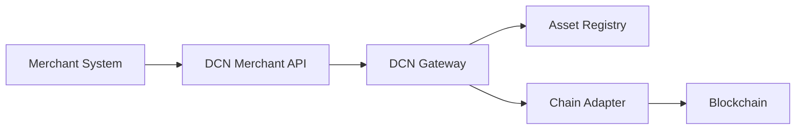

# APIs

> _The DCN API Standard enables merchants, payment providers, banks, governments, and enterprises to integrate Physical Digital Asset acceptance into existing software systems through a consistent, secure, and blockchain-neutral interface._

***

## Introduction

While consumers interact with Physical Digital Assets through wallets and NFC devices, businesses integrate through software.

Retail systems, e-commerce platforms, ERP solutions, banking systems, government portals, and enterprise applications all require a standardized method for communicating with the DCN ecosystem.

The **DCN Merchant APIs** provide this interface.

Rather than exposing blockchain-specific operations, the APIs expose **business operations** such as:

* Create a payment
* Verify an asset
* Check authenticity
* Validate ownership
* Query transaction status
* Request a refund
* Verify a ticket
* Validate a digital identity

This abstraction allows developers to build applications without needing deep blockchain expertise.

***

## Purpose

The API architecture is designed to:

* Simplify merchant integration
* Hide blockchain complexity
* Standardize payment operations
* Support multiple asset types
* Enable interoperability
* Support enterprise systems
* Provide secure communication
* Support future protocol extensions

***

## API Architecture



The merchant communicates only with the DCN API.

Blockchain-specific processing is performed behind the API layer.

***

## API Categories

The DCN Merchant API is organized into logical service groups.

| API Category     | Purpose                              |
| ---------------- | ------------------------------------ |
| Payment API      | Create and manage payments           |
| Verification API | Verify authenticity and ownership    |
| Merchant API     | Merchant registration and management |
| Asset API        | Read asset information               |
| Settlement API   | Query settlement status              |
| Refund API       | Process supported refunds            |
| Event API        | Receive transaction notifications    |

Each category exposes standardized operations regardless of the underlying blockchain.

***

## Payment API

The Payment API allows merchants to initiate payment requests.

Typical operations include:

* Create payment request
* Retrieve payment status
* Cancel pending payment
* Generate payment reference

Example:

```
POST /payments

Amount: 100
Asset Type: Stablecoin
Merchant ID: M-1001
```

The implementation details remain hidden behind the API.

***

## Verification API

Verification is not limited to payments.

Merchants may verify:

* Physical Digital Asset authenticity
* Publisher identity
* Ownership status
* Lifecycle state
* Revocation status
* Supported capabilities

Example:

```
POST /verification/authenticity

Asset ID
Device Certificate
```

The response indicates whether the asset is trusted.

***

## Merchant API

Merchant APIs manage merchant information.

Typical operations include:

* Register Merchant
* Update Merchant Profile
* Retrieve Merchant Information
* Obtain Merchant Certificate
* Manage Merchant Devices

These APIs simplify merchant onboarding.

***

## Asset API

The Asset API provides public asset information.

Typical responses include:

* Asset Identifier
* Asset Profile
* Publisher
* Supported Networks
* Metadata
* Lifecycle Status

Sensitive ownership information is not exposed through public asset queries.

***

## Settlement API

Settlement APIs allow merchants to monitor transaction progress.

Typical operations include:

* Query settlement status
* Retrieve blockchain reference
* View confirmation count
* Receive settlement completion

Standardized responses simplify integration across multiple settlement networks.

***

## Refund API

Where supported by Publisher policy, merchants may initiate refunds.

Typical workflow:

```
POST /refunds

Original Transaction

Refund Amount

Reason
```

The gateway validates refund eligibility before processing.

***

## Event API

The Event API allows systems to receive asynchronous notifications.

Examples include:

* Payment completed
* Payment failed
* Settlement finalized
* Asset revoked
* Refund completed
* Ownership transferred

Event-driven integration reduces unnecessary polling and improves application responsiveness.

***

## Standard Response Model

Every API should return a consistent response structure.

Typical fields include:

| Field      | Purpose                    |
| ---------- | -------------------------- |
| Request ID | Unique request identifier  |
| Status     | Operation result           |
| Timestamp  | Processing time            |
| Message    | Human-readable description |
| Data       | Operation-specific payload |

Consistent responses simplify application development.

***

## Authentication

Merchant APIs should require strong authentication.

Examples include:

* Merchant Certificate
* API Key
* OAuth 2.0
* Mutual TLS
* Digital Signatures

The appropriate authentication method depends on the deployment model.

***

## Security

All API communication should support:

* TLS encryption
* Certificate validation
* Request signing
* Replay protection
* Rate limiting
* Audit logging
* Authorization controls

Security should be enforced consistently across all API endpoints.

***

## Integration Examples

The API architecture supports many business environments.

Examples include:

| Platform       | Integration               |
| -------------- | ------------------------- |
| Retail POS     | Payment processing        |
| E-Commerce     | Online checkout           |
| ERP            | Enterprise reconciliation |
| Banking        | Digital asset services    |
| Government     | Public payments           |
| Transportation | Ticket validation         |
| University     | Student credentials       |
| Healthcare     | Identity verification     |

One API model serves many industries.

***

## Versioning

The DCN Standard supports API evolution through versioning.

Example:

```
/api/v1/payments
/api/v1/verification
/api/v1/settlement
```

Backward compatibility should be maintained whenever practical.

***

## Future APIs

Future versions of the DCN Standard may introduce APIs for:

* AI commerce
* Smart contracts
* Machine payments
* IoT devices
* Autonomous vehicles
* Digital identity wallets
* Cross-chain settlement
* Digital asset marketplaces

The API architecture is designed to evolve without disrupting existing integrations.

***

## Design Principles

The DCN API architecture follows five principles.

#### Standardized

One consistent interface for all implementations.

#### Secure

Protected through authentication and encryption.

#### Blockchain Neutral

Independent of settlement networks.

#### Developer Friendly

Business-focused operations rather than blockchain-specific commands.

#### Extensible

Supports future capabilities through versioned APIs.

***

## Summary

The DCN Merchant APIs provide the software interface that connects merchants and enterprise systems to the Physical Digital Asset ecosystem.

By exposing standardized business operations instead of blockchain-specific functionality, the APIs enable organizations to integrate payments, verification, settlement, and digital asset services through a secure, interoperable, and future-ready platform.
