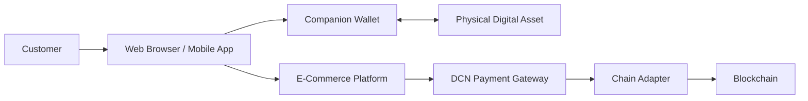
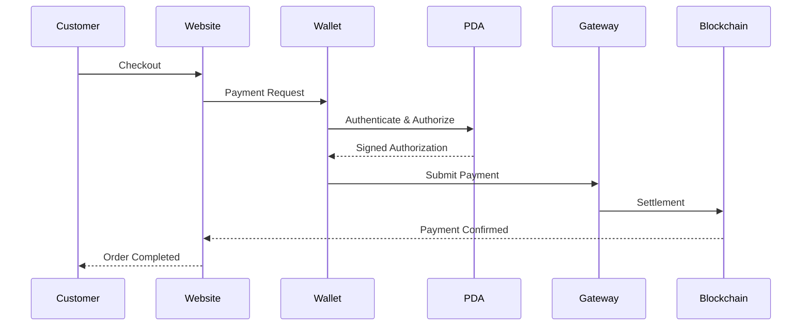

# E-Commerce

> _The DCN E-Commerce Standard enables online businesses to accept Physical Digital Assets through a secure, frictionless, and blockchain-neutral checkout experience. It extends the familiar tap-to-pay model into digital commerce while maintaining the same security and interoperability defined by the DCN Standard._

***

## Introduction

Electronic commerce has transformed how people buy goods and services.

Today, online merchants typically support:

* Credit and debit cards
* Internet banking
* Mobile wallets
* QR code payments
* Buy Now, Pay Later (BNPL)
* Cryptocurrency payment gateways

The DCN Standard introduces another option:

**Physical Digital Asset Checkout.**

Instead of copying wallet addresses or scanning QR codes, customers simply authenticate their purchase using a DCN-compatible Physical Digital Asset together with their Companion Wallet.

The checkout experience remains simple while the complexity of blockchain settlement is hidden behind the DCN infrastructure.

***

## Purpose

The E-Commerce architecture is designed to:

* Enable online acceptance of Physical Digital Assets
* Simplify checkout
* Support multiple asset types
* Hide blockchain complexity
* Improve payment security
* Support global interoperability
* Integrate with existing e-commerce platforms

***

## E-Commerce Architecture



The customer interacts with the merchant website while the Companion Wallet manages authentication and payment authorization.

***

## Online Checkout Flow

A typical checkout follows these steps.



The merchant receives confirmation through the DCN Payment Gateway without interacting directly with blockchain networks.

***

## Customer Experience

The goal is to make online payments as simple as in-store contactless payments.

Typical customer journey:

```
1. Add products to cart

↓

2. Select "Pay with DCN"

↓

3. Companion Wallet opens

↓

4. Tap Physical Digital Asset

↓

5. Confirm payment

↓

6. Order completed
```

The customer never needs to manually enter blockchain addresses or transaction parameters.

***

## Supported Payment Assets

An online merchant may accept many Physical Digital Asset categories through a single integration.

| Asset Type              | Example Use                  |
| ----------------------- | ---------------------------- |
| DCN-S                   | Digital Cash                 |
| DCN-R                   | Reloadable Balance           |
| Stablecoin              | International Payments       |
| CBDC                    | Government-approved payments |
| Gift Card               | Store Credit                 |
| Loyalty Points          | Reward Redemption            |
| Corporate Expense Asset | Business Purchases           |

The merchant selects which asset categories are supported.

***

## Authentication

Secure authentication is required before payment authorization.

Authentication may include:

* Companion Wallet authentication
* Physical Digital Asset authentication
* Merchant authentication
* Certificate validation
* Secure session establishment

These protections occur automatically within the DCN protocol.

***

## Merchant Integration

E-commerce platforms integrate through the DCN Merchant APIs.

Typical integration includes:

* Create payment session
* Display payment request
* Receive payment callback
* Verify payment status
* Complete order
* Process refunds (where supported)

No blockchain-specific development is required.

***

## Payment Status

The merchant receives standardized payment statuses.

| Status     | Description                |
| ---------- | -------------------------- |
| Initiated  | Checkout started           |
| Authorized | Customer approved payment  |
| Pending    | Awaiting settlement        |
| Confirmed  | Payment settled            |
| Failed     | Payment unsuccessful       |
| Cancelled  | Customer cancelled payment |

These standardized responses simplify integration across multiple settlement networks.

***

## Order Completion

After successful settlement:

* The merchant confirms the order.
* Inventory is updated.
* The customer receives a receipt.
* Shipping or service fulfillment begins.
* Transaction records are stored.

The overall business workflow remains unchanged from existing e-commerce systems.

***

## Security

The E-Commerce architecture provides multiple security layers.

These include:

* End-to-end encryption
* Mutual authentication
* Certificate validation
* Hardware-backed authorization
* Secure payment sessions
* Replay protection
* Settlement verification

Sensitive cryptographic operations remain inside the Secure Element.

***

## Platform Compatibility

The DCN Standard is designed to integrate with existing commerce platforms.

Examples include:

* Shopify
* WooCommerce
* Magento
* Adobe Commerce
* BigCommerce
* Custom enterprise platforms
* Mobile commerce applications

Integration occurs through standardized APIs and SDKs rather than platform-specific payment logic.

***

## Beyond Payments

E-commerce interactions may involve more than payment.

Examples include:

* Gift card redemption
* Loyalty point redemption
* Digital membership validation
* Warranty registration
* Digital collectible purchases
* Identity verification
* Age verification

This allows online merchants to build richer digital experiences using the same DCN infrastructure.

***

## Future Capabilities

Future versions of the DCN Standard may support:

* One-click DCN checkout
* Subscription payments
* Recurring payment authorization
* AI-assisted commerce
* Cross-chain payment routing
* Tokenized real-world asset purchases
* Autonomous commerce

The architecture is intentionally extensible to support future innovations.

***

## Design Principles

The E-Commerce architecture follows five principles.

#### Familiar

Fits naturally into existing online checkout flows.

#### Secure

Uses hardware-backed authorization and cryptographic verification.

#### Universal

Supports multiple Physical Digital Asset categories.

#### Blockchain Neutral

Independent of the underlying settlement network.

#### Scalable

Suitable for small merchants, global marketplaces, and enterprise commerce platforms.

***

## Summary

The DCN E-Commerce Standard extends Physical Digital Assets into online commerce by providing a secure, standardized, and blockchain-neutral checkout experience.

Through Companion Wallet integration, hardware-backed authorization, standardized APIs, and interoperable settlement, merchants can accept digital cash, stablecoins, CBDCs, gift cards, loyalty assets, and other Physical Digital Assets using a single integration while delivering a familiar and secure experience to customers.
