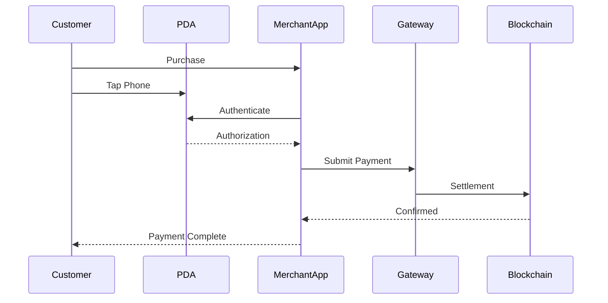

# Mobile Devices

> _The DCN Standard enables smartphones and tablets to function as merchant acceptance devices. A mobile device can securely accept, verify, and process Physical Digital Assets without requiring dedicated POS hardware, making digital asset acceptance accessible to businesses of every size._

***

## Introduction

Modern smartphones have become powerful business tools.

Millions of merchants already use mobile devices to:

* Accept card payments
* Generate invoices
* Manage inventory
* Scan QR codes
* Verify identities
* Issue receipts

The DCN Standard extends these capabilities by allowing **NFC-enabled mobile devices** to accept and interact with Physical Digital Assets.

This means that a merchant may not require dedicated payment hardware.

Instead, a smartphone or tablet running a **DCN Merchant App** can perform many of the functions traditionally handled by a POS terminal.

This significantly lowers the cost of merchant adoption and accelerates the deployment of the DCN ecosystem worldwide.

***

## Purpose

The Mobile Device architecture enables merchants to:

* Accept Physical Digital Assets
* Authenticate customers
* Verify asset authenticity
* Process payments
* Validate tickets and credentials
* Redeem gift cards and loyalty points
* Generate digital receipts
* Operate without specialized payment hardware

***

## Mobile Merchant Architecture

The mobile device acts as the merchant terminal while blockchain interaction remains abstracted through the DCN infrastructure.

***

## Supported Devices

The DCN Standard is designed for a broad range of mobile hardware.

Examples include:

* Android smartphones
* Android tablets
* iPhones (where platform capabilities permit)
* iPads
* Rugged enterprise devices
* Handheld inventory terminals
* Field service devices

The implementation depends on the NFC and security capabilities of the operating system.

***

## Merchant Application

The DCN Merchant App provides a standardized interface for accepting Physical Digital Assets.

Typical functions include:

* Create payment requests
* Read NFC assets
* Authenticate participants
* Verify authenticity
* Submit payments
* Display transaction status
* Generate receipts
* View transaction history

The application communicates through standardized DCN APIs.

***

## Mobile Payment Flow

From the user's perspective, the experience is similar to contactless mobile payments.

***

## Beyond Payments

Mobile devices can perform many additional DCN functions.

Examples include:

* Gift card redemption
* Loyalty point collection
* Event ticket validation
* Membership verification
* Identity verification
* Transit validation
* Certificate verification
* Corporate credential checks

This enables one application to support multiple Physical Digital Asset categories.

***

## Merchant Dashboard

A DCN Merchant App may include operational tools such as:

* Today's sales
* Payment history
* Accepted asset types
* Publisher analytics
* Refund requests
* Device status
* Settlement status
* Customer receipts

The dashboard provides merchants with a unified operational view.

***

## Security

Mobile devices should support:

* Secure NFC communication
* Merchant authentication
* Certificate validation
* Encrypted communication
* Secure local storage
* Biometric authentication (optional)
* Replay protection

Sensitive cryptographic operations remain within the customer's Physical Digital Asset and the trusted DCN infrastructure.

***

## Device Capabilities

Depending on hardware support, mobile devices may provide:

| Capability                         | Purpose                          |
| ---------------------------------- | -------------------------------- |
| NFC                                | Tap interaction                  |
| Camera                             | QR fallback and document capture |
| Biometrics                         | Merchant authentication          |
| GPS                                | Location-aware policies          |
| Internet                           | Settlement and verification      |
| Secure Enclave / Trusted Execution | Secure credential storage        |

The DCN Standard adapts to the capabilities available on each platform.

***

## Small Business Adoption

One of the major goals of the DCN Standard is to reduce the barrier to merchant acceptance.

A small business can:

* Install the DCN Merchant App
* Register as a merchant
* Receive a Merchant Certificate
* Begin accepting Physical Digital Assets

without investing in dedicated payment terminals.

This opens the ecosystem to independent retailers, market vendors, taxis, delivery services, and mobile businesses.

***

## Enterprise Deployment

Large organizations may deploy managed merchant applications.

Examples include:

* Retail chains
* Airlines
* Universities
* Hotels
* Healthcare providers
* Government service centers

Enterprise policies may control:

* User roles
* Device enrollment
* Security settings
* Transaction limits
* Reporting

***

## Offline Capability

Where supported by Publisher policy and future protocol versions, mobile devices may participate in offline payment scenarios.

Potential functions include:

* Temporary transaction storage
* Deferred synchronization
* Offline ticket validation
* Offline transit acceptance

These capabilities remain subject to future standardization.

***

## Future Capabilities

Future versions of the DCN Standard may support:

* AI-assisted fraud detection
* Digital identity verification
* Autonomous merchant kiosks
* Smart city services
* Machine-to-machine commerce
* Wearable merchant devices
* Voice-assisted acceptance

The mobile platform provides a flexible foundation for these innovations.

***

## Design Principles

The Mobile Device architecture follows five principles.

#### Accessible

Uses widely available consumer hardware.

#### Secure

Protects transactions through authentication and cryptography.

#### Flexible

Supports payments and non-payment use cases.

#### Blockchain Neutral

Independent of the underlying settlement network.

#### Scalable

Suitable for individual merchants and global enterprises alike.

***

## Summary

The DCN Mobile Device architecture transforms smartphones and tablets into secure merchant acceptance terminals for Physical Digital Assets.

By combining NFC interaction, standardized APIs, secure authentication, and blockchain-neutral settlement, mobile devices enable businesses of every size to participate in the DCN ecosystem without specialized hardware, accelerating the global adoption of Physical Digital Assets.
