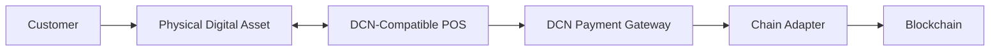
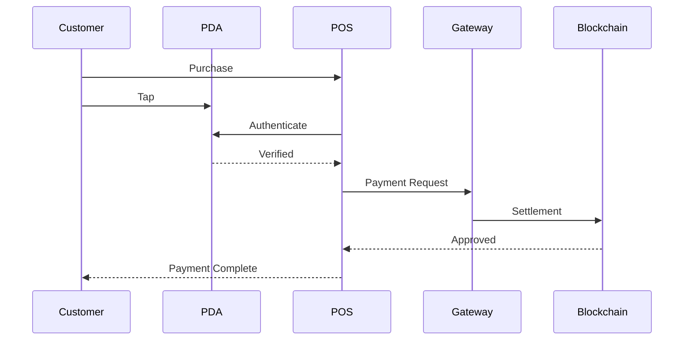

# POS

> _The DCN POS Standard defines how Physical Digital Assets are accepted at retail payment terminals. It enables merchants to accept payments, verify credentials, redeem digital assets, and authenticate Physical Digital Assets through a single standardized interface._

***

## Introduction

The Point of Sale (POS) terminal is where most real-world commerce takes place.

Today, POS systems support numerous payment technologies, including:

* EMV chip cards
* Contactless NFC cards
* Mobile wallets
* QR code payments
* Gift cards
* Loyalty programs

The DCN Standard extends this familiar payment experience to **Physical Digital Assets**.

Instead of requiring specialized cryptocurrency terminals, a DCN-compatible POS can communicate with Physical Digital Assets using standardized protocols while remaining independent of the underlying blockchain.

To the customer, the interaction remains simple:

> **Tap. Authenticate (if required). Payment Complete.**

***

## Purpose

The DCN POS architecture enables merchants to:

* Accept Physical Digital Assets
* Verify authenticity
* Authenticate customers where required
* Support multiple Publishers
* Support multiple blockchain networks
* Process non-payment assets
* Integrate with existing retail infrastructure

***

## POS Architecture



The POS terminal communicates using the DCN protocol, while blockchain communication is handled by the Payment Gateway and Chain Adapter.

***

## POS Responsibilities

A DCN-compatible POS terminal typically performs the following functions:

* Discover Physical Digital Assets
* Exchange NFC messages
* Display payment information
* Authenticate participants
* Request payment authorization
* Submit payment requests
* Receive settlement confirmation
* Print or generate receipts

The POS never stores customer private keys.

***

## Standard Payment Flow



This workflow remains consistent regardless of the blockchain used for settlement.

***

## NFC Interaction

The POS communicates with the Physical Digital Asset using NFC.

Typical interactions include:

* Device discovery
* Secure session establishment
* Authentication
* Payment authorization
* Transaction confirmation

All sensitive cryptographic operations remain inside the Secure Element.

***

## Supported Asset Types

A single POS terminal may support multiple Physical Digital Asset categories.

| Asset Type          | Example POS Function           |
| ------------------- | ------------------------------ |
| DCN-S               | Retail payment                 |
| DCN-R               | Reloadable payment             |
| DCN-P               | Corporate purchase             |
| Gift Card           | Balance redemption             |
| Loyalty Card        | Reward redemption              |
| Event Ticket        | Entry validation               |
| Transit Pass        | Fare collection                |
| Identity Credential | Age or membership verification |
| CBDC                | Government payment             |
| Stablecoin          | Digital asset payment          |

The merchant does not require different hardware for each asset category.

***

## Beyond Payments

The DCN POS Standard is not limited to payment acceptance.

A POS terminal may also perform:

* Gift card redemption
* Loyalty point redemption
* Membership validation
* Ticket verification
* Identity verification
* Digital certificate validation
* Corporate credential verification

This transforms the POS terminal into a **Physical Digital Asset interaction terminal**, not merely a payment device.

***

## Merchant Experience

For the merchant, accepting a Physical Digital Asset is straightforward.

```
1. Enter Purchase Amount

2. Customer Taps Physical Digital Asset

3. POS Verifies Authenticity

4. Payment Authorized

5. Settlement Confirmed

6. Receipt Generated
```

No blockchain-specific knowledge is required.

***

## Customer Experience

The customer experience remains familiar.

```
Select Asset

↓

Tap Physical Digital Asset

↓

Approve (if required)

↓

Receive Confirmation
```

The goal is to provide a payment experience comparable to modern contactless card payments.

***

## POS Security

Every DCN-compatible POS should support:

* Merchant authentication
* Device authentication
* Certificate validation
* Secure NFC communication
* Replay protection
* Secure session management
* Transaction integrity

These protections reduce fraud while maintaining usability.

***

## Existing Infrastructure

The DCN Standard is designed to integrate with existing retail systems.

Examples include:

* Retail POS software
* Inventory systems
* ERP platforms
* Accounting software
* Fiscal printers
* Receipt systems

Merchants should not need to replace their entire retail infrastructure to support Physical Digital Assets.

***

## Future POS Capabilities

Future versions of the DCN Standard may support:

* Multi-asset checkout
* Automatic asset selection
* AI-assisted fraud detection
* Smart discounts
* Digital identity verification
* Age-restricted purchases
* Autonomous retail

These capabilities build upon the same standardized POS protocol.

***

## Design Principles

The DCN POS architecture follows five principles.

#### Familiar

Operates similarly to existing contactless payment terminals.

#### Universal

Supports all Physical Digital Asset categories.

#### Secure

Uses mutual authentication and hardware-backed authorization.

#### Blockchain Neutral

Settlement occurs independently of the POS terminal.

#### Extensible

Supports future payment and identity applications.

***

## Summary

The DCN POS Standard enables merchants to accept, verify, and interact with Physical Digital Assets through existing retail infrastructure.

By combining secure NFC communication, cryptographic authentication, and blockchain-neutral payment processing, the POS becomes a universal interaction point for digital cash, stablecoins, CBDCs, loyalty programs, tickets, identity credentials, and future Physical Digital Assets.
