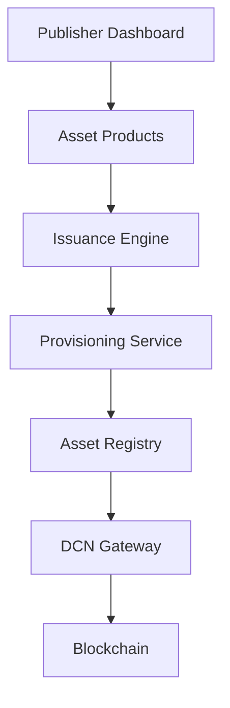

# 13. Publisher Platform

### Introduction

> _The Publisher Platform is the operational foundation of the DCN ecosystem. It enables organizations to create, issue, manage, monitor, and retire Physical Digital Assets using a standardized lifecycle while maintaining interoperability across all DCN-compatible wallets, merchants, and blockchain networks._

***

## Introduction

One of the most important innovations of the DCN Standard is the concept of the **Publisher**.

Just as anyone can deploy a smart contract using blockchain standards, any qualified organization should be able to publish **Physical Digital Assets** using the DCN Standard.

This transforms DCN from a payment solution into an **open publishing platform**.

A Publisher may issue:

* Digital Cash Notes
* Stablecoin Cards
* CBDC Devices
* Gift Cards
* Event Tickets
* Loyalty Cards
* Transit Passes
* University Certificates
* Government Benefits
* Digital Identity Credentials
* Tokenized Securities
* Carbon Credits
* Corporate Access Cards
* Digital Collectibles

The Publisher Platform provides the infrastructure required to manage these assets throughout their entire lifecycle.

***

## Purpose

The Publisher Platform enables organizations to:

* Become a certified DCN Publisher
* Define Physical Digital Asset products
* Issue new assets
* Provision Secure Hardware
* Manage asset lifecycles
* Monitor issued assets
* Suspend or revoke assets
* Integrate with blockchain networks
* Operate at global scale

***

## Who is a Publisher?

A Publisher is any organization authorized to issue Physical Digital Assets using the DCN Standard.

Examples include:

| Publisher          | Example Assets           |
| ------------------ | ------------------------ |
| Stablecoin Company | Stablecoin Notes         |
| Central Bank       | CBDC Cards               |
| Commercial Bank    | Reloadable Payment Cards |
| Government         | Identity Credentials     |
| University         | Diplomas & Certificates  |
| Retail Brand       | Gift Cards               |
| Airline            | Boarding Passes          |
| Transit Authority  | Transit Passes           |
| Enterprise         | Employee Credentials     |
| Gaming Platform    | Digital Collectibles     |

The DCN Standard defines the publishing framework while allowing innovation across industries.

***

## Platform Architecture

The Publisher Platform coordinates the complete lifecycle of Physical Digital Assets.

***

## Publisher Responsibilities

A Publisher is responsible for:

* Creating asset products
* Defining business policies
* Selecting supported blockchains
* Managing issuance
* Maintaining lifecycle records
* Defining recovery policies
* Monitoring asset status
* Managing revocations
* Supporting compliance requirements

The Publisher is **not** responsible for modifying the DCN protocol itself.

***

## Publisher Lifecycle

Every Publisher follows a lifecycle.

Each stage is governed by the DCN Standard and applicable certification requirements.

***

## Asset Lifecycle Management

The Publisher manages the lifecycle of every issued asset.

Typical lifecycle states include:

| State        | Description                    |
| ------------ | ------------------------------ |
| Designed     | Asset profile created          |
| Manufactured | Physical asset produced        |
| Provisioned  | Secure identities injected     |
| Issued       | Assigned to an owner or holder |
| Active       | Available for normal use       |
| Suspended    | Temporarily disabled           |
| Revoked      | Permanently invalidated        |
| Retired      | End of lifecycle               |

Lifecycle management ensures that every asset remains traceable and verifiable.

***

## Publisher Dashboard

A typical Publisher Dashboard may provide:

* Asset Products
* Issuance Batches
* Manufacturing Status
* Active Assets
* Suspended Assets
* Revoked Assets
* Analytics
* Recovery Requests
* Merchant Statistics
* Blockchain Activity
* Certification Status

The dashboard serves as the operational control center for the Publisher.

***

## Relationship to Following Sections

The Publisher Platform consists of five major capabilities:

* **Who Can Publish** — Publisher eligibility and ecosystem participation.
* **Publishing Workflow** — End-to-end asset publishing process.
* **Issuance** — Creating and activating Physical Digital Assets.
* **Management** — Operating and monitoring issued assets.
* **Revocation** — Suspending and permanently invalidating assets.

Together, these capabilities define how organizations participate in the DCN ecosystem as trusted Publishers.

***

## Publisher Vision

The long-term vision of the DCN Publisher Platform is to become the equivalent of what ERC-20 and ERC-721 did for blockchain tokens.

Instead of publishing only digital smart contracts, organizations publish **Physical Digital Assets** using one global open standard.

A single Publisher Platform can support thousands of asset categories while remaining interoperable with every DCN-compatible wallet, merchant, and verification service.

***

## Summary

The Publisher Platform is the operational heart of the DCN ecosystem.

It provides organizations with a standardized framework for designing, issuing, managing, and retiring Physical Digital Assets while ensuring interoperability, security, and lifecycle consistency across industries and blockchain networks.

This platform transforms DCN from a payment protocol into a global infrastructure for publishing Physical Digital Assets.

## In this chapter

* [Who Can Publish](who-can-publish.md)
* [Publishing Workflow](publishing-workflow.md)
* [Issuance](issuance.md)
* [Management](management.md)
* [Revocation](revocation.md)
