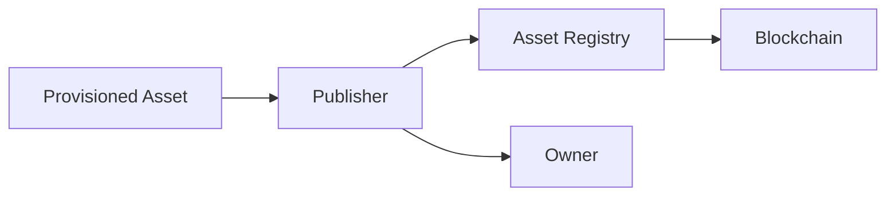

# Issuance

> _Issuance is the process by which a Publisher creates and activates a trusted Physical Digital Asset for its first owner or holder. It represents the moment an asset enters the DCN ecosystem and becomes available for real-world use._

***

## Introduction

Manufacturing creates the hardware.

Provisioning creates the cryptographic identity.

**Issuance creates the digital asset.**

Until an asset is issued, it exists only as an inactive product with no owner and no operational purpose.

During issuance, the Publisher establishes:

* The asset identity
* The first owner or holder
* Supported blockchain network(s)
* Asset policies
* Ownership model
* Initial value or permissions
* Lifecycle state

Once issuance is complete, the Physical Digital Asset becomes an active participant in the DCN ecosystem.

***

## Purpose

The Issuance process is designed to:

* Activate new Physical Digital Assets
* Establish initial ownership
* Associate the asset with a Publisher
* Configure operational policies
* Register blockchain information
* Enable future verification
* Maintain lifecycle integrity

***

## What Happens During Issuance?

Issuance is the point where an asset becomes usable.

Typical operations include:

* Assign Asset ID
* Associate Publisher
* Assign owner or holder
* Configure asset profile
* Register supported blockchain networks
* Apply usage policies
* Set lifecycle state to **Issued**
* Enable activation

At the end of issuance, the asset is trusted and ready for activation.

***

## Issuance Workflow



The Publisher coordinates the issuance process while the Asset Registry records the asset's identity.

***

## Issuance Types

The DCN Standard supports different issuance models depending on the asset.

| Issuance Model         | Example             |
| ---------------------- | ------------------- |
| Consumer Issuance      | Stablecoin Card     |
| Retail Issuance        | Gift Card           |
| Enterprise Issuance    | Employee Credential |
| Government Issuance    | National Identity   |
| Institutional Issuance | Tokenized Bond      |
| Event Issuance         | Concert Ticket      |
| Transit Issuance       | Travel Pass         |

Each follows the same technical framework while applying different business rules.

***

## Asset Configuration

During issuance, the Publisher configures essential asset parameters.

Examples include:

* Asset Profile
* Supported Networks
* Ownership Policy
* Transfer Rules
* Recovery Policy
* Spending Limits
* Expiration Date
* Metadata
* Certificate References

These settings define how the asset behaves throughout its lifecycle.

***

## Initial Owner

Some assets are issued directly to an owner.

Examples:

* Stablecoin Card sold to a customer
* Employee access credential
* University diploma
* Government identity card

Other assets may be issued without an owner.

Examples:

* Blank gift cards awaiting activation
* Retail inventory
* Promotional cards
* Manufacturing stock

The ownership model depends on the Publisher's business requirements.

***

## Initial Value

Certain Physical Digital Assets contain an initial value.

Examples include:

| Asset        | Initial Value          |
| ------------ | ---------------------- |
| Gift Card    | Store Credit           |
| DCN-S        | Fixed Stored Value     |
| DCN-R        | Initial Wallet Balance |
| Transit Pass | Travel Credits         |
| Loyalty Card | Reward Points          |

Other assets, such as identity credentials or certificates, may contain permissions instead of monetary value.

***

## Blockchain Registration

Where applicable, the Publisher associates the asset with one or more blockchain networks.

Examples:

```
Asset Profile:
DCN-R

Supported Networks:
Ethereum
Polygon
Lycan Chain

Primary Settlement:
Ethereum
```

The Companion Wallet uses this information when processing future transactions.

***

## Issuance Authentication

Issuance is a privileged operation.

Only authenticated Publishers should be permitted to issue assets.

Typical controls include:

* Publisher Certificate
* Secure authentication
* Hardware Security Modules (HSMs)
* Secure provisioning environment
* Audit logging

Unauthorized issuance undermines trust and must be prevented.

***

## Batch Issuance

Large organizations may issue assets in batches.

Example:

```
Batch ID:
DCN-2027-0001

Assets:
10,000

Profile:
DCN-S

Publisher:
ABC Stablecoin Ltd.
```

Batch issuance simplifies manufacturing, logistics, and lifecycle management.

***

## Issuance States

An asset progresses through several states before becoming operational.

| State        | Description                 |
| ------------ | --------------------------- |
| Manufactured | Physical hardware completed |
| Provisioned  | Identity installed          |
| Registered   | Recorded in Asset Registry  |
| Issued       | Assigned by Publisher       |
| Activated    | Ready for use               |

Only activated assets participate in payments and other DCN operations.

***

## Issuance Policies

Publishers define policies governing issuance.

Examples include:

* Geographic availability
* Customer eligibility
* Identity verification requirements
* Regulatory restrictions
* Product availability
* Expiration policies
* Asset quantity limits

Policies differ according to the asset category.

***

## Security

The Issuance process should ensure:

* Secure key management
* Certificate validation
* Publisher authentication
* Registry consistency
* Audit logging
* Tamper resistance

Issuance is one of the highest-trust operations in the DCN lifecycle.

***

## Monitoring

Publishers may monitor issuance through operational dashboards.

Typical metrics include:

* Total assets issued
* Active assets
* Pending activation
* Issuance batches
* Failed issuance attempts
* Issuance by product
* Issuance by region

These insights support operational planning and compliance.

***

## Future Automation

Future Publisher Platforms may automate:

* Product creation
* Issuance approval
* Blockchain registration
* Inventory allocation
* Customer onboarding
* Certificate generation
* Compliance checks

Automation improves efficiency while maintaining security.

***

## Design Principles

The Issuance architecture follows five principles.

#### Trusted

Only authorized Publishers may issue assets.

#### Standardized

Every asset follows the same issuance framework.

#### Secure

Protected through cryptography and certification.

#### Scalable

Supports issuance from individual assets to millions of devices.

#### Interoperable

Applies consistently across all supported asset profiles and blockchain networks.

***

## Summary

Issuance is the process that transforms a provisioned device into a trusted Physical Digital Asset.

By assigning identity, ownership, policies, blockchain associations, and lifecycle status, the Issuance process establishes the foundation upon which every payment, verification, ownership transfer, and recovery operation depends.
