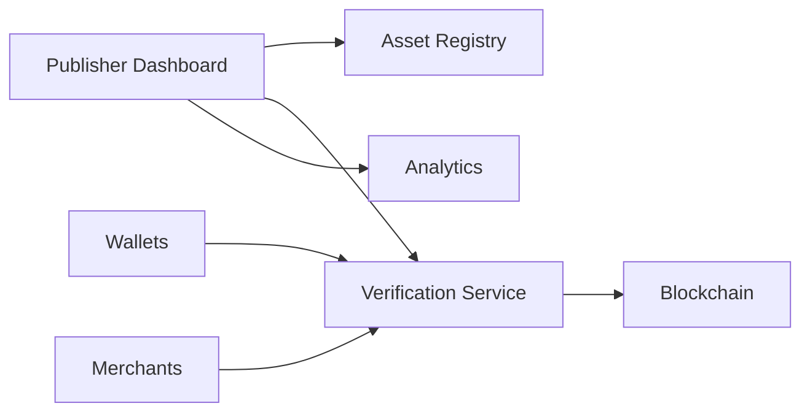
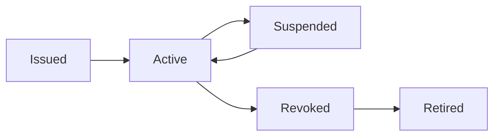

# Management

> _Management is the continuous operational process of administering Physical Digital Assets after issuance. The DCN Standard provides Publishers with a unified management framework for monitoring, updating, securing, and governing millions of assets throughout their lifecycle._

***

## Introduction

Issuing a Physical Digital Asset is only the beginning of its lifecycle.

Once an asset becomes active, the Publisher is responsible for ensuring that it continues to operate securely and reliably.

Management includes:

* Monitoring asset status
* Updating policies
* Managing ownership events
* Handling recovery requests
* Supporting customer service
* Maintaining security
* Responding to incidents
* Managing lifecycle transitions

The DCN Standard provides a consistent operational model that allows Publishers to manage millions of Physical Digital Assets from a single platform.

***

## Purpose

The Management architecture is designed to:

* Monitor active assets
* Update operational policies
* Manage lifecycle events
* Maintain security
* Support customer operations
* Enable analytics
* Improve operational efficiency
* Support compliance and auditing

***

## Management Architecture



The Publisher Dashboard serves as the operational control center for all issued assets.

***

## Core Management Functions

The Publisher Platform typically provides the following capabilities.

| Function              | Purpose                              |
| --------------------- | ------------------------------------ |
| Asset Monitoring      | View asset status                    |
| Lifecycle Management  | Update lifecycle states              |
| Ownership Management  | Process ownership changes            |
| Policy Management     | Configure asset rules                |
| Recovery Management   | Handle recovery requests             |
| Revocation Management | Suspend or revoke assets             |
| Analytics             | Monitor ecosystem activity           |
| Reporting             | Operational and compliance reporting |

These functions remain consistent across all asset types.

***

## Asset Monitoring

Publishers should be able to monitor every issued Physical Digital Asset.

Typical information includes:

* Asset ID
* Publisher
* Asset Profile
* Lifecycle State
* Current Owner (where applicable)
* Activation Status
* Last Activity
* Supported Networks

Monitoring provides real-time operational visibility.

***

## Lifecycle Management

Assets transition through different lifecycle states.



Lifecycle changes should be authorized, recorded, and verifiable.

***

## Policy Management

Publishers may update operational policies without changing the DCN protocol.

Examples include:

* Spending limits
* Geographic restrictions
* Merchant permissions
* Expiration dates
* Transfer rules
* Recovery requirements
* Security levels

Policy changes apply according to Publisher governance and asset capabilities.

***

## Ownership Management

Publishers may manage ownership events such as:

* Initial assignment
* Ownership transfer
* Enterprise reassignment
* Lost asset recovery
* Replacement issuance

Ownership operations should always respect the security and transfer policies defined for the asset.

***

## Customer Support

The Publisher Platform should support customer service operations.

Examples include:

* Balance inquiries
* Activation assistance
* Recovery requests
* Device replacement
* Status verification
* Transaction history
* Support case management

Operational tools improve the overall user experience while maintaining security.

***

## Analytics

The Management Platform may provide operational analytics.

Typical dashboards include:

| Metric                | Example   |
| --------------------- | --------- |
| Active Assets         | 2,500,000 |
| Daily Transactions    | 1,200,000 |
| New Activations       | 15,000    |
| Recovery Requests     | 320       |
| Revoked Assets        | 145       |
| Verification Requests | 8,400,000 |

Analytics help Publishers understand ecosystem health and usage patterns.

***

## Security Monitoring

Management includes continuous monitoring for security events.

Examples include:

* Repeated authentication failures
* Suspicious ownership transfers
* Certificate validation failures
* Duplicate device identities
* Abnormal transaction patterns
* Attempted counterfeit detection

Security monitoring helps identify potential threats before they affect users.

***

## Compliance & Audit

Many Publishers operate within regulated industries.

The platform may therefore support:

* Audit logs
* Regulatory reporting
* Transaction records
* Certificate history
* Lifecycle history
* Administrative actions

These capabilities assist organizations in meeting operational and legal obligations.

***

## Notifications

The Management Platform may generate notifications for significant events.

Examples include:

* Asset activated
* Recovery completed
* Asset suspended
* Certificate expiration
* Ownership transferred
* Firmware update available
* Security alert

Notifications help both administrators and users respond quickly to important events.

***

## Multi-Asset Management

A single Publisher may manage many different asset categories from one platform.

```
Publisher Dashboard

├── DCN-S Digital Cash
├── DCN-R Reloadable Cards
├── DCN-P Enterprise Assets
├── DCN-C Collectibles
├── Gift Cards
├── Tickets
├── Loyalty Cards
├── Identity Credentials
└── CBDC Products
```

Despite serving different business purposes, all assets follow the same operational management model.

***

## Multi-Chain Management

The platform may also manage assets across multiple blockchain networks.

| Blockchain          | Managed Assets    |
| ------------------- | ----------------- |
| Ethereum            | Stablecoins       |
| Polygon             | Loyalty           |
| Solana              | Collectibles      |
| Lycan Chain         | Enterprise Assets |
| Permissioned Ledger | CBDCs             |

The Publisher Dashboard presents a unified operational view regardless of the settlement network.

***

## Automation

Many management operations can be automated.

Examples include:

* Lifecycle updates
* Policy enforcement
* Certificate renewal
* Health monitoring
* Scheduled reporting
* Security alerts
* Compliance checks

Automation reduces operational overhead while improving consistency.

***

## Future Capabilities

Future Publisher Platforms may introduce:

* AI-assisted operations
* Predictive fraud detection
* Automated compliance reporting
* Smart policy recommendations
* Digital twin management
* Cross-chain operational analytics
* Autonomous asset administration

The Management architecture is designed to evolve alongside the DCN ecosystem.

***

## Design Principles

The Management architecture follows five principles.

#### Centralized Operations

Provides one operational platform for all issued assets.

#### Secure

Administrative operations require strong authentication and authorization.

#### Scalable

Supports millions of assets and thousands of Publishers.

#### Observable

Every important event is visible and auditable.

#### Extensible

Supports future asset categories and operational capabilities.

***

## Summary

Management ensures that Physical Digital Assets remain secure, operational, and trustworthy throughout their lifecycle.

By providing standardized monitoring, lifecycle management, policy administration, analytics, security monitoring, and customer support, the DCN Standard enables Publishers to operate large-scale ecosystems efficiently while maintaining interoperability across multiple asset types and blockchain networks.
