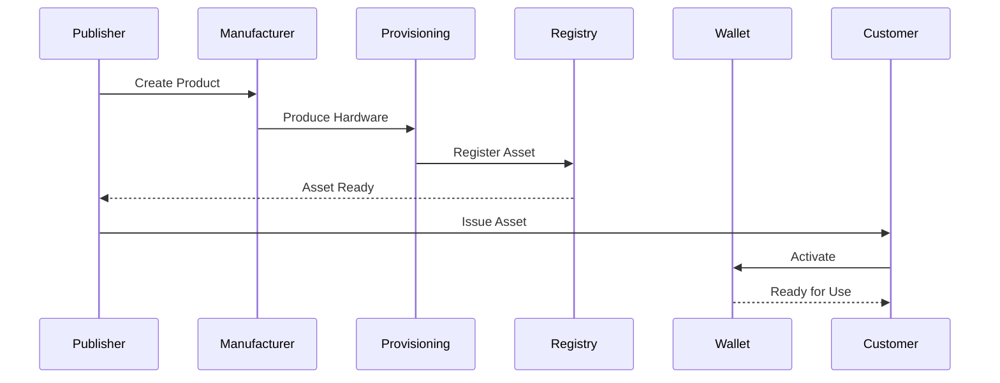

# Publishing Workflow

> _The Publishing Workflow defines the complete lifecycle for creating a Physical Digital Asset—from product design and manufacturing to issuance, activation, management, and retirement. It provides a standardized process that every DCN Publisher follows, regardless of the asset type or underlying blockchain._

***

## Introduction

Publishing a Physical Digital Asset is more than writing data to an NFC chip.

A trusted asset requires coordination between:

* Product definition
* Secure hardware
* Cryptographic identity
* Certificate infrastructure
* Asset Registry
* Blockchain settlement
* Lifecycle management

The **DCN Publishing Workflow** standardizes this process so that every Publisher follows a consistent and interoperable lifecycle.

Whether issuing a **CBDC**, **Stablecoin Note**, **Gift Card**, **University Certificate**, or **Digital Identity Credential**, the publishing process remains fundamentally the same.

***

## Purpose

The Publishing Workflow is designed to:

* Standardize asset creation
* Ensure secure provisioning
* Maintain interoperability
* Enable lifecycle management
* Reduce implementation differences
* Improve auditability
* Support multiple industries
* Support multiple blockchain networks

***

## Publishing Lifecycle

Every Physical Digital Asset follows the same high-level publishing lifecycle.

Each stage has clearly defined responsibilities and security requirements.

***

## Stage 1 — Design

The Publisher begins by defining the asset product.

Typical configuration includes:

* Asset Name
* Asset Profile (DCN-S, DCN-R, DCN-P, DCN-C)
* Supported Blockchain Networks
* Recovery Policy
* Ownership Model
* Transfer Rules
* Spending Rules
* Metadata Structure
* Security Requirements

At this stage, no physical assets exist.

Only the product definition is created.

***

## Stage 2 — Manufacturing

The Publisher works with a certified manufacturer to produce the Physical Digital Asset.

Typical manufacturing activities include:

* Secure Element installation
* NFC integration
* Physical printing
* Product serialization
* Anti-tamper protection
* Quality assurance

Manufacturing should occur only through trusted production facilities.

***

## Stage 3 — Provisioning

Provisioning transforms manufactured hardware into a trusted Physical Digital Asset.

Provisioning typically includes:

* Generate Device Identity
* Inject cryptographic keys
* Install Device Certificate
* Install Publisher Certificate
* Configure Secure Element
* Load product profile

At the end of provisioning, the device possesses a unique cryptographic identity.

***

## Stage 4 — Registration

The newly provisioned asset is registered within the DCN ecosystem.

Typical registration information includes:

* Asset Identifier
* Device Identifier
* Publisher
* Asset Profile
* Supported Networks
* Lifecycle Status
* Certificate References

The Asset Registry becomes the authoritative reference for future verification.

***

## Stage 5 — Issuance

Issuance assigns the Physical Digital Asset to its intended owner or holder.

Examples include:

* Customer purchases a Stablecoin Card
* Government issues an identity credential
* University issues a diploma
* Company issues an employee credential
* Retailer activates a gift card

Issuance establishes the first trusted relationship between the asset and its owner.

***

## Stage 6 — Activation

After issuance, the asset becomes active.

Activation may include:

* Wallet pairing
* Ownership confirmation
* Blockchain registration
* Balance initialization
* Security verification
* Policy activation

Only activated assets are available for normal operation.

***

## Stage 7 — Management

During its operational lifetime, the Publisher manages the asset.

Typical management functions include:

* Balance updates
* Metadata updates
* Ownership transfers
* Policy updates
* Recovery requests
* Suspension
* Monitoring
* Analytics

Management continues throughout the active lifecycle.

***

## Stage 8 — Retirement

Eventually, every asset reaches the end of its lifecycle.

Reasons include:

* Expiration
* Product replacement
* Hardware failure
* Security compromise
* Publisher policy
* Customer request

Retired assets are removed from active use while maintaining historical records where appropriate.

***

## End-to-End Workflow

This workflow remains consistent across all supported asset categories.

***

## Multi-Asset Workflow

The same publishing workflow applies to different products.

| Asset Type          | Workflow                                |
| ------------------- | --------------------------------------- |
| DCN-S               | Standard Workflow                       |
| DCN-R               | Standard Workflow                       |
| DCN-P               | Standard Workflow + Policies            |
| DCN-C               | Standard Workflow + Provenance          |
| Gift Card           | Standard Workflow                       |
| Event Ticket        | Standard Workflow                       |
| Identity Credential | Standard Workflow                       |
| CBDC                | Standard Workflow + Regulatory Controls |

This consistency is one of the strengths of the DCN Standard.

***

## Security Throughout the Workflow

Security is integrated into every stage.

| Stage         | Security Focus          |
| ------------- | ----------------------- |
| Design        | Policy definition       |
| Manufacturing | Trusted hardware        |
| Provisioning  | Key injection           |
| Registration  | Identity recording      |
| Issuance      | Ownership establishment |
| Activation    | Authentication          |
| Management    | Continuous protection   |
| Retirement    | Secure deactivation     |

There is no stage where security is optional.

***

## Automation

The Publishing Workflow is designed to support automation.

Future Publisher Platforms may automate:

* Product creation
* Manufacturing requests
* Provisioning
* Registry updates
* Certificate issuance
* Blockchain registration
* Monitoring
* Analytics

Automation reduces operational costs while improving consistency.

***

## Benefits

A standardized publishing workflow provides several advantages.

* Consistent asset lifecycle
* Faster product launches
* Simplified certification
* Interoperable implementations
* Improved security
* Easier auditing
* Better developer experience
* Lower integration costs

***

## Design Principles

The Publishing Workflow follows five principles.

#### Standardized

Every Publisher follows the same lifecycle.

#### Secure

Security is integrated into every stage.

#### Interoperable

Works across all asset types and blockchain networks.

#### Automated

Supports scalable operational workflows.

#### Auditable

Every stage can be independently verified.

***

## Summary

The Publishing Workflow defines the complete lifecycle of a Physical Digital Asset, from initial product design to secure retirement.

By standardizing design, manufacturing, provisioning, registration, issuance, activation, management, and retirement, the DCN Standard provides a repeatable and interoperable framework that enables organizations worldwide to publish trusted Physical Digital Assets at scale.
