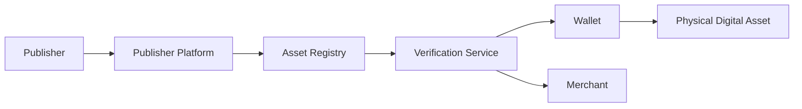
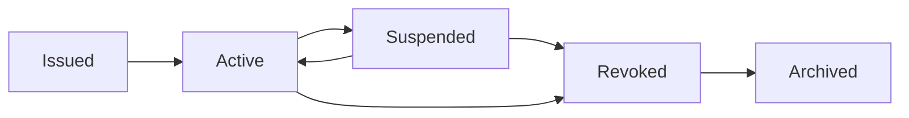
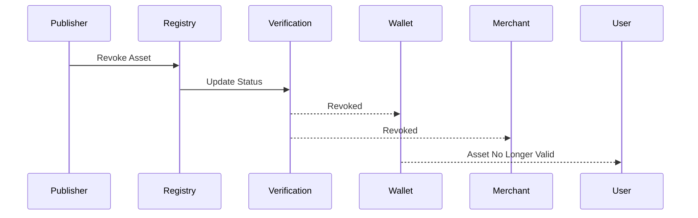

# Revocation

> _Revocation is the controlled process of permanently or temporarily invalidating a Physical Digital Asset. It protects the DCN ecosystem by ensuring that lost, stolen, compromised, expired, or unauthorized assets can no longer be trusted or used._

***

## Introduction

No secure ecosystem is complete without the ability to remove trust.

Even properly issued Physical Digital Assets may eventually become unsafe or invalid.

Examples include:

* A Physical Digital Asset is lost.
* A device is stolen.
* The Secure Element is compromised.
* A Publisher detects fraudulent activity.
* A product reaches its expiration date.
* A certificate is revoked.
* A government identity is replaced.
* A gift card campaign ends.

The DCN Standard provides a standardized **Revocation Framework** that allows Publishers to invalidate assets while preserving ecosystem integrity.

Revocation protects users, merchants, Publishers, and verification services from relying on assets that should no longer be trusted.

***

## Purpose

The Revocation architecture is designed to:

* Protect the ecosystem
* Invalidate compromised assets
* Support temporary suspension
* Support permanent revocation
* Prevent fraudulent transactions
* Update verification services
* Maintain auditability
* Preserve trust

***

## Revocation Principles

Every revocation operation follows five principles.

#### Authorized

Only authorized Publishers or designated authorities may revoke assets.

#### Verifiable

Revocation status must be independently verifiable.

#### Immediate

Revocation information should propagate as quickly as possible.

#### Auditable

Revocation events should be permanently recorded.

#### Policy Driven

Different asset categories may implement different revocation rules.

***

## Revocation Architecture



The Asset Registry acts as the authoritative source of revocation information.

***

## Revocation Lifecycle

An asset may transition through several operational states.



Not every suspended asset is permanently revoked.

***

## Suspension vs Revocation

The DCN Standard distinguishes between temporary suspension and permanent revocation.

| Suspension                 | Revocation                  |
| -------------------------- | --------------------------- |
| Temporary                  | Permanent                   |
| Can be reversed            | Cannot normally be reversed |
| Used during investigations | Used after final decision   |
| Asset may return to Active | Asset reaches end of trust  |

This distinction gives Publishers operational flexibility.

***

## Reasons for Revocation

Common reasons include:

* Lost asset
* Stolen asset
* Hardware compromise
* Counterfeit detection
* Fraud investigation
* Certificate expiration
* Policy violation
* Regulatory order
* Customer request
* Product retirement

Each event follows Publisher-defined procedures.

***

## Revocation Workflow



Every participant receives a consistent view of the asset's trust status.

***

## Revocation Scope

Revocation may apply to different entities.

| Revoked Object         | Example                 |
| ---------------------- | ----------------------- |
| Physical Digital Asset | Lost device             |
| Device Certificate     | Compromised hardware    |
| Publisher Certificate  | Unauthorized Publisher  |
| Merchant Certificate   | Fraudulent merchant     |
| Wallet Certificate     | Compromised application |
| Product Batch          | Manufacturing defect    |

The revocation framework is designed to operate across the entire trust infrastructure.

***

## Verification During Transactions

Before accepting an asset, wallets and merchants should verify:

* Revocation status
* Lifecycle status
* Certificate validity
* Publisher status
* Device authenticity

Assets marked as revoked should not be accepted for protected operations.

***

## Revocation Registry

The Asset Registry maintains current revocation information.

Typical records include:

* Asset Identifier
* Revocation Status
* Revocation Reason
* Revocation Time
* Publisher Reference
* Replacement Asset (if applicable)

Verification services use this information to determine asset validity.

***

## Asset Replacement

Revocation does not necessarily result in asset loss.

For recoverable products:

1. Original asset is revoked.
2. Replacement asset is provisioned.
3. Ownership is restored.
4. Replacement becomes active.

This approach is common for:

* Reloadable payment assets
* Government credentials
* Enterprise credentials
* Transit cards

***

## Customer Experience

If a revoked asset is presented, the Companion Wallet may display:

```
Status

Asset Revoked

Reason:
Reported Lost

Action:
Contact Publisher
```

The wallet should present clear guidance without exposing unnecessary technical details.

***

## Monitoring

The Publisher Platform may monitor:

* Daily revocations
* Suspended assets
* Revocation reasons
* Geographic trends
* Fraud indicators
* Replacement statistics

These metrics help improve operational security and customer support.

***

## Security Considerations

Revocation protects against:

* Continued use of stolen assets
* Counterfeit devices
* Certificate compromise
* Unauthorized ownership
* Fraudulent merchants
* Rogue Publishers

Revocation is therefore a critical element of the DCN Security Architecture.

***

## Future Enhancements

Future versions of the DCN Standard may support:

* Real-time global revocation propagation
* Decentralized revocation registries
* AI-assisted fraud detection
* Automatic risk-based suspension
* Cross-chain revocation synchronization
* Regional trust authorities

These enhancements can improve ecosystem responsiveness without changing the core revocation model.

***

## Design Principles

The Revocation architecture follows five principles.

#### Trusted

Only authorized entities may revoke assets.

#### Transparent

Revocation status is independently verifiable.

#### Immediate

Updates propagate rapidly throughout the ecosystem.

#### Secure

Revocation prevents continued misuse of compromised assets.

#### Interoperable

Works consistently across all asset types and supported blockchain networks.

***

## Summary

Revocation is the mechanism that removes trust from Physical Digital Assets when they are no longer safe or valid.

Through standardized lifecycle transitions, registry updates, verification services, and Publisher governance, the DCN Standard ensures that compromised or obsolete assets cannot continue participating in the ecosystem.

Together with issuance, management, authentication, and recovery, revocation completes the operational lifecycle of a trusted Physical Digital Asset.
