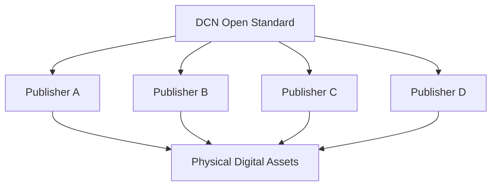
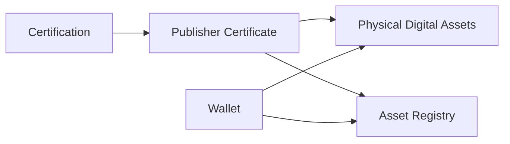

# Who Can Publish

> _The DCN Standard is an open publishing standard. Any qualified organization that complies with the DCN Specification, security requirements, and certification process can become a Publisher and issue Physical Digital Assets._

***

## Introduction

One of the most important design decisions behind the DCN Standard is that **publishing is open**.

DCN is **not** intended to be operated by a single company.

It is **not** a closed payment network.

It is **not** a proprietary card system.

Instead, DCN is an **open standard** that allows independent organizations around the world to issue trusted Physical Digital Assets.

This philosophy is similar to how:

* Anyone can create a website using Internet standards.
* Anyone can issue an ERC-20 token using Ethereum standards.
* Any manufacturer can build USB-compatible devices.

Likewise, any qualified organization can become a **DCN Publisher**.

The role of the DCN Standard is to define **how** assets are published—not **who** is allowed to innovate.

***

## Purpose

The Publisher framework is designed to:

* Enable open participation
* Promote interoperability
* Encourage innovation
* Prevent vendor lock-in
* Maintain ecosystem security
* Support global adoption
* Provide consistent governance
* Protect users through certification

***

## Publisher Philosophy

The DCN ecosystem separates **the standard** from **the Publisher**.



The DCN Foundation defines the standard.

Publishers create products using that standard.

This separation encourages competition, innovation, and long-term ecosystem growth.

***

## Eligible Publishers

Many different organizations may become Publishers.

| Organization                | Example Assets             |
| --------------------------- | -------------------------- |
| Central Bank                | CBDCs                      |
| Commercial Bank             | Payment Cards              |
| Stablecoin Issuer           | Stablecoin Notes           |
| Government Agency           | Digital Identity           |
| Retail Brand                | Gift Cards                 |
| Airline                     | Boarding Passes            |
| University                  | Diplomas                   |
| Transit Authority           | Transit Passes             |
| Enterprise                  | Employee Credentials       |
| Healthcare Provider         | Medical Credentials        |
| Gaming Company              | Digital Collectibles       |
| Carbon Registry             | Carbon Credit Certificates |
| Asset Tokenization Platform | Tokenized Bonds & RWAs     |

The DCN Standard is industry-neutral.

***

## Publisher Categories

Publishers may be grouped according to their primary function.

| Category                 | Description                       |
| ------------------------ | --------------------------------- |
| Financial Publisher      | Payments and digital money        |
| Government Publisher     | Public services and identity      |
| Enterprise Publisher     | Internal organizational assets    |
| Educational Publisher    | Academic records                  |
| Commercial Publisher     | Gift cards and loyalty            |
| Event Publisher          | Tickets and access                |
| Infrastructure Publisher | Transit and utilities             |
| Digital Asset Publisher  | Collectibles and tokenized assets |

Each category may apply different business rules while following the same technical standard.

***

## Publisher Responsibilities

Every Publisher is responsible for:

* Defining asset products
* Issuing Physical Digital Assets
* Maintaining security policies
* Managing asset lifecycles
* Supporting recovery procedures
* Maintaining compliance
* Protecting customer trust
* Cooperating with ecosystem governance

These responsibilities exist regardless of the industry.

***

## Publisher Requirements

To participate in the DCN ecosystem, a Publisher should satisfy several technical requirements.

Examples include:

* Implement the DCN Standard
* Use certified Secure Hardware
* Support the Certificate Infrastructure
* Maintain secure key management
* Operate secure issuance systems
* Support verification services
* Maintain lifecycle records

Additional regulatory requirements may apply depending on jurisdiction.

***

## Publisher Certification

Although the DCN Standard is open, trust requires verification.

Publishers should complete an ecosystem certification process before issuing trusted Physical Digital Assets.

Certification may evaluate:

* Security controls
* Issuance procedures
* Key management
* Operational processes
* Compliance with the DCN Specification
* Interoperability testing

Successful certification enables the Publisher to receive a trusted Publisher Certificate.

***

## Publisher Identity

Every Publisher receives a globally unique Publisher Identity.

Example:

```
Publisher ID

dcn.publisher.cardaxo
```

The Publisher Identity appears in:

* Publisher Certificates
* Asset Registry
* Physical Digital Assets
* Verification services
* Lifecycle records

This allows every issued asset to be traced back to its originating Publisher.

***

## Multi-Chain Publishing

A Publisher may issue assets across multiple blockchain ecosystems.

Example:

| Product         | Settlement Network    |
| --------------- | --------------------- |
| Stablecoin Card | Ethereum              |
| Loyalty Card    | Polygon               |
| Corporate Asset | Enterprise Blockchain |
| CBDC Device     | Permissioned Ledger   |
| Collectible     | Solana                |

Despite using different settlement infrastructures, all assets follow the same DCN publishing model.

***

## Multi-Asset Publishing

A single Publisher may manage many different asset types.

Example:

```
Publisher

├── DCN-S Digital Cash
├── DCN-R Reloadable Card
├── Gift Cards
├── Event Tickets
├── Loyalty Program
├── Transit Pass
├── Identity Credential
└── Digital Collectibles
```

The Publisher Platform provides one operational environment for all supported products.

***

## Publisher Trust

Trust is established through multiple layers.



Users trust the Publisher because the ecosystem can independently verify its identity and certification status.

***

## Governance

The DCN Foundation defines the technical standard.

Publishers remain responsible for:

* Their products
* Business policies
* Customer relationships
* Regulatory compliance
* Operational security

This balance encourages innovation while preserving ecosystem interoperability.

***

## Business Opportunities

The open Publisher model enables entirely new markets.

Organizations can launch products such as:

* National CBDCs
* Global stablecoin cards
* Branded gift cards
* Physical NFTs
* University credentials
* Corporate identity cards
* Tourism passes
* Carbon credit certificates
* Tokenized real estate certificates
* Government benefit cards

The DCN Standard provides the common infrastructure for all of these use cases.

***

## Design Principles

The Publisher model follows five principles.

#### Open

Any qualified organization can participate.

#### Trusted

Participation is supported by certification and cryptographic identity.

#### Interoperable

All Publishers follow the same technical specification.

#### Competitive

Innovation occurs at the Publisher level rather than through proprietary protocols.

#### Scalable

The ecosystem is designed to support millions of Publishers and billions of Physical Digital Assets.

***

## Summary

The DCN Publisher model transforms Physical Digital Assets into an open ecosystem rather than a closed payment network.

By allowing qualified organizations across finance, government, education, transportation, retail, healthcare, gaming, and enterprise sectors to become Publishers, the DCN Standard creates a universal infrastructure for issuing trusted Physical Digital Assets.

This open publishing approach is one of the defining characteristics of the DCN ecosystem and a key reason it can evolve into a global standard for Physical Digital Assets.
