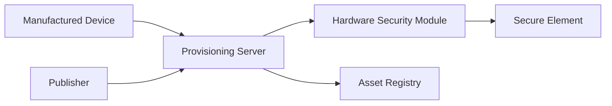
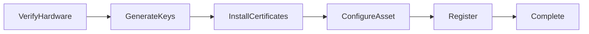

# Provisioning

> _Provisioning is the secure personalization process that transforms manufactured hardware into a trusted Physical Digital Asset. During provisioning, cryptographic identities, certificates, asset profiles, and Publisher information are securely installed, making the device ready for issuance._

***

## Introduction

A manufactured device is only hardware.

Even with a Secure Element, NFC interface, and anti-tamper protection, it cannot participate in the DCN ecosystem until it receives its cryptographic identity.

**Provisioning** is the process that gives a Physical Digital Asset its digital identity.

It is one of the most security-critical operations in the entire DCN lifecycle.

During provisioning, the device is transformed from a blank secure product into a trusted DCN-compatible Physical Digital Asset.

Provisioning establishes:

* Device Identity
* Cryptographic Keys
* Device Certificates
* Publisher Certificates
* Asset Profile
* Security Policies
* Blockchain Configuration
* Initial Lifecycle State

After provisioning, the device is ready to be issued by the Publisher.

***

## Purpose

The Provisioning architecture is designed to:

* Install trusted identities
* Protect cryptographic keys
* Configure asset profiles
* Register devices
* Establish trust
* Prevent unauthorized personalization
* Prepare assets for issuance

***

## Provisioning Architecture



The Provisioning Server securely coordinates the personalization process, while sensitive cryptographic operations are protected by Hardware Security Modules (HSMs) and the Secure Element.

***

## Provisioning Objectives

Provisioning should ensure that every device receives:

* A globally unique identity
* Secure cryptographic keys
* Trusted certificates
* Publisher information
* Asset configuration
* Lifecycle status
* Blockchain compatibility

No two Physical Digital Assets should receive the same identity or key material.

***

## Provisioning Workflow



Each stage builds upon the previous one to establish a trusted device.

***

## Stage 1 — Hardware Verification

Before personalization begins, the provisioning system verifies that the device is genuine.

Typical checks include:

* Secure Element authenticity
* Device serial number
* Manufacturer certificate
* Firmware integrity
* Hardware version
* Production batch

Only verified hardware proceeds to provisioning.

***

## Stage 2 — Key Generation

Every Physical Digital Asset requires unique cryptographic keys.

Best practice is to generate keys **inside the Secure Element**, ensuring that private keys never leave trusted hardware.

Typical keys include:

* Device Key Pair
* Authentication Key
* Secure Messaging Key
* Optional Asset-Specific Keys

These keys become the cryptographic foundation of the device.

***

## Stage 3 — Certificate Installation

Once keys are available, certificates are installed.

Typical certificates include:

| Certificate                     | Purpose                             |
| ------------------------------- | ----------------------------------- |
| Device Certificate              | Identifies the hardware             |
| Publisher Certificate           | Identifies the issuing organization |
| Manufacturer Certificate        | Establishes manufacturing trust     |
| Optional Enterprise Certificate | Organization-specific trust         |

Certificates allow wallets and merchants to verify the authenticity of the device.

***

## Stage 4 — Asset Configuration

The Publisher configures the asset according to its product definition.

Typical configuration includes:

* Asset Profile
* Supported Networks
* Recovery Policy
* Ownership Policy
* Transfer Rules
* Spending Rules
* Metadata Schema
* Protocol Version

This information determines how the Physical Digital Asset behaves after issuance.

***

## Stage 5 — Registry Registration

The newly provisioned device is registered with the Asset Registry.

Typical registration data includes:

* Asset ID
* Device ID
* Publisher ID
* Certificate References
* Product Type
* Supported Networks
* Lifecycle State

Registration enables future verification and lifecycle management.

***

## Stage 6 — Provisioning Complete

After successful provisioning:

```
Lifecycle Status

Provisioned

Ready for Issuance
```

The asset is now trusted by the DCN ecosystem but has not yet been assigned to an owner.

***

## Provisioning Data

The Secure Element may contain information such as:

| Data                  | Description                           |
| --------------------- | ------------------------------------- |
| Device Identity       | Permanent hardware identity           |
| Public Keys           | Verification keys                     |
| Private Keys          | Securely protected cryptographic keys |
| Device Certificate    | Hardware authenticity                 |
| Publisher Certificate | Issuing organization                  |
| Asset Profile         | Product definition                    |
| Protocol Version      | Supported DCN version                 |

Private keys should remain non-exportable throughout the device's lifetime.

***

## Security Controls

Provisioning is protected through multiple security mechanisms.

Examples include:

* Hardware Security Modules (HSMs)
* Mutual authentication
* Secure channels
* Certificate validation
* Role-based authorization
* Audit logging
* Tamper detection

Unauthorized provisioning should be technically prevented.

***

## Batch Provisioning

Large-scale production often provisions devices in batches.

Example:

```
Provisioning Batch

Batch ID:
P-2027-00452

Product:
DCN-S Digital Cash

Devices:
100,000

Publisher:
Global Stable Ltd.
```

Batch management simplifies manufacturing and operational reporting.

***

## Failed Provisioning

If provisioning fails:

* The device remains inactive.
* No trusted identity is established.
* Certificates are not accepted.
* The asset cannot be issued.

Failed devices should be isolated for investigation or securely destroyed according to Publisher policy.

***

## Relationship with Issuance

Provisioning and Issuance are distinct processes.

| Provisioning           | Issuance                   |
| ---------------------- | -------------------------- |
| Creates trusted device | Creates trusted asset      |
| Installs identity      | Assigns ownership          |
| Configures hardware    | Activates business product |
| Registers device       | Delivers asset to customer |

Separating these responsibilities improves operational security and flexibility.

***

## Future Enhancements

Future versions of the DCN Standard may support:

* Remote secure provisioning
* Zero-touch provisioning
* Automated HSM integration
* Decentralized provisioning services
* Multi-Publisher provisioning
* AI-assisted provisioning validation

These capabilities will improve scalability while maintaining the same trust model.

***

## Design Principles

The Provisioning architecture follows five principles.

#### Trusted

Only authorized systems may provision devices.

#### Secure

Private keys remain protected inside Secure Hardware.

#### Standardized

Every Physical Digital Asset follows the same provisioning model.

#### Traceable

Every provisioning operation is recorded and auditable.

#### Scalable

Supports both small deployments and global manufacturing volumes.

***

## Summary

Provisioning transforms manufactured hardware into a trusted Physical Digital Asset.

By securely generating cryptographic identities, installing certificates, configuring asset profiles, and registering devices within the DCN ecosystem, the provisioning process establishes the trusted digital foundation required for issuance, payments, ownership, and long-term lifecycle management.
