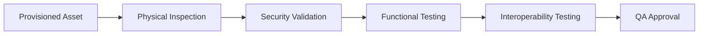
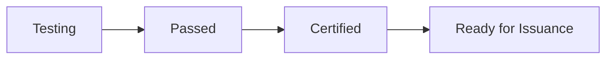

# Quality Assurance

> _Quality Assurance (QA) ensures that every Physical Digital Asset produced under the DCN Standard meets defined requirements for security, functionality, interoperability, durability, and reliability before it is issued into the ecosystem._

***

## Introduction

Manufacturing and provisioning alone do not guarantee a trusted Physical Digital Asset.

Every device must be verified before it reaches the Publisher or end user.

Quality Assurance (QA) is the final validation stage of the manufacturing process.

Its purpose is to ensure that each Physical Digital Asset:

* Operates correctly
* Meets DCN specifications
* Contains authentic hardware
* Functions with compliant wallets
* Successfully completes security validation
* Is ready for issuance

Quality Assurance is not limited to physical inspection.

It also includes cryptographic verification, interoperability testing, and lifecycle validation.

***

## Purpose

The Quality Assurance framework is designed to:

* Verify manufacturing quality
* Validate Secure Hardware
* Confirm provisioning success
* Test interoperability
* Detect production defects
* Improve manufacturing reliability
* Protect ecosystem trust
* Reduce operational failures

***

## QA Architecture



Only assets that successfully complete all required validation stages should proceed to issuance.

***

## Quality Objectives

Every Physical Digital Asset should satisfy the following objectives.

#### Secure

Hardware and cryptographic identities are genuine.

#### Functional

All features operate correctly.

#### Interoperable

The asset works with compliant wallets and merchant systems.

#### Reliable

The asset performs consistently under expected operating conditions.

#### Traceable

Quality results are recorded for future reference.

***

## Physical Inspection

The first stage verifies physical quality.

Typical inspection items include:

* Card dimensions
* NFC antenna placement
* Printing quality
* Surface finish
* Anti-tamper features
* Packaging
* Product labeling

Damaged or defective products should be rejected before further testing.

***

## Hardware Validation

Secure Hardware is verified before release.

Typical checks include:

* Secure Element authenticity
* NFC communication
* Device serial number
* Hardware version
* Manufacturer certificate
* Secure boot status

Only trusted hardware should pass QA.

***

## Security Validation

Security testing confirms that the asset meets DCN security requirements.

Typical tests include:

* Device authentication
* Certificate validation
* Challenge-response verification
* Secure messaging
* Cryptographic key integrity
* Replay protection
* Tamper detection

These tests verify that the device behaves as a trusted Physical Digital Asset.

***

## Functional Testing

Each functional capability should be verified.

Examples include:

* NFC communication
* Wallet pairing
* Asset reading
* Authentication
* Payment authorization
* Metadata retrieval
* Lifecycle reporting

Every supported feature should operate according to the DCN Specification.

***

## Interoperability Testing

Quality Assurance includes interoperability testing.

The asset should successfully communicate with:

* DCN Companion Wallets
* Merchant Applications
* Verification Services
* Publisher Platforms
* Asset Registry
* Chain Adapters

Interoperability is one of the defining goals of the DCN Standard.

***

## Environmental Testing

Depending on the product category, additional environmental testing may be performed.

Examples include:

* Temperature resistance
* Humidity testing
* Mechanical stress
* Bending tests
* Vibration
* Water resistance
* Wear testing

These tests help ensure long-term reliability in real-world environments.

***

## Performance Testing

Performance metrics may include:

| Metric                  | Example                 |
| ----------------------- | ----------------------- |
| NFC Detection Time      | < 300 ms                |
| Authentication Time     | Within Publisher policy |
| Provisioning Validation | 100% success            |
| Wallet Recognition      | Successful              |
| Secure Messaging        | Successful              |

The DCN Standard intentionally avoids prescribing mandatory performance values, allowing implementations to evolve while maintaining interoperability.

***

## Batch Validation

Quality Assurance is performed on both individual devices and manufacturing batches.

Example:

```
QA Batch Report

Batch ID:
QA-2027-0048

Devices Tested:
10,000

Passed:
9,996

Rejected:
4

Status:
Approved
```

Batch validation improves manufacturing efficiency while maintaining quality standards.

***

## Failure Handling

If an asset fails QA:

* It is removed from the production batch.
* It is not issued.
* The failure is recorded.
* The root cause is investigated.
* Corrective actions are applied.

Rejected devices should never enter the trusted DCN ecosystem.

***

## QA Reporting

Quality reports may include:

* Batch information
* Manufacturing facility
* Test results
* Security validation
* Interoperability results
* Failure statistics
* Certification status

These reports support traceability and operational transparency.

***

## Certification

After successful QA, the asset is approved for issuance.



Certification confirms that the Physical Digital Asset complies with the Publisher's manufacturing requirements and the DCN Standard.

***

## Continuous Improvement

Publishers and manufacturers should continuously improve quality by analyzing:

* Failure rates
* Security incidents
* Customer feedback
* Manufacturing defects
* Interoperability issues
* Warranty claims

This feedback helps strengthen future production.

***

## Future Enhancements

Future versions of the DCN Standard may introduce:

* AI-assisted visual inspection
* Automated interoperability laboratories
* Predictive quality analytics
* Digital quality passports
* Continuous production monitoring
* Self-diagnostic hardware testing

These technologies can further improve manufacturing quality and operational efficiency.

***

## Design Principles

The Quality Assurance architecture follows five principles.

#### Comprehensive

Tests hardware, software, and interoperability.

#### Independent

Quality validation is objective and repeatable.

#### Traceable

Every result is recorded and auditable.

#### Reliable

Only verified assets are approved.

#### Scalable

Supports production ranging from small batches to global manufacturing volumes.

***

## Summary

Quality Assurance is the final manufacturing safeguard before a Physical Digital Asset enters the DCN ecosystem.

Through comprehensive physical inspection, hardware validation, security testing, functional verification, interoperability testing, and certification, the DCN Standard ensures that every approved asset is secure, reliable, and ready for issuance.
