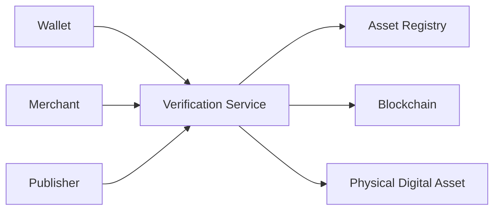
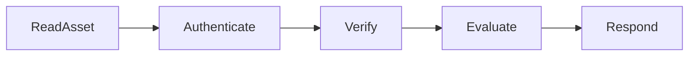

# 15. Verification Services

> _Verification Services provide the trust layer of the DCN ecosystem. They enable wallets, merchants, publishers, enterprises, and governments to verify the authenticity, ownership, lifecycle status, and trustworthiness of Physical Digital Assets before performing sensitive operations._

***

## Introduction

Trust is one of the most valuable components of the DCN ecosystem.

A merchant must know that a payment asset is genuine.

A wallet must know that a Physical Digital Asset has not been cloned.

A government must know that a credential was issued by an authorized Publisher.

An enterprise must know that an employee credential remains active.

These questions cannot always be answered by the Physical Digital Asset alone.

Instead, they require trusted verification services.

The **DCN Verification Services** provide standardized methods for validating assets, certificates, ownership, and lifecycle information without exposing unnecessary technical complexity to users.

Verification is not limited to payments.

It applies to every interaction within the DCN ecosystem.

***

## Purpose

The Verification Services architecture is designed to:

* Verify asset authenticity
* Validate Publisher trust
* Verify ownership
* Detect revoked assets
* Support merchants
* Support Companion Wallets
* Enable enterprise and government services
* Maintain ecosystem trust

***

## Verification Architecture

Verification Services act as a trusted information layer between ecosystem participants.

***

## Why Verification Matters

Without verification:

* Counterfeit assets cannot be detected.
* Revoked devices may continue to operate.
* Fraudulent Publishers may impersonate trusted organizations.
* Ownership cannot be independently validated.
* Merchants cannot confidently accept payments.

Verification protects every participant within the ecosystem.

***

## What Can Be Verified?

Verification Services may validate:

| Verification Type  | Purpose                                  |
| ------------------ | ---------------------------------------- |
| Asset Authenticity | Confirm genuine hardware                 |
| Publisher          | Confirm issuing organization             |
| Ownership          | Verify authorized owner where applicable |
| Lifecycle          | Check operational status                 |
| Certificates       | Validate trust chain                     |
| Blockchain State   | Verify on-chain information              |
| Asset Metadata     | Validate asset configuration             |

The exact verification process depends on the asset profile and Publisher policy.

***

## Verification Principles

Every verification process should follow these principles.

#### Independent

Verification should not rely solely on the presented asset.

#### Cryptographic

Trust is established using digital signatures and certificates.

#### Privacy Respecting

Only necessary information is disclosed.

#### Fast

Verification should complete quickly enough for real-world usage.

#### Interoperable

Results should be consistent across the DCN ecosystem.

***

## Verification Workflow

The workflow remains consistent regardless of the asset category.

***

## Verification Participants

Several participants may request verification.

| Participant      | Purpose                |
| ---------------- | ---------------------- |
| Companion Wallet | User verification      |
| Merchant         | Payment verification   |
| Publisher        | Lifecycle management   |
| Government       | Identity verification  |
| Enterprise       | Employee validation    |
| API Client       | Automated verification |

The same verification infrastructure serves many different applications.

***

## Verification Response

Verification Services should provide standardized responses.

Typical results include:

| Status    | Meaning                    |
| --------- | -------------------------- |
| Verified  | Asset is trusted           |
| Suspended | Temporarily restricted     |
| Revoked   | Asset is no longer trusted |
| Expired   | Asset validity has ended   |
| Unknown   | Verification unavailable   |

These responses allow applications to make consistent decisions.

***

## Relationship to Following Sections

Verification Services are divided into four functional areas:

* **Authenticity** — Is the Physical Digital Asset genuine?
* **Ownership** — Who controls the asset?
* **Revocation** — Has trust been removed?
* **Analytics** — What operational insights can be derived?

Together, these services provide the trust layer that enables secure interactions across the DCN ecosystem.

***

## Summary

Verification Services provide the independent trust mechanism that underpins the DCN ecosystem.

By validating authenticity, ownership, certificates, lifecycle status, and blockchain information, they enable wallets, merchants, governments, and enterprises to interact confidently with Physical Digital Assets while preserving security, privacy, and interoperability.

***

## In this chapter

* [Authenticity](authenticity.md)
* [Ownership Check](ownership-check.md)
* [Revocation Check](revocation-check.md)
* [Analytics](analytics.md)
