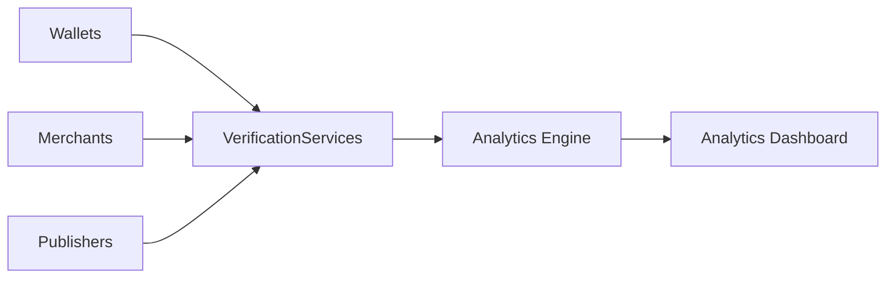

# Analytics

> _Analytics Services provide operational intelligence for the DCN ecosystem by transforming verification events into actionable insights. They enable Publishers, merchants, enterprises, governments, and ecosystem operators to monitor trust, security, adoption, and system health without compromising user privacy._

***

## Introduction

Every interaction within the DCN ecosystem generates valuable operational data.

Examples include:

* Payment verification
* Authentication requests
* Ownership verification
* Asset activation
* Merchant transactions
* Recovery requests
* Revocation checks
* Certificate validation

Individually, these events confirm trust.

Collectively, they provide a real-time view of the health and performance of the entire ecosystem.

The purpose of Analytics Services is **not** to monitor users.

Its purpose is to monitor the **ecosystem**.

The DCN Standard follows a **privacy-by-design** approach, where analytics focus on operational metrics rather than unnecessary personal information.

***

## Purpose

Analytics Services are designed to:

* Monitor ecosystem health
* Measure adoption
* Detect security anomalies
* Improve operational efficiency
* Support Publisher reporting
* Assist regulatory compliance
* Enable business intelligence
* Guide future ecosystem development

***

## Analytics Architecture



The Analytics Engine aggregates operational events and transforms them into meaningful insights.

***

## Analytics Sources

Analytics may be generated from:

| Source                | Example Events                 |
| --------------------- | ------------------------------ |
| Companion Wallet      | Authentication, payments       |
| Merchant Systems      | Transaction acceptance         |
| Publisher Platform    | Issuance, recovery, revocation |
| Verification Services | Authenticity checks            |
| Asset Registry        | Lifecycle updates              |
| Chain Adapters        | Settlement status              |

These sources provide a comprehensive operational view of the ecosystem.

***

## Analytics Categories

The DCN Standard groups analytics into several categories.

| Category    | Purpose                |
| ----------- | ---------------------- |
| Operational | System performance     |
| Security    | Threat monitoring      |
| Asset       | Lifecycle statistics   |
| Merchant    | Payment activity       |
| Publisher   | Product performance    |
| Network     | Blockchain utilization |
| Adoption    | Ecosystem growth       |

Each category helps organizations make informed operational decisions.

***

## Operational Dashboard

A Publisher Dashboard may display:

```
Active Assets

2,450,000

-------------------------

Daily Transactions

18,720,000

-------------------------

Verification Requests

145,000,000

-------------------------

Successful Authentications

99.98%

-------------------------

Active Merchants

84,320

-------------------------

Connected Wallets

12,800,000
```

These metrics provide a real-time overview of ecosystem activity.

***

## Security Analytics

Analytics can help identify unusual operational patterns.

Examples include:

* Increased authentication failures
* Repeated counterfeit attempts
* Certificate validation failures
* Suspicious ownership transfers
* Geographic anomalies
* Abnormal merchant activity
* Device cloning indicators

Security analytics support early detection of ecosystem threats.

***

## Asset Analytics

Publishers may monitor:

* Assets issued
* Assets activated
* Assets transferred
* Assets recovered
* Assets suspended
* Assets revoked
* Assets retired

These metrics help manage the lifecycle of Physical Digital Assets.

***

## Merchant Analytics

Merchant insights may include:

* Transaction volume
* Accepted asset categories
* Average payment value
* Peak transaction periods
* Settlement performance
* Refund statistics

These analytics support business optimization and capacity planning.

***

## Publisher Analytics

Publishers may analyze:

* Product adoption
* Geographic distribution
* Asset utilization
* Recovery rates
* Customer growth
* Manufacturing batches
* Lifecycle transitions

This information helps improve product strategy and operational planning.

***

## Ecosystem Analytics

At the ecosystem level, analytics may provide insights into:

* Number of active Publishers
* Number of certified manufacturers
* Number of active merchants
* Number of Companion Wallets
* Number of supported blockchain networks
* Global transaction volume
* Asset category distribution

These metrics reflect the maturity and growth of the DCN ecosystem.

***

## Privacy by Design

Analytics should respect user privacy.

The DCN Standard recommends:

* Aggregated reporting
* Data minimization
* Role-based access
* Pseudonymization where appropriate
* Compliance with applicable privacy regulations

Personal information should not be collected unless required for the specific application and permitted by law.

***

## Reporting

Analytics Services may generate reports such as:

* Daily operational reports
* Monthly Publisher reports
* Merchant performance reports
* Security incident reports
* Manufacturing quality reports
* Ecosystem growth reports

Reports support governance, planning, and continuous improvement.

***

## AI-Assisted Analytics

Future Publisher Platforms may use AI to:

* Detect fraud patterns
* Predict hardware failures
* Forecast transaction demand
* Identify counterfeit trends
* Recommend operational improvements
* Detect abnormal ecosystem behavior

AI should augment operational decision-making while remaining transparent and accountable.

***

## Future Enhancements

Future versions of the DCN Standard may include:

* Cross-chain ecosystem analytics
* Digital twin monitoring
* Carbon footprint reporting
* Sustainability metrics
* Predictive operational intelligence
* Real-time ecosystem health scoring

These enhancements will expand the value of analytics without altering the core verification model.

***

## Design Principles

Analytics Services follow five principles.

#### Privacy First

Operational insights should not compromise user privacy.

#### Actionable

Analytics should support informed decision-making.

#### Accurate

Metrics should be derived from trusted operational events.

#### Scalable

Supports billions of assets and transactions.

#### Interoperable

Works consistently across all Publishers, merchants, wallets, and blockchain networks.

***

## Summary

Analytics Services transform verification events into operational intelligence for the DCN ecosystem.

By providing standardized insights into security, adoption, asset lifecycles, merchant operations, Publisher performance, and ecosystem growth, the DCN Standard enables organizations to manage Physical Digital Assets efficiently while preserving privacy, transparency, and long-term trust.
