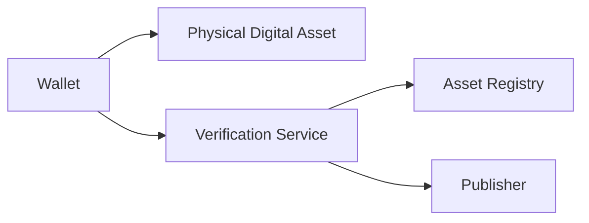
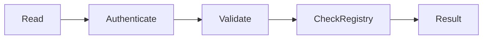
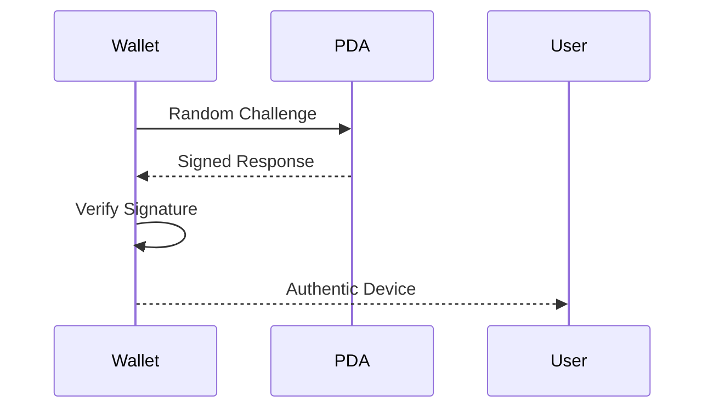

# Authenticity

> _Authenticity Verification confirms that a Physical Digital Asset is genuine, untampered, and issued by an authorized Publisher. It is the first trust decision performed before any payment, ownership transfer, identity verification, or asset interaction._

***

## Introduction

A Physical Digital Asset should never be trusted based solely on its appearance.

An attacker may successfully copy:

* Printed graphics
* Logos
* QR codes
* NFC identifiers
* Product packaging

However, what cannot easily be copied is the **cryptographic identity** established during secure provisioning.

The purpose of Authenticity Verification is to answer one simple question:

> **"Is this a genuine DCN Physical Digital Asset?"**

Every important operation in the DCN ecosystem begins with answering this question.

***

## Purpose

Authenticity Verification is designed to:

* Verify genuine hardware
* Detect counterfeit devices
* Validate cryptographic identity
* Confirm Publisher authenticity
* Prevent cloned devices
* Protect merchants and users
* Establish trust before transactions

***

## What is Authenticity?

Within the DCN Standard, authenticity means that a Physical Digital Asset:

* Was manufactured using trusted hardware.
* Was provisioned securely.
* Possesses a valid Device Certificate.
* Was issued by an authorized Publisher.
* Has not been revoked.
* Has not been modified outside approved processes.

Authenticity is determined through cryptographic proof—not visual inspection.

***

## Authenticity Architecture



The wallet combines information from the asset and trusted verification services to determine authenticity.

***

## Verification Workflow

A standard authenticity check follows these stages.



Each stage strengthens confidence in the asset's authenticity.

***

## What is Verified?

Authenticity verification may include:

| Verification Item     | Purpose                     |
| --------------------- | --------------------------- |
| Device Identity       | Verify genuine hardware     |
| Device Certificate    | Verify trust chain          |
| Publisher Certificate | Verify issuing organization |
| Secure Element        | Verify protected hardware   |
| Protocol Version      | Verify compatibility        |
| Lifecycle Status      | Verify operational state    |
| Revocation Status     | Verify continued trust      |

Together, these checks establish confidence in the Physical Digital Asset.

***

## Authentication and Authenticity

Authentication and authenticity are closely related but serve different purposes.

| Authentication              | Authenticity                                   |
| --------------------------- | ---------------------------------------------- |
| Confirms identity           | Confirms legitimacy                            |
| Uses challenge-response     | Uses certificates and trust validation         |
| Occurs during communication | Determines whether the asset should be trusted |

Authentication proves **who** the device is.

Authenticity determines **whether it should be trusted**.

***

## Challenge–Response Verification

Authenticity relies on challenge–response verification.



Since the private key never leaves the Secure Element, cloned devices cannot successfully respond to the challenge.

***

## Certificate Validation

Every genuine Physical Digital Asset presents a valid certificate chain.

The wallet verifies:

* Device Certificate
* Manufacturer Certificate
* Publisher Certificate
* Root Certificate Authority

If any certificate fails validation, the asset should not be trusted.

***

## Registry Verification

Authenticity also depends on the Asset Registry.

The wallet may verify:

* Asset Identifier
* Lifecycle State
* Revocation Status
* Publisher Information
* Supported Asset Profile
* Supported Networks

Registry verification provides an additional layer of protection.

***

## Asset Categories

Authenticity applies to every Physical Digital Asset.

Examples include:

| Asset Category      | Authenticity Verification        |
| ------------------- | -------------------------------- |
| DCN-S               | Payment device validation        |
| DCN-R               | Reloadable asset validation      |
| DCN-P               | Policy-enabled device validation |
| DCN-C               | Collectible authenticity         |
| CBDC                | Government-issued validation     |
| Gift Card           | Retail authenticity              |
| Identity Credential | Credential validation            |
| Event Ticket        | Entry validation                 |

The verification process remains consistent across all categories.

***

## User Experience

Authenticity should be simple for users.

Example wallet result:

```
✓ Verified

Publisher:
Global Stable Ltd.

Asset:
DCN-R Reloadable

Status:
Authentic
```

Complex certificate processing remains hidden from the user.

***

## Merchant Experience

Before accepting payment, merchants may automatically verify:

* Device authenticity
* Publisher trust
* Lifecycle status
* Revocation status

Verification occurs in the background and should not delay the payment experience.

***

## Failure Handling

If authenticity cannot be established, the wallet or merchant may display:

```
Verification Failed

Reason:
Certificate Invalid

Recommendation:
Do Not Trust This Asset
```

The DCN Standard prioritizes safety over convenience.

***

## Security Considerations

Authenticity Verification protects against:

* Counterfeit hardware
* Cloned devices
* Fake Publishers
* Certificate forgery
* Device substitution
* Unauthorized manufacturing

It is one of the primary defenses within the DCN Security Architecture.

***

## Future Enhancements

Future versions of the DCN Standard may support:

* AI-assisted counterfeit detection
* Hardware fingerprint verification
* Decentralized verification services
* Risk scoring
* Continuous trust monitoring

These capabilities can enhance authenticity without changing the core verification model.

***

## Design Principles

Authenticity Verification follows five principles.

#### Cryptographic

Trust is based on digital proof.

#### Independent

Verification does not rely on visual inspection.

#### Layered

Multiple trust mechanisms work together.

#### Fast

Suitable for real-time payments and interactions.

#### Universal

Applicable to every Physical Digital Asset category.

***

## Summary

Authenticity Verification is the first and most fundamental trust decision within the DCN ecosystem.

By validating hardware identity, certificates, Publisher authority, registry information, and lifecycle status, the DCN Standard enables wallets, merchants, governments, and enterprises to confidently distinguish genuine Physical Digital Assets from counterfeit or unauthorized devices.
