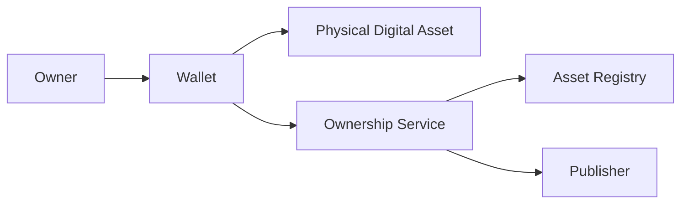
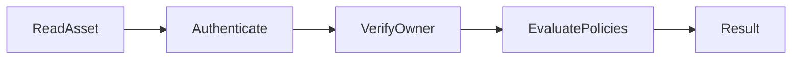
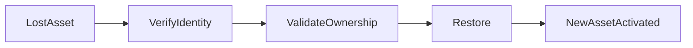

# Ownership Check

> _Ownership Verification determines who has the legitimate authority to control, use, or transfer a Physical Digital Asset. It enables trusted ownership validation while supporting privacy, recoverability, and different ownership models across the DCN ecosystem._

***

## Introduction

Authenticity answers the question:

> **"Is this a genuine Physical Digital Asset?"**

Ownership answers a different question:

> **"Who has the legitimate authority to use or control it?"**

These two concepts are intentionally separate.

A Physical Digital Asset may be authentic but no longer belong to its original owner.

Likewise, an asset may be genuine but temporarily assigned to another person, organization, or device.

The DCN Standard therefore treats **ownership** as a dynamic relationship that can change throughout the lifecycle of an asset while preserving its authenticity.

***

## Purpose

Ownership Verification is designed to:

* Verify legitimate ownership
* Support secure ownership transfers
* Prevent unauthorized use
* Enable asset recovery
* Support enterprise and shared ownership
* Respect user privacy
* Maintain an auditable ownership history

***

## Ownership Model

Every Physical Digital Asset has an ownership state.

Depending on the asset type, ownership may represent:

* An individual user
* A business
* A government agency
* A merchant
* A custodian
* A smart account
* A decentralized organization (DAO)

Ownership is determined by the Publisher's policy and the asset profile.

***

## Ownership Architecture

Ownership information is validated through trusted services rather than relying solely on data stored on the Physical Digital Asset.

***

## Ownership Verification Workflow

Ownership verification combines cryptographic proof with Publisher policies and lifecycle information.

***

## Ownership Models

The DCN Standard supports multiple ownership models.

| Ownership Model | Example                    |
| --------------- | -------------------------- |
| Individual      | Consumer wallet            |
| Enterprise      | Employee credential        |
| Government      | National identity          |
| Merchant        | Store-issued gift card     |
| Custodial       | Bank-managed asset         |
| Shared          | Family account             |
| Smart Account   | Account abstraction wallet |
| DAO             | Community treasury         |

The ownership model depends on the intended use of the asset.

***

## Holder vs Owner

The DCN Standard distinguishes between a **Holder** and an **Owner**.

| Holder                          | Owner                                |
| ------------------------------- | ------------------------------------ |
| Possesses the asset             | Has legal or cryptographic authority |
| May be temporary                | Usually permanent until transferred  |
| Can use the asset if authorized | Defines permissions and policies     |

For example:

* A company owns an employee access card.
* The employee is the holder.
* The company remains the owner.

This distinction is important for enterprise and government deployments.

***

## Ownership Proof

Ownership may be established using one or more mechanisms.

Examples include:

* Smart Account association
* Digital signatures
* Companion Wallet pairing
* Publisher records
* Identity verification
* Enterprise directory
* Government registry

The DCN Standard does not mandate a single ownership mechanism, allowing flexibility across industries.

***

## Ownership Transfer Verification

When ownership changes, the Verification Service confirms:

* Current owner
* Transfer authorization
* Asset authenticity
* Publisher policy compliance
* Successful transfer registration

Only after these checks are complete is the new ownership recognized.

***

## Ownership States

An asset may exist in different ownership states.

| State            | Description                       |
| ---------------- | --------------------------------- |
| Unassigned       | Not yet issued                    |
| Assigned         | Initial owner established         |
| Active           | Owned and operational             |
| Pending Transfer | Ownership change in progress      |
| Transferred      | Ownership successfully changed    |
| Recovered        | Ownership restored after recovery |
| Revoked          | Ownership terminated              |

These states support the full lifecycle of a Physical Digital Asset.

***

## Privacy Protection

Ownership verification should disclose only the information necessary for the requested operation.

For example:

A merchant usually needs to know:

* The asset is valid.
* The customer is authorized.

The merchant typically does **not** need:

* The customer's identity
* Home address
* Personal information
* Wallet balances
* Transaction history

This privacy-by-design approach is a core principle of the DCN Standard.

***

## Enterprise Ownership

Organizations often manage thousands of Physical Digital Assets.

Examples include:

* Employee access cards
* Corporate payment devices
* Equipment credentials
* Vehicle access cards
* Government employee IDs

Enterprise ownership verification enables organizations to:

* Assign assets
* Reassign employees
* Suspend access
* Recover devices
* Audit ownership history

***

## Ownership During Payments

During payment authorization, ownership verification may confirm:

* The asset belongs to the customer.
* The customer is authorized to spend.
* Spending policies are satisfied.
* Ownership has not been revoked.

This verification occurs automatically within the Companion Wallet and Verification Service.

***

## Recovery Support

Ownership verification is also essential for asset recovery.

Example workflow:

The original asset may be revoked while ownership is securely restored to a replacement asset.

***

## Security Considerations

Ownership Verification protects against:

* Unauthorized asset use
* Fraudulent ownership claims
* Account takeover
* Social engineering attacks
* Unauthorized transfers
* Identity impersonation

Strong authentication and Publisher policies reduce these risks.

***

## Future Enhancements

Future versions of the DCN Standard may support:

* Decentralized identity (DID) integration
* Verifiable Credentials (VCs)
* Zero-Knowledge Proof (ZKP) ownership verification
* Multi-party ownership
* Time-limited delegated ownership
* Autonomous machine ownership

These capabilities can extend ownership verification while preserving interoperability.

***

## Design Principles

Ownership Verification follows five principles.

#### Accurate

Ownership information reflects the current authoritative state.

#### Secure

Ownership changes require strong authorization.

#### Private

Only the minimum necessary information is disclosed.

#### Flexible

Supports multiple ownership models.

#### Interoperable

Works consistently across all Physical Digital Asset categories.

***

## Summary

Ownership Verification establishes who has the legitimate authority to control and use a Physical Digital Asset.

By combining cryptographic authentication, Publisher policies, registry information, and privacy-preserving verification, the DCN Standard enables secure ownership management across consumer, enterprise, government, and decentralized environments while supporting transfers, recovery, and long-term lifecycle integrity.
