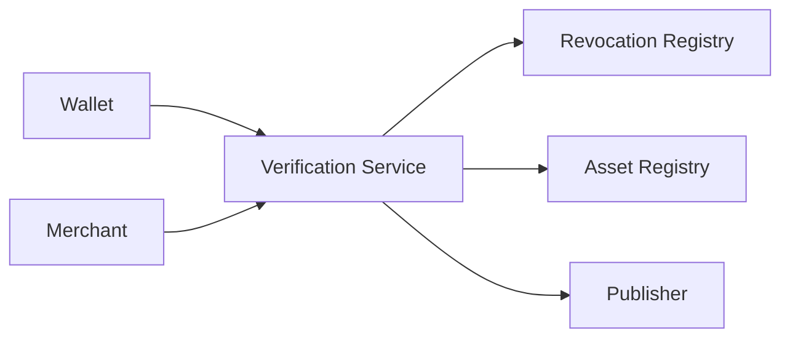
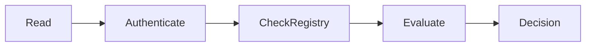

# Revocation Check

> _Revocation Verification enables wallets, merchants, publishers, and other ecosystem participants to determine whether a Physical Digital Asset, certificate, or trusted entity should no longer be accepted. It ensures that trust can be removed quickly, consistently, and transparently across the DCN ecosystem._

***

## Introduction

Trust is not permanent.

A Physical Digital Asset that was trusted yesterday may no longer be trusted today.

Examples include:

* A customer reports the asset as lost.
* The asset is stolen.
* A Secure Element is compromised.
* A Publisher certificate expires.
* A counterfeit device is discovered.
* A product reaches the end of its lifecycle.
* A government identity is cancelled.
* A merchant is removed from the ecosystem.

The DCN ecosystem therefore requires every participant to verify not only **what is trusted**, but also **what is no longer trusted**.

Revocation Verification provides this capability.

Before accepting an asset, wallets and merchants should confirm that neither the asset nor its trust chain has been revoked.

***

## Purpose

The Revocation Verification architecture is designed to:

* Detect revoked assets
* Protect against stolen devices
* Validate certificate status
* Prevent fraudulent transactions
* Support lifecycle management
* Enable ecosystem-wide trust updates
* Reduce operational risk

***

## Revocation Verification Architecture



The Verification Service combines information from the Revocation Registry and Asset Registry to determine the trust status of an asset.

***

## What Can Be Revoked?

The DCN Standard allows different trust objects to be revoked.

| Object                 | Example                                |
| ---------------------- | -------------------------------------- |
| Physical Digital Asset | Lost or stolen device                  |
| Device Certificate     | Hardware compromise                    |
| Publisher Certificate  | Publisher removed from trust ecosystem |
| Merchant Certificate   | Unauthorized merchant                  |
| Wallet Certificate     | Compromised wallet application         |
| Product Batch          | Manufacturing defect                   |
| Enterprise Credential  | Employee departure                     |

Revocation is therefore broader than simply disabling a payment device.

***

## Revocation Verification Workflow



The workflow ensures that revocation status is evaluated before any sensitive operation is permitted.

***

## Revocation States

Verification Services should return standardized revocation states.

| Status    | Meaning                     |
| --------- | --------------------------- |
| Valid     | Trust remains active        |
| Suspended | Temporarily restricted      |
| Revoked   | Permanently invalid         |
| Expired   | Validity period ended       |
| Unknown   | Status cannot be determined |

Applications should interpret these states consistently.

***

## Registry Validation

During verification, the service may validate:

* Asset Identifier
* Device Identifier
* Publisher Identifier
* Lifecycle State
* Revocation Reason
* Effective Revocation Date
* Replacement Reference (if applicable)

This information allows wallets and merchants to make informed trust decisions.

***

## Transaction Verification

Before authorizing a payment, a merchant may automatically verify:

* Asset authenticity
* Ownership
* Certificate validity
* Revocation status
* Publisher trust

If the asset is revoked, the transaction should not proceed.

This verification typically occurs within milliseconds and is transparent to the user.

***

## Certificate Revocation

Certificates form the trust chain of the DCN ecosystem.

Verification Services may validate:

* Device Certificate
* Manufacturer Certificate
* Publisher Certificate
* Merchant Certificate
* Wallet Certificate

If any certificate in the chain has been revoked, trust may be denied according to Publisher policy.

***

## User Experience

When a revoked asset is detected, the Companion Wallet may display:

```
Asset Status

Revoked

Reason:
Reported Lost

Recommendation:
Contact Your Publisher
```

The message should be clear and understandable without exposing unnecessary technical information.

***

## Merchant Experience

Merchant systems should receive simple responses.

Example:

```
Verification Result

Status:
Revoked

Action:
Reject Transaction
```

Merchants do not need to understand the underlying cryptographic or registry details.

***

## Security Benefits

Revocation Verification protects against:

* Continued use of stolen assets
* Counterfeit hardware
* Compromised certificates
* Fraudulent merchants
* Unauthorized Publishers
* Expired credentials

It is one of the most important safeguards in maintaining ecosystem trust.

***

## Performance Considerations

Verification Services should provide:

* Fast response times
* High availability
* Scalable infrastructure
* Global accessibility
* Consistent responses

Real-time verification is especially important for payment and identity use cases.

***

## Future Enhancements

Future versions of the DCN Standard may introduce:

* Decentralized revocation registries
* Blockchain-based revocation proofs
* Zero-Knowledge revocation verification
* AI-assisted fraud correlation
* Regional trust authorities
* Real-time global synchronization

These capabilities can improve resilience while preserving interoperability.

***

## Design Principles

Revocation Verification follows five principles.

#### Timely

Trust updates should propagate quickly.

#### Reliable

Verification results should be accurate and consistent.

#### Secure

Revoked entities must not continue to operate as trusted participants.

#### Transparent

Applications receive standardized verification results.

#### Interoperable

Works across every Physical Digital Asset, Publisher, wallet, merchant, and blockchain network.

***

## Relationship with Revocation Management

It is important to distinguish between two related concepts.

| Revocation Management      | Revocation Verification                    |
| -------------------------- | ------------------------------------------ |
| Publisher revokes an asset | Wallet checks whether the asset is revoked |
| Administrative operation   | Runtime verification                       |
| Updates trust records      | Consumes trust records                     |
| Changes lifecycle state    | Validates lifecycle state                  |

This separation allows Publishers to manage trust while enabling every participant to independently verify it.

***

## Summary

Revocation Verification ensures that only trusted Physical Digital Assets and trusted ecosystem participants continue to operate within the DCN ecosystem.

By validating revocation status for assets, certificates, Publishers, merchants, and wallets, the DCN Standard enables secure, real-time trust decisions that protect users, businesses, and governments from compromised or unauthorized entities.
