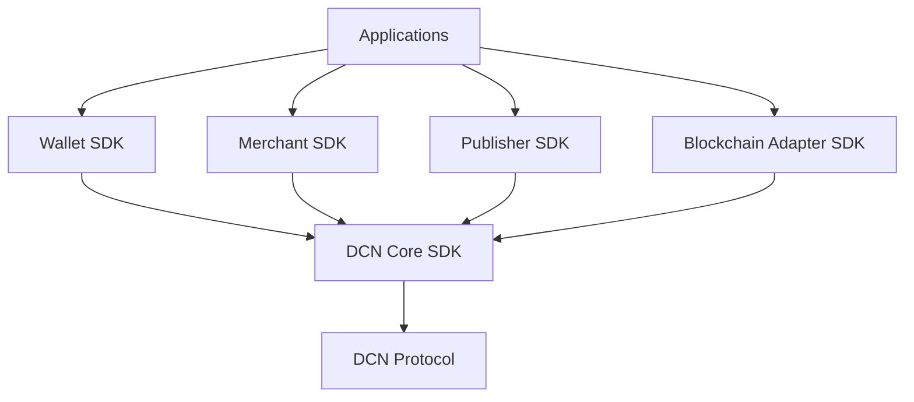

# 16. SDKs

> _The DCN SDKs provide standardized software development kits that enable developers to build wallets, merchant applications, Publisher platforms, and blockchain integrations without implementing the DCN protocol from scratch. They serve as the primary developer interface for the entire DCN ecosystem._

***

## Introduction

The success of any open standard depends not only on its specification but also on the ease with which developers can build on top of it.

For this reason, the DCN ecosystem provides a family of **Software Development Kits (SDKs)**.

Rather than requiring developers to understand every aspect of:

* NFC communication
* Secure Element integration
* Certificate validation
* Authentication protocols
* Asset lifecycle management
* Blockchain communication
* Publisher operations

the SDKs expose simple, well-defined APIs that implement the DCN Standard.

The SDK layer abstracts protocol complexity while preserving security and interoperability.

***

## Purpose

The DCN SDK architecture is designed to:

* Accelerate application development
* Standardize protocol implementation
* Reduce development errors
* Improve interoperability
* Simplify blockchain integration
* Support multiple programming languages
* Provide reusable components
* Enable ecosystem innovation

***

## SDK Architecture



Every SDK builds upon a shared **DCN Core SDK**, ensuring consistent protocol behavior across all implementations.

***

## SDK Design Philosophy

The SDK family follows a layered architecture.

```
Application Layer

↓

DCN SDK

↓

DCN Core SDK

↓

DCN Protocol

↓

Hardware / Blockchain
```

This separation allows applications to focus on business logic while the SDK manages protocol implementation.

***

## Core SDK Responsibilities

The DCN Core SDK provides common services shared by all SDKs.

Core capabilities include:

* Protocol implementation
* Certificate validation
* Authentication engine
* Secure messaging
* Cryptographic utilities
* NFC communication framework
* Asset parser
* Metadata parser
* Error handling
* Event framework
* Logging
* Version negotiation

Every SDK depends on these foundational components.

***

## SDK Categories

The DCN Standard defines four primary SDKs.

| SDK                    | Purpose                       |
| ---------------------- | ----------------------------- |
| Wallet SDK             | Companion Wallet development  |
| Merchant SDK           | Merchant acceptance           |
| Publisher SDK          | Asset issuance and management |
| Blockchain Adapter SDK | Blockchain integration        |

Together, they cover the primary development needs of the DCN ecosystem.

***

## Supported Platforms

The SDKs are designed to support multiple development environments.

Examples include:

**Mobile**

* Android (Kotlin)
* Android (Java)
* iOS (Swift)
* Flutter
* React Native

**Backend**

* Java
* Go
* Rust
* Node.js
* .NET
* Python

**Frontend**

* TypeScript
* JavaScript
* Angular
* React
* Vue

This enables developers to build DCN applications using familiar technologies.

***

## SDK Features

All SDKs share several common capabilities.

* Automatic protocol negotiation
* Secure session establishment
* Certificate verification
* Event-driven architecture
* Standard error model
* API version compatibility
* Logging and diagnostics
* Configuration management

These shared features reduce implementation differences across the ecosystem.

***

## Package Structure

A typical SDK may follow this modular structure.

```
dcn-sdk/

├── core/
├── crypto/
├── certificates/
├── protocol/
├── nfc/
├── assets/
├── registry/
├── verification/
├── lifecycle/
├── adapters/
├── events/
├── storage/
├── config/
└── examples/
```

Each module has a clearly defined responsibility and can evolve independently.

***

## Versioning

All SDKs follow semantic versioning.

Example:

```
DCN SDK

v1.0.0

Major.Minor.Patch
```

Backward compatibility should be maintained whenever possible.

***

## Developer Experience

The SDKs are designed with a developer-first philosophy.

Goals include:

* Simple APIs
* Strong typing
* Extensive documentation
* Code samples
* Test utilities
* Mock environments
* Emulator support
* Open standards

Developers should be able to build interoperable applications without implementing low-level protocol details.

***

## Security

Security is built into every SDK.

Capabilities include:

* Certificate validation
* Secure random generation
* Digital signatures
* Mutual authentication
* Replay protection
* Secure storage integration
* Secure session management

Applications should never implement cryptographic primitives independently when equivalent SDK functionality exists.

***

## Future SDK Expansion

Future versions of the DCN ecosystem may introduce additional SDKs.

Examples include:

* Identity SDK
* Government SDK
* IoT SDK
* Smart City SDK
* Enterprise SDK
* Web SDK
* AI Agent SDK
* Manufacturing SDK

The modular architecture allows the ecosystem to grow without changing the Core SDK.

***

## Relationship to Following Sections

The SDK chapter consists of four specialized development kits:

* **Wallet SDK** — Companion Wallet development.
* **Merchant SDK** — Merchant applications and POS integration.
* **Publisher SDK** — Asset issuance and lifecycle management.
* **Blockchain Adapter SDK** — Integration with blockchain networks.

Together, these SDKs provide the complete software foundation for building interoperable DCN applications.

***

## Summary

The DCN SDK family is the primary developer interface to the DCN Standard.

By providing reusable, secure, and modular software components, the SDKs enable developers to build wallets, merchant applications, Publisher platforms, and blockchain integrations with minimal effort while maintaining interoperability, security, and compliance with the DCN Specification.

***

## In this chapter

* [Wallet SDK](wallet-sdk.md)
* [Merchant SDK](merchant-sdk.md)
* [Publisher SDK](publisher-sdk.md)
* [Blockchain Adapter SDK](blockchain-adapter-sdk.md)
