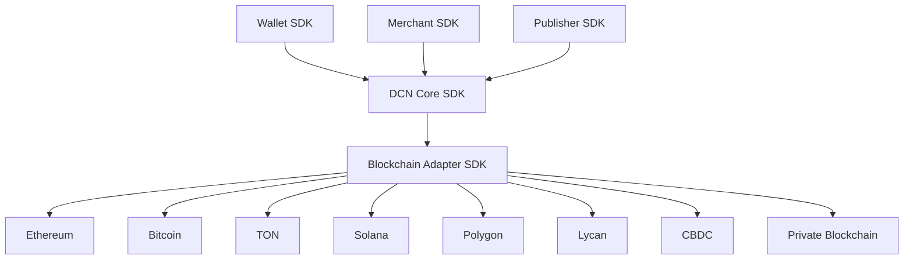
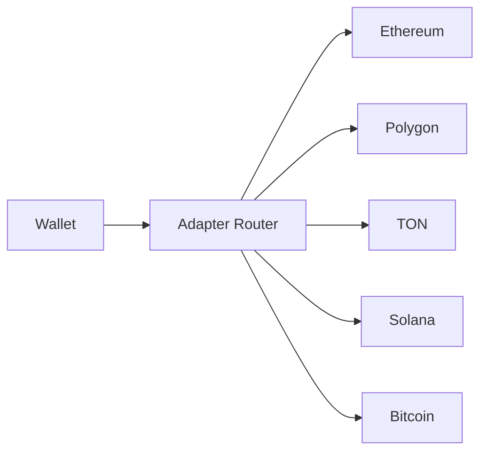

# Blockchain Adapter SDK

> _The Blockchain Adapter SDK provides a standardized abstraction layer between the DCN Protocol and blockchain networks. It enables any blockchain to become DCN-compatible by implementing a common adapter interface, allowing wallets, merchants, and Publishers to operate independently of blockchain-specific APIs, transaction formats, or smart contract implementations._

***

## Introduction

One of the core principles of the DCN Standard is **blockchain neutrality**.

A Physical Digital Asset should not be tied to:

* Ethereum
* Solana
* Bitcoin
* TON
* Polygon
* Avalanche
* Hyperledger
* CBDC networks
* Private enterprise chains

Instead, every blockchain communicates with the DCN ecosystem through a **Blockchain Adapter**.

This design is similar to how operating systems communicate with different hardware through device drivers.

Applications interact only with the DCN SDKs.

The Blockchain Adapter handles everything specific to an individual blockchain.

This architecture allows the same Wallet SDK, Merchant SDK, and Publisher SDK to work with any supported blockchain.

***

## Why an Adapter Layer?

Without adapters, every SDK would need blockchain-specific code.

```
Wallet
 ├── Ethereum
 ├── Solana
 ├── Bitcoin
 ├── TON
 ├── Polygon
 └── ...
```

As more blockchains are supported, maintenance becomes increasingly complex.

Instead, the DCN Standard introduces a single abstraction layer.

```
Wallet SDK
        │
DCN Blockchain Interface
        │
Blockchain Adapter
        │
Ethereum / Bitcoin / TON / Solana / CBDC
```

This separation dramatically simplifies application development.

***

## Adapter Architecture



The SDKs never communicate directly with blockchain nodes.

***

## Adapter Responsibilities

Every Blockchain Adapter is responsible for:

* RPC communication
* Transaction construction
* Transaction signing requests
* Broadcast transactions
* Confirmation monitoring
* Event subscriptions
* Smart contract interaction
* Fee estimation
* Network metadata
* Address validation
* Token discovery

Everything else is handled by the DCN SDKs.

***

## Standard Adapter Interface

Every blockchain implementation must expose the same interface.

```typescript
interface BlockchainAdapter {

 initialize()

 connect()

 disconnect()

 network()

 capabilities()

 shutdown()

}
```

Regardless of the blockchain, these lifecycle methods remain identical.

***

## Wallet APIs

The Wallet SDK communicates with adapters through standardized methods.

```typescript
adapter.getBalance()

adapter.transfer()

adapter.signTransaction()

adapter.broadcast()

adapter.transactionStatus()

adapter.estimateFees()
```

Wallet developers never call blockchain RPC methods directly.

***

## Publisher APIs

The Publisher SDK uses the adapter for asset issuance.

```typescript
adapter.deployAsset()

adapter.registerAsset()

adapter.mint()

adapter.burn()

adapter.freeze()

adapter.unfreeze()
```

These methods are translated into blockchain-specific operations internally.

***

## Merchant APIs

Merchant applications require only payment operations.

```typescript
adapter.submitPayment()

adapter.verifySettlement()

adapter.refund()

adapter.confirmTransaction()
```

The merchant remains completely isolated from blockchain implementation details.

***

## Event APIs

Every blockchain emits events differently.

The Adapter converts native blockchain events into standardized DCN events.

```typescript
adapter.on("block")

adapter.on("transaction")

adapter.on("assetUpdated")

adapter.on("confirmation")

adapter.on("networkChanged")
```

Applications subscribe to the same events regardless of blockchain.

***

## Smart Contract Abstraction

The Adapter hides differences between blockchain execution models.

```
DCN Asset Operation

↓

Blockchain Adapter

↓

Ethereum Smart Contract

or

TON Contract

or

Solana Program

or

Bitcoin Script

or

CBDC API
```

Applications never need to understand individual blockchain execution environments.

***

## Network Discovery

The Adapter exposes standardized network metadata.

```typescript
adapter.networkInfo()

↓

{
 chainId,
 networkName,
 protocolVersion,
 rpcEndpoint,
 finality,
 capabilities
}
```

This enables automatic network selection by higher-level SDKs.

***

## Capability Discovery

Not every blockchain supports the same functionality.

Example:

```typescript
adapter.capabilities()

↓

Payments

NFTs

Smart Contracts

Confidential Transfers

Offline Support

Programmable Assets
```

SDKs can enable or disable features dynamically based on adapter capabilities.

***

## Multi-Chain Routing

A single wallet may contain assets on multiple networks.



The Adapter Router automatically selects the correct blockchain based on the asset.

***

## Reference Adapter Structure

```
adapter/

├── core/
├── rpc/
├── signer/
├── broadcaster/
├── contracts/
├── events/
├── tokens/
├── fees/
├── validator/
├── configuration/
└── tests/
```

This modular structure encourages reusable implementations.

***

## Supported Blockchain Types

The SDK is designed to support many blockchain architectures.

| Blockchain Type | Examples                                          |
| --------------- | ------------------------------------------------- |
| EVM             | Ethereum, Polygon, BNB Chain, Avalanche, Lycan    |
| UTXO            | Bitcoin, Litecoin                                 |
| Account-Based   | TON, Aptos, Sui                                   |
| WASM            | Cosmos, Polkadot                                  |
| Enterprise      | Hyperledger Besu, Quorum                          |
| Permissioned    | CBDC Networks                                     |
| Layer 2         | Arbitrum, Optimism, zkSync                        |
| Future Networks | Any blockchain implementing the adapter interface |

This makes DCN future-proof as new blockchain technologies emerge.

***

## Reference Implementation

The DCN Foundation should publish open-source reference adapters for major blockchain ecosystems.

Initial adapters may include:

```
dcn-adapter-ethereum

dcn-adapter-bitcoin

dcn-adapter-ton

dcn-adapter-solana

dcn-adapter-polygon

dcn-adapter-lycan

dcn-adapter-hyperledger
```

Community-developed adapters can extend support to additional networks while maintaining compatibility with the DCN Core SDK.

***

## Performance Considerations

The Adapter SDK should support:

* Connection pooling
* RPC failover
* Automatic node selection
* Transaction retry policies
* Confirmation caching
* Event streaming
* Horizontal scalability

These optimizations improve reliability in production environments.

***

## Design Principles

The Blockchain Adapter SDK follows five principles.

#### Blockchain Agnostic

Applications remain independent of blockchain implementation details.

#### Standardized

Every blockchain implements the same adapter interface.

#### Modular

New blockchains can be added without changing existing SDKs.

#### High Performance

Designed for enterprise-scale transaction throughput.

#### Future Ready

Supports emerging blockchain technologies through capability-based extension.

***

## Summary

The Blockchain Adapter SDK is the interoperability layer that connects the DCN ecosystem to the world's blockchain networks.

By defining a standardized adapter interface for transaction processing, smart contract interaction, event handling, capability discovery, and network communication, the DCN Standard enables Wallets, Merchants, Publishers, and future applications to operate across multiple blockchain ecosystems without modification.

This architecture is one of the most important technical foundations of the DCN Standard, ensuring that Physical Digital Assets remain truly **multi-chain**, **interoperable**, and **future-proof**.
