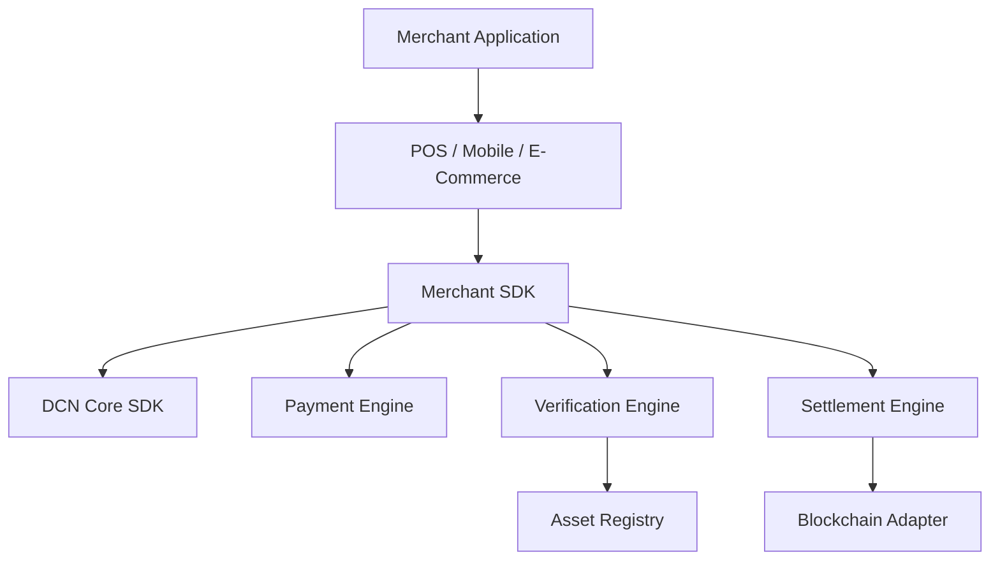

# Merchant SDK

> _The Merchant SDK provides a complete software framework for building DCN-compatible merchant applications, Point-of-Sale (POS) systems, mobile payment applications, e-commerce platforms, kiosks, and enterprise payment gateways. It abstracts the complexity of the DCN Payment Protocol while providing high-performance APIs for payment acceptance, verification, settlement, and merchant operations._

***

## Introduction

Merchants should focus on **selling products**, not implementing blockchain protocols.

The Merchant SDK removes the complexity of:

* NFC communication
* Payment Protocol
* Secure messaging
* Asset verification
* Certificate validation
* Multi-chain settlement
* Ownership verification
* Publisher interoperability

Instead, developers receive a clean set of APIs that integrate into existing POS systems, mobile applications, websites, and enterprise software.

The SDK automatically communicates with the DCN ecosystem while exposing business-friendly APIs.

***

## Merchant SDK Architecture



The Merchant SDK is responsible for merchant-side protocol execution while maintaining compatibility with every DCN asset.

***

## Merchant SDK Modules

```
merchant-sdk/

├── payment/
├── checkout/
├── verification/
├── settlement/
├── merchant/
├── certificates/
├── registry/
├── refunds/
├── receipts/
├── analytics/
├── events/
├── network/
├── security/
├── config/
└── examples/
```

Each module can evolve independently while remaining compatible with the DCN Core SDK.

***

## Primary Responsibilities

The Merchant SDK provides:

* Payment acceptance
* Merchant authentication
* Asset verification
* Payment settlement
* Receipt generation
* Refund processing
* Transaction history
* Merchant analytics
* Certificate validation
* Publisher interoperability

***

## Merchant Lifecycle APIs

```typescript
Merchant.initialize()

Merchant.login()

Merchant.activate()

Merchant.deactivate()

Merchant.shutdown()
```

These APIs manage the merchant application's lifecycle.

***

## Checkout APIs

```typescript
Checkout.create()

Checkout.amount()

Checkout.currency()

Checkout.assetType()

Checkout.start()

Checkout.cancel()
```

The Checkout module prepares standardized payment sessions for every supported asset.

***

## Payment APIs

```typescript
Payment.request()

Payment.authorize()

Payment.confirm()

Payment.complete()

Payment.status()
```

The SDK coordinates the complete payment lifecycle while abstracting blockchain communication.

***

## Verification APIs

```typescript
Verify.asset()

Verify.publisher()

Verify.certificate()

Verify.ownership()

Verify.revocation()
```

Verification occurs automatically before sensitive operations such as payment acceptance.

***

## Settlement APIs

```typescript
Settlement.submit()

Settlement.confirm()

Settlement.status()

Settlement.history()
```

Settlement operations remain blockchain-independent through the Blockchain Adapter SDK.

***

## Refund APIs

```typescript
Refund.create()

Refund.verify()

Refund.execute()

Refund.status()
```

Refund behavior follows Publisher-defined policies and asset capabilities.

***

## Receipt APIs

```typescript
Receipt.generate()

Receipt.print()

Receipt.email()

Receipt.download()
```

Receipt generation follows the standardized DCN transaction model.

***

## Merchant Events

The SDK follows an event-driven architecture.

```typescript
merchant.on("assetDetected")

merchant.on("paymentStarted")

merchant.on("paymentAuthorized")

merchant.on("paymentCompleted")

merchant.on("paymentFailed")

merchant.on("refundCompleted")
```

Applications subscribe to events rather than implementing complex state management.

***

## POS Integration

The Merchant SDK supports multiple acceptance channels.

```
Merchant SDK

├── Retail POS
├── Android POS
├── Smart POS
├── Mobile Merchant App
├── Self Checkout
├── Kiosk
├── Vending Machine
└── Enterprise POS
```

The same SDK powers every merchant environment.

***

## E-Commerce Integration

The Merchant SDK also supports web-based commerce.

Example checkout flow:

```typescript
Checkout.create()

↓

Wallet.launch()

↓

Payment.authorize()

↓

Settlement.confirm()

↓

Order.complete()
```

No blockchain-specific logic is required within the merchant application.

***

## Security Layer

The Merchant SDK automatically handles:

* Mutual authentication
* Certificate validation
* Secure messaging
* Merchant identity
* Replay protection
* Session encryption
* Signature verification

Developers do not need to implement these security mechanisms manually.

***

## Transaction Object

A standardized transaction model is used throughout the SDK.

```typescript
interface PaymentTransaction {

    transactionId

    assetId

    merchantId

    amount

    currency

    assetProfile

    status

    settlementReference

    timestamp

}
```

This model remains consistent across all supported blockchain networks.

***

## Plugin Architecture

The Merchant SDK supports extensions.

Examples include:

* ERP connectors
* Accounting integrations
* Fiscal printer modules
* Loyalty systems
* Tax engines
* AI fraud detection
* Country-specific payment modules

Plugins interact through defined SDK interfaces without modifying the core implementation.

***

## Reference Merchant Application

The DCN Foundation should publish an open-source reference implementation.

Example projects include:

* Android POS
* Windows POS
* Linux POS
* Merchant Mobile App
* Web Checkout SDK
* Self-Service Kiosk
* Enterprise Payment Server

Reference implementations accelerate adoption and improve interoperability.

***

## Design Principles

The Merchant SDK follows five principles.

#### Business First

Developers interact with payment concepts, not blockchain internals.

#### Secure by Default

Security mechanisms are automatically enforced.

#### Event Driven

Applications react to standardized events.

#### Blockchain Neutral

Works across all supported settlement networks.

#### Enterprise Ready

Designed for scalability, reliability, and high transaction volumes.

***

## Summary

The Merchant SDK is the reference development toolkit for accepting Physical Digital Assets across retail, mobile, enterprise, and e-commerce environments.

By providing standardized APIs for checkout, payments, verification, settlement, refunds, receipts, and merchant operations, it enables developers to build secure, interoperable, and high-performance merchant applications while remaining fully compliant with the DCN Standard.
