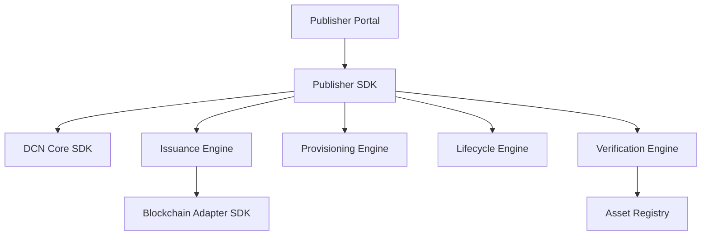

# Publisher SDK

> _The Publisher SDK provides a complete development framework for building DCN Publisher Platforms. It enables organizations to create Physical Digital Asset products, provision secure hardware, issue assets, manage lifecycles, integrate manufacturing systems, and operate large-scale publishing infrastructure through standardized APIs._

***

## Introduction

The Publisher SDK is the **most powerful SDK** within the DCN ecosystem.

While the Wallet SDK is designed for end users and the Merchant SDK is designed for payment acceptance, the Publisher SDK powers the organizations that create and manage Physical Digital Assets.

Using the Publisher SDK, developers can build:

* Stablecoin Issuing Platforms
* CBDC Issuing Systems
* Gift Card Platforms
* Identity Management Systems
* Enterprise Credential Platforms
* University Certificate Systems
* Transit Card Platforms
* Digital Collectible Platforms
* Tokenized Asset Platforms

The SDK abstracts the complexity of issuance, provisioning, lifecycle management, cryptography, and blockchain integration, allowing developers to focus on business logic.

***

## Publisher SDK Architecture



The Publisher SDK coordinates the complete lifecycle of every Physical Digital Asset.

***

## SDK Modules

```
publisher-sdk/

├── products/
├── issuance/
├── provisioning/
├── lifecycle/
├── registry/
├── certificates/
├── verification/
├── recovery/
├── revocation/
├── manufacturing/
├── blockchain/
├── analytics/
├── events/
├── security/
├── configuration/
└── examples/
```

Each module is independently maintained while sharing the DCN Core SDK.

***

## Primary Responsibilities

The Publisher SDK provides APIs for:

* Product definition
* Asset issuance
* Secure provisioning
* Lifecycle management
* Ownership management
* Recovery
* Revocation
* Registry synchronization
* Certificate management
* Blockchain registration
* Analytics

***

## Product APIs

Publishers define reusable asset products before issuing devices.

```typescript
Product.create()

Product.update()

Product.delete()

Product.publish()

Product.list()
```

Example product types include:

* DCN-S
* DCN-R
* DCN-P
* DCN-C
* CBDC
* Gift Card
* Identity Credential
* Transit Pass

***

## Issuance APIs

```typescript
Issue.create()

Issue.batch()

Issue.activate()

Issue.assign()

Issue.complete()
```

These APIs control the issuance lifecycle for both single assets and high-volume production batches.

***

## Provisioning APIs

```typescript
Provision.start()

Provision.device()

Provision.keys()

Provision.certificates()

Provision.complete()
```

Provisioning operations establish cryptographic identity before issuance.

***

## Lifecycle APIs

```typescript
Lifecycle.activate()

Lifecycle.suspend()

Lifecycle.resume()

Lifecycle.retire()

Lifecycle.status()
```

Lifecycle operations ensure every asset follows the standardized DCN lifecycle.

***

## Ownership APIs

```typescript
Ownership.assign()

Ownership.transfer()

Ownership.verify()

Ownership.replace()

Ownership.history()
```

These APIs support consumer, enterprise, and government ownership models.

***

## Recovery APIs

```typescript
Recovery.request()

Recovery.verify()

Recovery.approve()

Recovery.restore()

Recovery.complete()
```

Recovery implementations automatically respect Publisher-defined policies.

***

## Revocation APIs

```typescript
Revoke.asset()

Revoke.batch()

Revoke.publisher()

Revoke.certificate()

Revoke.restore()
```

The SDK propagates revocation events to the Asset Registry and Verification Services.

***

## Registry APIs

```typescript
Registry.register()

Registry.lookup()

Registry.update()

Registry.search()

Registry.sync()
```

These APIs maintain synchronization with the global DCN Asset Registry.

***

## Manufacturing Integration

The Publisher SDK integrates directly with certified manufacturing facilities.

```
Publisher Platform

↓

Manufacturing Partner

↓

Provisioning

↓

Asset Registry

↓

Issued Asset
```

This enables automated production pipelines.

***

## Batch Operations

The SDK is optimized for industrial-scale publishing.

Example:

```typescript
Batch.create()

Batch.issue()

Batch.activate()

Batch.track()

Batch.complete()
```

Large-scale deployments may issue millions of assets through batch processing.

***

## Event Framework

The SDK follows an event-driven architecture.

```typescript
publisher.on("productCreated")

publisher.on("batchIssued")

publisher.on("assetActivated")

publisher.on("ownershipTransferred")

publisher.on("recoveryCompleted")

publisher.on("assetRevoked")
```

Applications subscribe to events rather than continuously polling backend services.

***

## Security Services

The Publisher SDK integrates with enterprise-grade security infrastructure.

Supported components include:

* Hardware Security Modules (HSMs)
* Secure Key Vaults
* Certificate Authorities (CA)
* Secure Provisioning Systems
* Audit Logging
* Role-Based Access Control (RBAC)
* Multi-Factor Authentication (MFA)

Sensitive cryptographic operations should be performed using secure hardware wherever possible.

***

## Multi-Tenant Architecture

The SDK supports Software-as-a-Service (SaaS) Publisher Platforms.

```
DCN Publisher Cloud

├── Publisher A
├── Publisher B
├── Publisher C
├── Publisher D
└── Shared Infrastructure
```

Each Publisher operates independently while sharing common platform services.

***

## Extension Framework

The Publisher SDK provides extension points for:

* ERP systems
* CRM platforms
* Identity providers
* Manufacturing execution systems (MES)
* Banking systems
* Government registries
* Compliance engines
* AI analytics modules

Extensions communicate through stable SDK interfaces, ensuring long-term compatibility.

***

## Reference Publisher Platform

The DCN Foundation should publish an open-source reference implementation demonstrating best practices.

Example components include:

* Publisher Admin Portal
* Asset Product Manager
* Manufacturing Console
* Issuance Dashboard
* Lifecycle Manager
* Registry Explorer
* Certificate Manager
* Analytics Dashboard

This reference implementation serves as the baseline for ecosystem interoperability.

***

## Design Principles

The Publisher SDK follows five principles.

#### Enterprise First

Designed for institutions issuing millions of Physical Digital Assets.

#### Secure by Design

Cryptographic and lifecycle operations are protected by default.

#### Modular

Independent services can be deployed and scaled separately.

#### API Driven

Every capability is accessible through well-defined APIs.

#### Cloud Native

Supports Kubernetes, containers, microservices, and horizontal scaling.

***

## Summary

The Publisher SDK is the operational backbone for organizations building DCN Publisher Platforms.

By providing standardized APIs for product management, issuance, provisioning, lifecycle operations, ownership, recovery, revocation, manufacturing integration, and registry synchronization, it enables developers to build secure, scalable, and interoperable publishing platforms capable of managing millions of Physical Digital Assets across multiple industries and blockchain networks.
