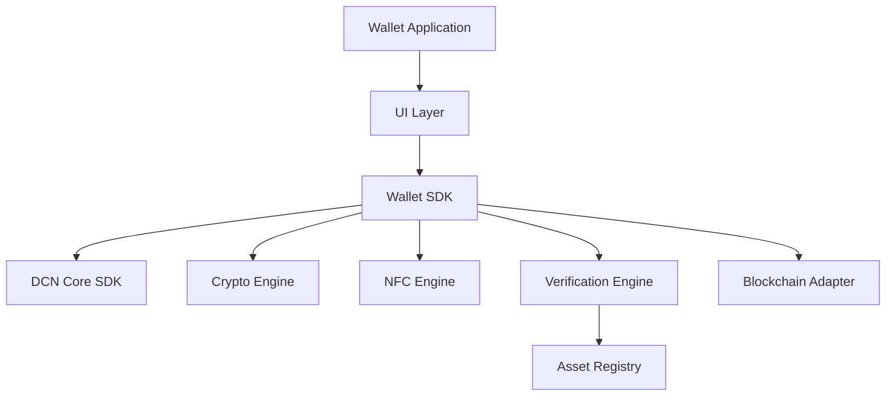

# Wallet SDK

> _The Wallet SDK is the reference implementation for building DCN-compatible Companion Wallets. It provides APIs for NFC communication, authentication, secure sessions, asset management, payments, ownership verification, lifecycle operations, and blockchain interaction while abstracting the complexity of the underlying DCN protocol._

***

## Introduction

The Companion Wallet is the primary interface between users and the DCN ecosystem.

Rather than requiring every wallet developer to implement:

* NFC communication
* Secure Element protocols
* Certificate validation
* Cryptographic authentication
* Asset parsing
* Blockchain adapters
* Payment protocol
* Ownership verification

the **Wallet SDK** provides a standardized implementation.

Every wallet built using the Wallet SDK behaves consistently across the DCN ecosystem, ensuring interoperability regardless of the Publisher or blockchain network.

***

## SDK Architecture



The Wallet SDK exposes high-level APIs while delegating protocol implementation to the Core SDK.

***

## High-Level Modules

```
wallet-sdk/

├── auth/
├── assets/
├── payment/
├── ownership/
├── recovery/
├── certificates/
├── verification/
├── registry/
├── blockchain/
├── nfc/
├── crypto/
├── lifecycle/
├── events/
├── storage/
└── config/
```

Each module is independently versioned while remaining compatible with the DCN Core SDK.

***

## Primary Responsibilities

The Wallet SDK is responsible for:

* Reading Physical Digital Assets
* Establishing secure NFC sessions
* Authenticating devices
* Verifying authenticity
* Managing ownership
* Authorizing payments
* Interacting with blockchain adapters
* Synchronizing asset state
* Handling recovery
* Managing local secure storage

***

## Core API Overview

```typescript
WalletSDK.initialize(config)

WalletSDK.connect()

WalletSDK.disconnect()

WalletSDK.version()

WalletSDK.shutdown()
```

The SDK lifecycle is intentionally simple.

***

## Asset APIs

```typescript
Wallet.read()

Wallet.readMetadata()

Wallet.readCapabilities()

Wallet.readCertificates()

Wallet.getAssetProfile()

Wallet.getLifecycleState()
```

These APIs provide structured access to Physical Digital Assets.

***

## Payment APIs

```typescript
Payment.create()

Payment.authorize()

Payment.sign()

Payment.submit()

Payment.status()

Payment.cancel()
```

The SDK manages payment protocol execution while hiding blockchain-specific details.

***

## Authentication APIs

```typescript
Auth.challenge()

Auth.verify()

Auth.authenticate()

Auth.session()

Auth.logout()
```

Authentication is implemented using the DCN Authentication Protocol.

***

## Verification APIs

```typescript
Verification.authenticity()

Verification.ownership()

Verification.revocation()

Verification.publisher()

Verification.device()

Verification.certificates()
```

Verification APIs automatically interact with Registry and Verification Services.

***

## Recovery APIs

```typescript
Recovery.begin()

Recovery.verify()

Recovery.transfer()

Recovery.complete()
```

Recovery implementations remain Publisher-policy aware.

***

## NFC Engine

The Wallet SDK includes a platform-independent NFC abstraction.

```typescript
NFC.scan()

NFC.connect()

NFC.exchange()

NFC.disconnect()
```

Developers interact with logical NFC operations instead of platform-specific APIs.

***

## Event System

The Wallet SDK follows an event-driven architecture.

```typescript
wallet.on("assetDetected")

wallet.on("authenticated")

wallet.on("paymentAuthorized")

wallet.on("paymentCompleted")

wallet.on("verificationFailed")

wallet.on("assetRemoved")
```

Applications subscribe to events instead of continuously polling device status.

***

## Blockchain Abstraction

Applications never interact directly with blockchain RPC endpoints.

Instead:

```typescript
Wallet

↓

Wallet SDK

↓

Blockchain Adapter

↓

Blockchain Network
```

The Blockchain Adapter handles:

* Transaction construction
* Fee estimation
* Signing requests
* Submission
* Confirmation monitoring

***

## Secure Storage

The SDK abstracts platform-specific secure storage.

Examples:

* Android Keystore
* Apple Secure Enclave
* TPM
* Secure Element
* Hardware-backed storage

Developers never directly manage sensitive cryptographic material.

***

## Offline Cache

The SDK may securely cache:

* Asset metadata
* Publisher certificates
* Verification history
* Lifecycle state
* Registry snapshots

Sensitive data should remain encrypted and respect Publisher policies.

***

## Error Model

All SDK operations return standardized error codes.

```
DCN_ERROR_TIMEOUT

DCN_ERROR_AUTHENTICATION

DCN_ERROR_REVOKED

DCN_ERROR_INVALID_CERTIFICATE

DCN_ERROR_UNSUPPORTED_PROFILE

DCN_ERROR_BLOCKCHAIN
```

A consistent error model simplifies application development.

***

## Configuration

Example SDK configuration:

```yaml
wallet:
  protocolVersion: 1.0
  verification: true
  registrySync: true

security:
  certificateValidation: true
  secureStorage: true

blockchain:
  autoSelectNetwork: true
```

Configuration files allow applications to customize behavior without changing source code.

***

## Extension Points

The Wallet SDK supports plugins.

Examples:

* New blockchain adapters
* Identity providers
* Payment processors
* Analytics providers
* Enterprise policy engines
* Government modules

Extensions operate through well-defined interfaces without modifying the SDK core.

***

## Reference Implementation

The DCN Foundation should provide an open-source reference wallet demonstrating best practices.

The reference implementation may include:

* Android Companion Wallet
* iOS Companion Wallet
* Desktop Wallet
* Web Wallet (where supported)
* Test Wallet
* Emulator

Reference implementations accelerate ecosystem adoption and interoperability.

***

## Design Principles

The Wallet SDK follows five principles.

#### Secure by Default

Security features are enabled automatically.

#### Blockchain Neutral

Applications remain independent of blockchain implementation details.

#### Modular

Features are organized into reusable modules.

#### Event Driven

Applications react to SDK events instead of managing protocol state manually.

#### Developer Friendly

Simple APIs abstract complex protocol operations.

***

## Summary

The Wallet SDK is the primary development toolkit for building DCN Companion Wallets.

By providing standardized APIs for NFC communication, authentication, verification, payments, lifecycle management, recovery, secure storage, and blockchain interaction, it allows developers to build interoperable, secure, and feature-rich wallet applications while remaining fully compliant with the DCN Standard.
