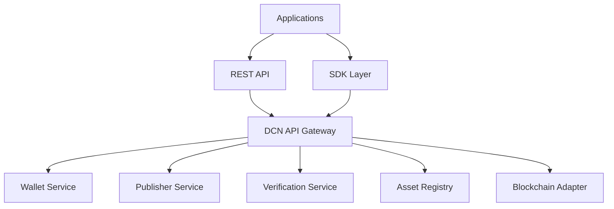

# 17. API Overview

> _The DCN API provides a standardized interface for interacting with Physical Digital Assets, Publishers, Verification Services, and blockchain networks. It enables applications to build interoperable DCN solutions without requiring knowledge of protocol internals or blockchain-specific implementations._

***

## Introduction

While SDKs provide high-level development libraries, APIs provide **language-independent access** to the DCN ecosystem.

The DCN API allows applications to communicate with:

* Companion Wallets
* Publisher Platforms
* Verification Services
* Asset Registry
* Blockchain Adapters
* Payment Services
* Lifecycle Management
* Certificate Infrastructure

Applications written in any programming language can integrate with the DCN ecosystem using these standardized APIs.

Whether building:

* Mobile applications
* Enterprise systems
* Government portals
* Banking platforms
* Merchant systems
* Manufacturing systems
* Web applications
* Cloud services

the interaction model remains consistent.

***

## Purpose

The API architecture is designed to:

* Standardize communication
* Reduce integration complexity
* Support interoperability
* Provide language independence
* Enable cloud-native deployments
* Simplify ecosystem integration
* Ensure security by default

***

## API Architecture



The API Gateway provides a single entry point into the DCN ecosystem while routing requests to the appropriate service.

***

## API Design Principles

The DCN APIs follow several core principles.

#### REST First

All services expose RESTful APIs using standard HTTP methods.

#### Resource Based

Every object is represented as a resource.

Examples include:

* Assets
* Wallets
* Publishers
* Certificates
* Transactions
* Ownership
* Verification

#### Stateless

Each request contains sufficient information to be processed independently.

#### Versioned

All APIs include explicit version numbers.

Example:

```
/api/v1/assets
/api/v1/wallets
/api/v1/verification
```

#### Secure

Every sensitive endpoint requires authentication and authorization.

***

## API Categories

The DCN Standard defines three primary API groups.

| API               | Purpose          |
| ----------------- | ---------------- |
| Wallet APIs       | User interaction |
| Publisher APIs    | Asset management |
| Verification APIs | Trust validation |

Additional APIs may be introduced in future versions of the standard.

***

## Common API Structure

All DCN APIs follow a consistent request model.

```http
POST /api/v1/resource

Headers

Authorization

Content-Type

X-Request-ID

Body

JSON
```

***

## Standard Response

Every API returns a standardized response object.

```json
{
  "success": true,
  "requestId": "REQ-12345",
  "timestamp": "2027-08-01T10:30:00Z",
  "data": { },
  "errors": [ ]
}
```

This response format simplifies client development across all services.

***

## Authentication

Sensitive APIs require authentication.

Supported mechanisms may include:

* OAuth 2.1
* JWT
* Mutual TLS
* API Keys
* Publisher Certificates
* Merchant Certificates

The authentication method depends on the deployment environment.

***

## Error Model

All APIs return standardized error responses.

Example:

```json
{
  "success": false,
  "errorCode": "DCN-4010",
  "message": "Invalid Publisher Certificate"
}
```

Standardized errors improve interoperability and simplify troubleshooting.

***

## API Versioning

The DCN Standard follows semantic API versioning.

```
v1

Major version

↓

Minor additions

↓

Backward compatible updates
```

Breaking changes require a new major version.

***

## Security

Every API should support:

* TLS 1.3+
* Digital Signatures
* Certificate Validation
* Rate Limiting
* Audit Logging
* Request Signing
* Replay Protection

Security requirements apply consistently across all API groups.

***

## Relationship to Following Sections

This chapter introduces the three core API families:

* **Wallet APIs** — Companion Wallet interaction.
* **Publisher APIs** — Issuance and lifecycle management.
* **Verification APIs** — Trust validation and authenticity.

Together they define the primary integration surface of the DCN ecosystem.

***

## Summary

The DCN API provides a standardized, secure, and language-independent interface for interacting with the entire DCN ecosystem.

By exposing consistent APIs for wallets, Publishers, verification, and blockchain infrastructure, the DCN Standard enables developers to build interoperable applications across every supported platform and industry.

***

## In this chapter

* [Wallet APIs](wallet-apis.md)
* [Publisher APIs](publisher-apis.md)
* [Verification APIs](verification-apis.md)
