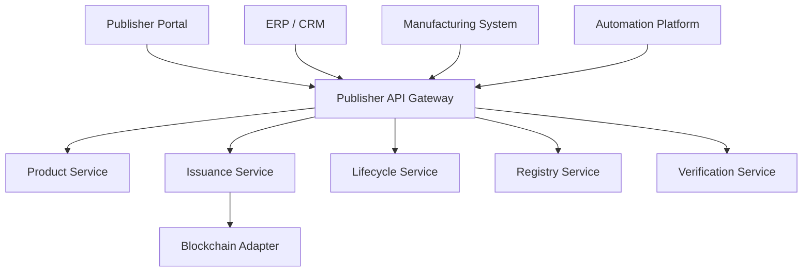

# Publisher APIs

> _The Publisher APIs provide standardized interfaces for creating, issuing, managing, and retiring Physical Digital Assets. They expose the complete Publisher Platform through secure REST APIs, enabling organizations to automate issuance, manufacturing, provisioning, lifecycle management, verification, and blockchain operations at enterprise scale._

***

## Introduction

The Publisher Platform is the operational center of the DCN ecosystem.

While the Publisher SDK provides language-specific libraries, the **Publisher APIs** expose the same capabilities as platform-independent web services.

These APIs allow organizations to integrate the DCN Standard into:

* Banking systems
* Core payment platforms
* Manufacturing systems
* ERP solutions
* CRM platforms
* Government infrastructure
* Enterprise identity platforms
* Cloud-native applications

Every operation available through the Publisher Portal can also be performed programmatically using the Publisher APIs.

***

## Publisher API Architecture



The Publisher API Gateway routes requests to specialized platform services while enforcing authentication, authorization, and auditing.

***

## API Modules

The Publisher API is organized into functional modules.

```
Publisher API

├── Products
├── Manufacturing
├── Provisioning
├── Issuance
├── Lifecycle
├── Ownership
├── Recovery
├── Revocation
├── Registry
├── Certificates
├── Verification
├── Analytics
├── Blockchain
├── Events
└── Administration
```

Each module exposes independent endpoints that can be deployed as separate microservices.

***

## Product APIs

Manage reusable asset products.

| Method | Endpoint                   | Description      |
| ------ | -------------------------- | ---------------- |
| POST   | `/publisher/products`      | Create product   |
| GET    | `/publisher/products`      | List products    |
| GET    | `/publisher/products/{id}` | Retrieve product |
| PUT    | `/publisher/products/{id}` | Update product   |
| DELETE | `/publisher/products/{id}` | Archive product  |

Products define reusable templates such as DCN-S, DCN-R, identity credentials, or transit passes.

***

## Manufacturing APIs

Coordinate manufacturing operations.

| Method | Endpoint                               | Description                |
| ------ | -------------------------------------- | -------------------------- |
| POST   | `/publisher/manufacturing/orders`      | Create manufacturing order |
| GET    | `/publisher/manufacturing/orders/{id}` | Order status               |
| GET    | `/publisher/manufacturing/batches`     | Manufacturing batches      |
| POST   | `/publisher/manufacturing/complete`    | Mark production complete   |

These APIs integrate directly with certified manufacturing partners.

***

## Provisioning APIs

Provision manufactured devices.

| Method | Endpoint                               | Description           |
| ------ | -------------------------------------- | --------------------- |
| POST   | `/publisher/provisioning/start`        | Start provisioning    |
| POST   | `/publisher/provisioning/device`       | Provision device      |
| POST   | `/publisher/provisioning/certificates` | Install certificates  |
| POST   | `/publisher/provisioning/complete`     | Complete provisioning |

Provisioning APIs establish trusted identities before issuance.

***

## Issuance APIs

Issue new Physical Digital Assets.

| Method | Endpoint                          | Description    |
| ------ | --------------------------------- | -------------- |
| POST   | `/publisher/assets`               | Issue asset    |
| POST   | `/publisher/assets/batch`         | Batch issuance |
| POST   | `/publisher/assets/{id}/activate` | Activate asset |
| GET    | `/publisher/assets/{id}`          | Retrieve asset |

Issuance APIs support both individual and high-volume deployments.

***

## Lifecycle APIs

Manage lifecycle transitions.

| Method | Endpoint                         | Description      |
| ------ | -------------------------------- | ---------------- |
| POST   | `/publisher/assets/{id}/suspend` | Suspend asset    |
| POST   | `/publisher/assets/{id}/resume`  | Resume asset     |
| POST   | `/publisher/assets/{id}/retire`  | Retire asset     |
| GET    | `/publisher/assets/{id}/status`  | Lifecycle status |

Lifecycle operations remain fully auditable.

***

## Ownership APIs

Manage ownership records.

| Method | Endpoint                                 | Description        |
| ------ | ---------------------------------------- | ------------------ |
| POST   | `/publisher/ownership/assign`            | Assign owner       |
| POST   | `/publisher/ownership/transfer`          | Transfer ownership |
| GET    | `/publisher/ownership/{assetId}`         | Current ownership  |
| GET    | `/publisher/ownership/history/{assetId}` | Ownership history  |

Ownership changes automatically update the Asset Registry.

***

## Recovery APIs

Handle recovery requests.

| Method | Endpoint                      | Description       |
| ------ | ----------------------------- | ----------------- |
| POST   | `/publisher/recovery/request` | Recovery request  |
| POST   | `/publisher/recovery/approve` | Approve recovery  |
| POST   | `/publisher/recovery/restore` | Restore ownership |
| GET    | `/publisher/recovery/{id}`    | Recovery status   |

Recovery workflows are governed by Publisher policies.

***

## Revocation APIs

Manage trust removal.

| Method | Endpoint                         | Description             |
| ------ | -------------------------------- | ----------------------- |
| POST   | `/publisher/revocations`         | Revoke asset            |
| POST   | `/publisher/revocations/batch`   | Batch revocation        |
| GET    | `/publisher/revocations/{id}`    | Revocation details      |
| POST   | `/publisher/revocations/restore` | Restore suspended asset |

Revocation updates are propagated to Verification Services.

***

## Registry APIs

Interact with the Asset Registry.

| Method | Endpoint                        | Description          |
| ------ | ------------------------------- | -------------------- |
| POST   | `/publisher/registry/register`  | Register asset       |
| PUT    | `/publisher/registry/update`    | Update registry      |
| GET    | `/publisher/registry/{assetId}` | Asset lookup         |
| POST   | `/publisher/registry/sync`      | Synchronize registry |

Registry synchronization maintains a consistent global view of issued assets.

***

## Analytics APIs

Retrieve operational metrics.

| Method | Endpoint                         | Description         |
| ------ | -------------------------------- | ------------------- |
| GET    | `/publisher/analytics/assets`    | Asset statistics    |
| GET    | `/publisher/analytics/payments`  | Payment metrics     |
| GET    | `/publisher/analytics/lifecycle` | Lifecycle analytics |
| GET    | `/publisher/analytics/security`  | Security dashboard  |

Analytics APIs support operational monitoring and reporting.

***

## Event Streaming

Publisher APIs support asynchronous events.

Example topics:

```
product.created

batch.started

asset.issued

asset.activated

ownership.transferred

asset.revoked

recovery.completed

registry.updated
```

Events may be delivered using WebSockets, Server-Sent Events (SSE), or webhook integrations.

***

## Example Asset Issuance

```http
POST /api/v1/publisher/assets

{
    "productId": "DCN-R-001",
    "deviceId": "DEVICE-7821",
    "ownerId": "USER-1045",
    "network": "polygon"
}
```

***

## Example Response

```json
{
  "success": true,
  "assetId": "DCN-7821",
  "status": "ISSUED",
  "lifecycle": "ACTIVE",
  "publisherId": "publisher.cardaxo"
}
```

The response format remains identical regardless of the underlying blockchain.

***

## Security

Publisher APIs should support enterprise-grade security.

Recommended mechanisms include:

* OAuth 2.1
* Mutual TLS (mTLS)
* Publisher Certificates
* JWT
* Hardware Security Module (HSM) integration
* Role-Based Access Control (RBAC)
* Multi-Factor Authentication (MFA)
* Request signing
* Audit logging

Administrative operations should require elevated authorization.

***

## Scalability

Publisher APIs are designed for cloud-native deployment.

Recommended characteristics include:

* Stateless services
* Horizontal scaling
* Kubernetes deployment
* API Gateway routing
* Distributed caching
* Message queues
* Event-driven workflows
* High availability

This architecture supports deployments ranging from a single Publisher to national-scale issuance platforms.

***

## Future APIs

Future versions of the Publisher API may introduce:

* Smart manufacturing APIs
* Digital Identity APIs
* Verifiable Credential APIs
* AI-assisted issuance APIs
* Digital twin management
* Cross-chain synchronization APIs
* Regulatory reporting APIs

The modular architecture allows these capabilities to be added without disrupting existing integrations.

***

## Design Principles

The Publisher APIs follow five principles.

#### Enterprise Ready

Built for large-scale issuance and lifecycle management.

#### API First

Every Publisher Platform capability is accessible programmatically.

#### Secure

Administrative operations require strong authentication and authorization.

#### Event Driven

Supports synchronous REST APIs and asynchronous events.

#### Cloud Native

Optimized for distributed, scalable infrastructure.

***

## Summary

The Publisher APIs provide a complete enterprise interface for building and operating DCN Publisher Platforms.

By exposing standardized endpoints for product management, manufacturing, provisioning, issuance, ownership, lifecycle management, recovery, revocation, registry synchronization, analytics, and blockchain integration, they enable organizations to automate the entire lifecycle of Physical Digital Assets while maintaining interoperability, security, and compliance with the DCN Standard.
