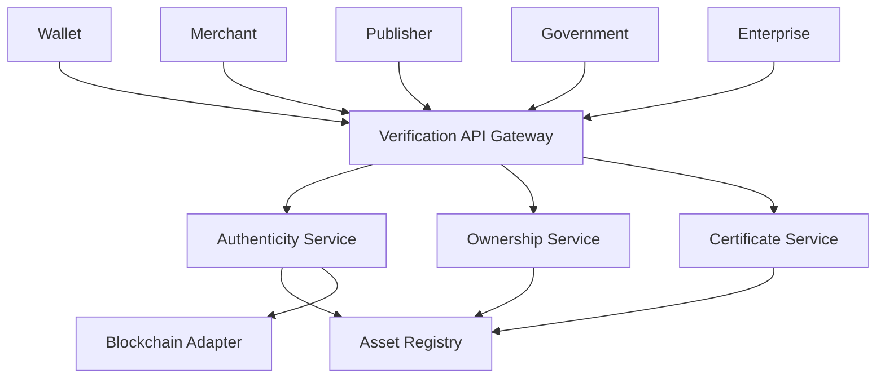

# Verification APIs

> _The Verification APIs provide standardized interfaces for validating the trust status of Physical Digital Assets, Publishers, merchants, certificates, and ownership. They are the foundation of trust within the DCN ecosystem, enabling applications to make secure, real-time decisions before accepting payments, granting access, or authorizing sensitive operations._

***

## Introduction

Verification is one of the most frequently executed operations in the DCN ecosystem.

Every time a user:

* Makes a payment
* Opens a secure door
* Enters a stadium
* Redeems a ticket
* Uses a government credential
* Presents an identity card
* Transfers ownership

multiple verification checks may occur behind the scenes.

Instead of requiring every application to implement complex cryptographic logic, the **Verification APIs** expose standardized services that perform trust validation on behalf of the application.

The result is a simple, consistent, and secure verification interface that can be used by wallets, merchants, publishers, governments, enterprises, and third-party applications.

***

## Verification Service Architecture



The Verification API Gateway coordinates multiple trust services while presenting a single integration interface.

***

## API Modules

The Verification API is organized into specialized modules.

```
Verification API

├── Authenticity
├── Ownership
├── Certificates
├── Revocation
├── Publisher
├── Merchant
├── Registry
├── Blockchain
├── Trust Score
├── Audit
└── Events
```

Each module performs a specific trust-related function while sharing a common authentication model.

***

## Authenticity APIs

Verify that a Physical Digital Asset is genuine.

| Method | Endpoint                               | Description                |
| ------ | -------------------------------------- | -------------------------- |
| GET    | `/verification/authenticity/{assetId}` | Verify asset authenticity  |
| POST   | `/verification/authenticity/challenge` | Execute challenge-response |
| GET    | `/verification/device/{deviceId}`      | Verify device identity     |

Authenticity APIs validate cryptographic identity, hardware trust, and provisioning status.

***

## Ownership APIs

Validate ownership information.

| Method | Endpoint                                    | Description       |
| ------ | ------------------------------------------- | ----------------- |
| GET    | `/verification/ownership/{assetId}`         | Verify owner      |
| POST   | `/verification/ownership/transfer`          | Validate transfer |
| GET    | `/verification/ownership/history/{assetId}` | Ownership history |

Ownership responses are filtered according to Publisher policies and requester permissions.

***

## Certificate APIs

Validate certificates used throughout the DCN ecosystem.

| Method | Endpoint                                    | Description           |
| ------ | ------------------------------------------- | --------------------- |
| GET    | `/verification/certificates/device/{id}`    | Device certificate    |
| GET    | `/verification/certificates/publisher/{id}` | Publisher certificate |
| GET    | `/verification/certificates/merchant/{id}`  | Merchant certificate  |
| GET    | `/verification/certificates/root`           | Root trust chain      |

Certificate validation establishes the trust chain between the Physical Digital Asset and the ecosystem.

***

## Revocation APIs

Determine whether trust has been removed.

| Method | Endpoint                                    | Description            |
| ------ | ------------------------------------------- | ---------------------- |
| GET    | `/verification/revocation/{assetId}`        | Asset revocation       |
| GET    | `/verification/revocation/certificate/{id}` | Certificate revocation |
| GET    | `/verification/revocation/publisher/{id}`   | Publisher status       |

Applications should consult these endpoints before completing sensitive operations.

***

## Publisher APIs

Verify Publisher trust.

| Method | Endpoint                                         | Description            |
| ------ | ------------------------------------------------ | ---------------------- |
| GET    | `/verification/publisher/{publisherId}`          | Publisher information  |
| GET    | `/verification/publisher/{publisherId}/status`   | Publisher trust status |
| GET    | `/verification/publisher/{publisherId}/products` | Supported products     |

These endpoints allow applications to verify that an asset originates from a recognized Publisher.

***

## Merchant APIs

Verify merchant identity.

| Method | Endpoint                                          | Description          |
| ------ | ------------------------------------------------- | -------------------- |
| GET    | `/verification/merchant/{merchantId}`             | Merchant information |
| GET    | `/verification/merchant/{merchantId}/status`      | Merchant trust       |
| GET    | `/verification/merchant/{merchantId}/certificate` | Merchant certificate |

Merchant verification is useful for payment routing, settlement, and enterprise integrations.

***

## Registry APIs

Retrieve trusted asset information.

| Method | Endpoint                                   | Description     |
| ------ | ------------------------------------------ | --------------- |
| GET    | `/verification/registry/{assetId}`         | Asset record    |
| GET    | `/verification/registry/device/{deviceId}` | Device record   |
| GET    | `/verification/registry/search`            | Registry search |

Registry endpoints provide authoritative lifecycle information.

***

## Blockchain APIs

Retrieve blockchain verification data.

| Method | Endpoint                                      | Description              |
| ------ | --------------------------------------------- | ------------------------ |
| GET    | `/verification/blockchain/{network}`          | Network status           |
| GET    | `/verification/blockchain/transaction/{txId}` | Transaction verification |
| GET    | `/verification/blockchain/asset/{assetId}`    | On-chain asset status    |

The Blockchain Adapter hides network-specific implementation details.

***

## Trust Evaluation

Many applications require a single trust decision rather than multiple API calls.

The Verification API may provide a consolidated endpoint.

```http
POST /api/v1/verification/evaluate

{
  "assetId": "DCN-48291",
  "operation": "payment"
}
```

Example response:

```json
{
  "verified": true,
  "authenticity": "VALID",
  "ownership": "VALID",
  "publisher": "TRUSTED",
  "revocation": "NOT_REVOKED",
  "overallTrust": "HIGH"
}
```

This endpoint simplifies integration by aggregating results from multiple verification services.

***

## Event Streaming

Applications can subscribe to verification events.

```
verification.completed

verification.failed

certificate.updated

asset.revoked

ownership.changed

publisher.updated

merchant.updated
```

Events enable real-time trust monitoring across the ecosystem.

***

## Security

Verification APIs should support:

* OAuth 2.1
* Mutual TLS
* JWT
* Request signing
* Certificate-based authentication
* Role-Based Access Control (RBAC)
* Rate limiting
* Audit logging

Every verification request should be authenticated and traceable.

***

## Performance

Verification is often executed during user-facing operations.

Recommended performance characteristics include:

* Low-latency responses
* Distributed verification nodes
* Registry caching
* Certificate caching
* Horizontal scalability
* High availability
* Automatic failover

These optimizations support real-time payments and identity verification.

***

## Future APIs

Future versions of the Verification API may include:

* Zero-Knowledge Proof (ZKP) verification
* Decentralized Identity (DID) verification
* Verifiable Credential (VC) verification
* Risk scoring APIs
* AI-powered fraud assessment
* Continuous trust monitoring
* Cross-chain trust federation

These capabilities will expand the verification framework while maintaining backward compatibility.

***

## Design Principles

The Verification APIs follow five principles.

#### Trust First

Every verification result is based on cryptographic evidence and authoritative registry data.

#### Unified

Multiple trust checks are exposed through a consistent API.

#### Privacy Preserving

Only the minimum required information is disclosed.

#### High Performance

Optimized for real-time verification at global scale.

#### Extensible

New verification services can be added without changing existing integrations.

***

## Summary

The Verification APIs provide the trust layer for the entire DCN ecosystem.

By exposing standardized endpoints for authenticity, ownership, certificates, revocation, Publisher validation, merchant validation, registry access, blockchain verification, and unified trust evaluation, they enable developers to build secure, interoperable, and scalable applications that can confidently interact with Physical Digital Assets across every supported blockchain and industry.
