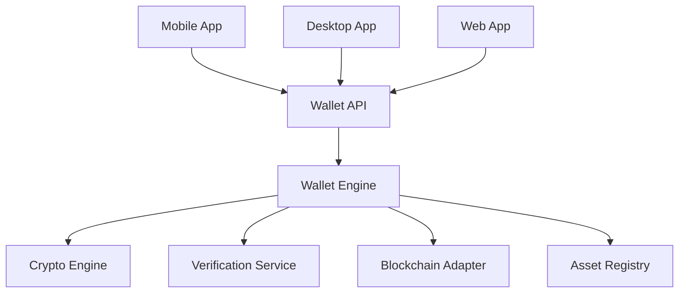

# Wallet APIs

> _The Wallet APIs provide standardized programmatic access to Companion Wallet functionality. They enable applications to discover Physical Digital Assets, authenticate devices, initiate payments, manage ownership, synchronize blockchain state, and interact with the DCN ecosystem through a consistent REST and event-driven interface._

***

## Introduction

The Companion Wallet is the primary gateway between users and the DCN ecosystem.

Every operation performed through a wallet—reading an asset, making a payment, verifying authenticity, or transferring ownership—is exposed through a standardized set of Wallet APIs.

Rather than interacting directly with:

* Secure Elements
* NFC protocols
* Blockchain RPCs
* Smart Contracts
* Certificate Authorities
* Verification Services

applications call the Wallet APIs.

The Wallet Service coordinates the required operations while maintaining compliance with the DCN Standard.

***

## Wallet Service Architecture



Applications communicate only with the Wallet API while the Wallet Engine coordinates protocol execution.

***

## API Modules

The Wallet API is organized into logical modules.

```
Wallet API

├── Session
├── Assets
├── Authentication
├── Payments
├── Ownership
├── Recovery
├── Verification
├── Certificates
├── Blockchain
├── Registry
├── Events
└── Settings
```

Each module exposes independent endpoints while sharing a common authentication and response model.

***

## Session APIs

Manage wallet sessions.

| Method | Endpoint                 | Description                  |
| ------ | ------------------------ | ---------------------------- |
| POST   | `/wallet/session/open`   | Create wallet session        |
| POST   | `/wallet/session/close`  | Close active session         |
| GET    | `/wallet/session/status` | Retrieve session information |

Sessions establish a trusted communication channel between the application and the Companion Wallet.

***

## Asset APIs

Interact with Physical Digital Assets.

| Method | Endpoint                                | Description                     |
| ------ | --------------------------------------- | ------------------------------- |
| GET    | `/wallet/assets`                        | List available assets           |
| GET    | `/wallet/assets/{assetId}`              | Retrieve asset details          |
| GET    | `/wallet/assets/{assetId}/metadata`     | Read metadata                   |
| GET    | `/wallet/assets/{assetId}/capabilities` | Retrieve supported capabilities |

These endpoints provide structured access to assets managed by the wallet.

***

## Authentication APIs

Authenticate users and devices.

| Method | Endpoint                 | Description               |
| ------ | ------------------------ | ------------------------- |
| POST   | `/wallet/auth/challenge` | Generate challenge        |
| POST   | `/wallet/auth/verify`    | Verify challenge response |
| POST   | `/wallet/auth/login`     | Authenticate wallet       |
| POST   | `/wallet/auth/logout`    | End authenticated session |

Authentication APIs leverage the DCN Authentication Protocol.

***

## Payment APIs

Initiate and manage payments.

| Method | Endpoint                          | Description             |
| ------ | --------------------------------- | ----------------------- |
| POST   | `/wallet/payments`                | Create payment          |
| POST   | `/wallet/payments/{id}/authorize` | Authorize payment       |
| POST   | `/wallet/payments/{id}/submit`    | Submit payment          |
| GET    | `/wallet/payments/{id}`           | Retrieve payment status |
| DELETE | `/wallet/payments/{id}`           | Cancel pending payment  |

These endpoints abstract the complete DCN Payment Protocol.

***

## Ownership APIs

Manage ownership operations.

| Method | Endpoint                      | Description               |
| ------ | ----------------------------- | ------------------------- |
| GET    | `/wallet/ownership/{assetId}` | Retrieve ownership status |
| POST   | `/wallet/ownership/transfer`  | Transfer ownership        |
| GET    | `/wallet/ownership/history`   | Ownership history         |

Ownership validation automatically respects Publisher policies.

***

## Recovery APIs

Support recovery workflows.

| Method | Endpoint                    | Description             |
| ------ | --------------------------- | ----------------------- |
| POST   | `/wallet/recovery/request`  | Initiate recovery       |
| POST   | `/wallet/recovery/verify`   | Verify recovery request |
| POST   | `/wallet/recovery/complete` | Complete recovery       |

Recovery operations remain subject to Publisher approval where applicable.

***

## Verification APIs

Wallets integrate directly with Verification Services.

| Method | Endpoint                      | Description           |
| ------ | ----------------------------- | --------------------- |
| GET    | `/wallet/verify/authenticity` | Verify authenticity   |
| GET    | `/wallet/verify/ownership`    | Verify ownership      |
| GET    | `/wallet/verify/revocation`   | Check revocation      |
| GET    | `/wallet/verify/certificates` | Validate certificates |

These endpoints simplify trust validation before sensitive operations.

***

## Blockchain APIs

Expose blockchain-independent operations.

| Method | Endpoint               | Description         |
| ------ | ---------------------- | ------------------- |
| GET    | `/wallet/networks`     | Supported networks  |
| GET    | `/wallet/balance`      | Asset balance       |
| GET    | `/wallet/transactions` | Transaction history |
| GET    | `/wallet/fees`         | Fee estimation      |

Blockchain-specific implementation details remain hidden behind the Blockchain Adapter SDK.

***

## Event Streaming

Wallet APIs support event-driven integration through WebSockets or Server-Sent Events (SSE).

Example events include:

```
asset.detected

wallet.connected

wallet.disconnected

payment.created

payment.authorized

payment.completed

ownership.transferred

asset.updated
```

Applications can subscribe to these events for real-time updates.

***

## Example Payment Request

```http
POST /api/v1/wallet/payments

{
    "assetId": "DCN-123456",
    "merchantId": "MERCHANT-001",
    "amount": "125.00",
    "currency": "USDT",
    "network": "ethereum"
}
```

***

## Example Payment Response

```json
{
    "success": true,
    "paymentId": "PAY-98A71",
    "status": "AUTHORIZED",
    "network": "ethereum",
    "transactionReference": "0x4f8b..."
}
```

The response structure remains identical across all supported blockchain networks.

***

## Security

The Wallet APIs should enforce:

* OAuth 2.1 or JWT authentication
* Mutual TLS (enterprise deployments)
* Request signing
* Certificate validation
* Role-based authorization
* Replay protection
* Audit logging
* Rate limiting

Sensitive operations should require explicit user authorization.

***

## Performance

The Wallet API is designed for high-performance applications.

Recommended capabilities include:

* Connection pooling
* HTTP/2 or HTTP/3 support
* WebSocket event streaming
* Local metadata caching
* Registry synchronization
* Automatic retry policies

These features improve responsiveness while maintaining protocol integrity.

***

## Future APIs

Future versions of the Wallet API may include:

* AI Agent APIs
* Offline payment APIs
* Digital Identity APIs
* Verifiable Credential APIs
* Multi-party approval APIs
* Zero-Knowledge authentication APIs
* Cross-chain asset management APIs

The Wallet API is designed to evolve without breaking existing integrations.

***

## Design Principles

The Wallet APIs follow five principles.

#### RESTful

Resource-oriented endpoints using standard HTTP semantics.

#### Secure

Every sensitive operation is authenticated and authorized.

#### Blockchain Neutral

Applications remain independent of blockchain-specific implementations.

#### Event Driven

Supports both synchronous APIs and asynchronous event streaming.

#### Developer Friendly

Simple, predictable endpoints with consistent request and response models.

***

## Summary

The Wallet APIs provide a comprehensive interface for building DCN-compatible Companion Wallets.

By exposing standardized endpoints for asset management, authentication, payments, ownership, recovery, verification, and blockchain interaction, they enable developers to create secure, interoperable, and high-performance wallet applications while remaining fully compliant with the DCN Standard.
