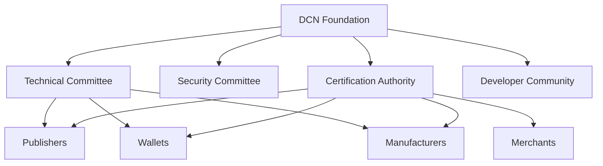

# 18. DCN Foundation

> _The DCN Foundation is the independent organization responsible for stewarding the Digital Crypto Note (DCN) Standard. Its mission is to promote open standards, ensure interoperability, coordinate ecosystem governance, and support the long-term growth of trusted Physical Digital Assets worldwide._

***

## Introduction

The success of the Internet was made possible because no single company owned it.

Similarly, technologies such as:

* TCP/IP
* HTTP
* USB
* Bluetooth
* Wi-Fi
* HTML

became global standards because they were governed by independent organizations rather than commercial vendors.

The **DCN Standard** follows the same philosophy.

No single wallet provider, manufacturer, Publisher, government, or blockchain network should control the future of Physical Digital Assets.

Instead, the ecosystem is governed through the **DCN Foundation**.

The Foundation exists to protect the standard—not to operate the network.

Its role is to ensure that every participant can innovate while remaining interoperable with the broader ecosystem.

***

## Purpose

The DCN Foundation is responsible for:

* Maintaining the DCN Specification
* Promoting global interoperability
* Managing protocol evolution
* Operating certification programs
* Supporting developers
* Coordinating ecosystem governance
* Publishing technical documentation
* Protecting the openness of the standard

***

## Foundation Architecture



The Foundation coordinates governance while allowing ecosystem participants to innovate independently.

***

## Vision

The long-term vision of the DCN Foundation is to establish the **global open standard for Physical Digital Assets**.

The Foundation aims to create an ecosystem where:

* Every wallet can interact with every asset.
* Every merchant can accept every compliant DCN product.
* Every Publisher follows a common standard.
* Every blockchain can participate through standardized adapters.
* Every manufacturer produces interoperable hardware.

This vision extends beyond payments into identity, government services, enterprise systems, digital ownership, and future Web3 infrastructure.

***

## Core Responsibilities

The Foundation serves as the steward of the standard.

Its responsibilities include:

* Protocol maintenance
* Standards publication
* Reference implementations
* Security guidance
* Certification programs
* Compliance testing
* Developer support
* Community engagement

The Foundation does **not** operate commercial Publisher services or proprietary payment networks.

***

## Relationship to Following Sections

The work of the DCN Foundation is organized into four key areas:

* **Mission** — Defining the long-term purpose of the ecosystem.
* **Governance** — Managing decision-making and protocol evolution.
* **Open Standards** — Ensuring interoperability and public accessibility.
* **Certification** — Establishing trust through compliance programs.

Together, these functions provide the governance framework that enables the DCN ecosystem to grow while remaining secure, open, and interoperable.

***

## Design Philosophy

The Foundation follows several guiding principles.

#### Independent

Governance is separate from commercial interests.

#### Transparent

Standards development occurs through open processes.

#### Collaborative

Industry participants contribute to the evolution of the specification.

#### Neutral

The Foundation remains blockchain, vendor, and jurisdiction neutral.

#### Long-Term

Every decision should support the sustainability of the ecosystem for decades.

***

## Ecosystem Participants

The Foundation collaborates with many stakeholders.

```
DCN Foundation

├── Publishers
├── Wallet Providers
├── Merchants
├── Manufacturers
├── Blockchain Networks
├── Governments
├── Banks
├── Stablecoin Issuers
├── Developers
├── Researchers
└── Certification Partners
```

Each participant contributes to the ecosystem while adhering to the same open standard.

***

## Global Collaboration

The Foundation encourages collaboration across industries and regions.

Potential areas include:

* Financial services
* Central Bank Digital Currencies (CBDCs)
* Digital identity
* Transportation
* Education
* Healthcare
* Retail
* Supply chain
* Government services
* Digital asset infrastructure

This broad participation supports the adoption of the DCN Standard as a universal platform for Physical Digital Assets.

***

## Summary

The DCN Foundation is the independent steward of the Digital Crypto Note Standard.

By maintaining specifications, coordinating governance, supporting developers, operating certification programs, and promoting open standards, the Foundation provides the institutional framework required for the DCN ecosystem to evolve into a trusted, interoperable, and globally adopted standard for Physical Digital Assets.

***

## In this chapter

* [Mission](mission.md)
* [Governance](governance.md)
* [Open Standards](open-standards.md)
* [Certification](certification.md)
