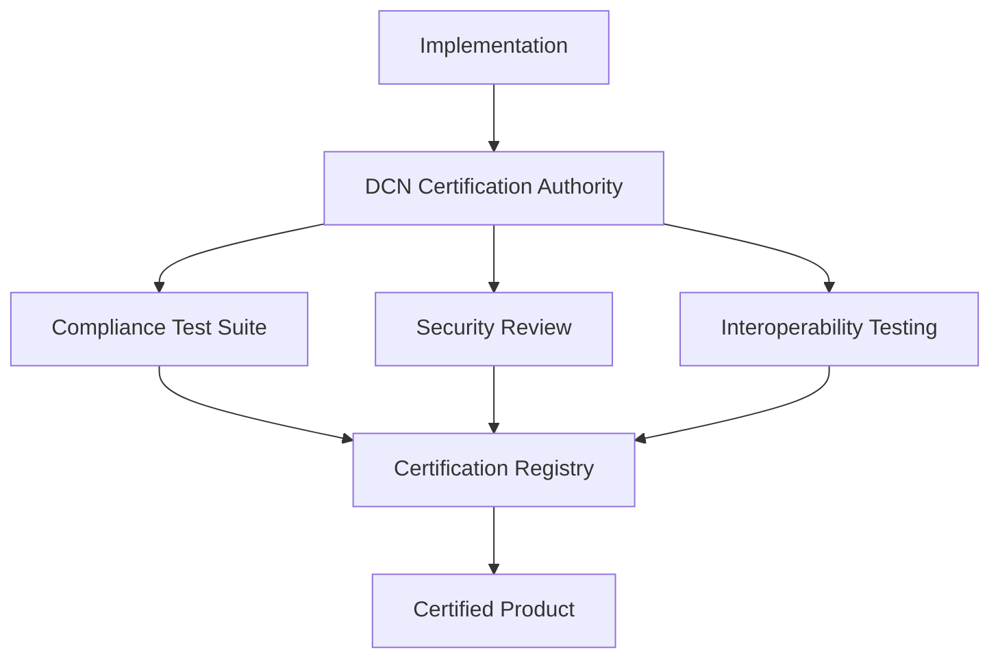
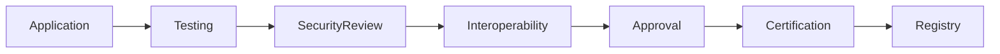

# Certification

> _Certification establishes trust within the DCN ecosystem by verifying that products, organizations, and implementations comply with the DCN Standard. It provides a consistent framework for validating interoperability, security, functionality, and operational readiness across wallets, Publishers, manufacturers, merchants, verification services, and blockchain adapters._

***

## Introduction

The DCN Standard is intentionally open.

Anyone can implement the specification.

However, **openness alone does not guarantee interoperability or security**.

Two implementations may claim to support the DCN Standard while behaving differently.

A wallet may incorrectly implement the Payment Protocol.

A manufacturer may use uncertified Secure Hardware.

A Publisher may issue assets that do not follow the lifecycle requirements.

Without verification, users and organizations cannot distinguish compliant implementations from incompatible or insecure ones.

Certification solves this problem.

It provides an independent process for verifying that an implementation conforms to the DCN Specification and can interoperate with the broader ecosystem.

***

## Purpose

The Certification Framework is designed to:

* Verify compliance with the DCN Standard
* Ensure interoperability
* Validate security requirements
* Build ecosystem trust
* Improve implementation quality
* Reduce integration risk
* Support global adoption

***

## Certification Architecture



The Certification Authority evaluates implementations using standardized test procedures before recognizing them as DCN Certified.

***

## What Can Be Certified?

The DCN ecosystem supports certification across multiple implementation types.

| Category              | Examples                                |
| --------------------- | --------------------------------------- |
| Wallets               | Companion Wallets, enterprise wallets   |
| Publisher Platforms   | Issuance and lifecycle systems          |
| Merchant Systems      | POS, e-commerce, payment gateways       |
| Manufacturers         | Secure production facilities            |
| Secure Hardware       | Secure Elements, NFC modules            |
| Verification Services | Trust and validation platforms          |
| Blockchain Adapters   | Ethereum, Bitcoin, TON, Solana adapters |
| SDKs                  | Wallet SDK, Merchant SDK, Publisher SDK |
| APIs                  | REST and event interfaces               |

Certification ensures that every ecosystem component behaves consistently.

***

## Certification Levels

The Foundation may define multiple certification levels.

| Level      | Description                                  |
| ---------- | -------------------------------------------- |
| Developer  | Suitable for development and testing         |
| Certified  | Meets mandatory compliance requirements      |
| Enterprise | Includes operational and security validation |
| Government | Meets additional public sector requirements  |

Different industries may require different certification levels.

***

## Certification Process



Each implementation progresses through a structured evaluation process.

***

## Compliance Testing

Compliance testing verifies adherence to the DCN Specification.

Typical validation includes:

* Protocol implementation
* API compatibility
* SDK behavior
* Asset profile support
* Lifecycle operations
* Error handling
* Version compatibility

The goal is to ensure that independently developed implementations behave consistently.

***

## Security Evaluation

Security testing may include:

* Certificate validation
* Authentication procedures
* Secure messaging
* Key management
* Cryptographic implementation
* Secure storage
* Replay protection
* Access control

Security evaluations help preserve ecosystem trust.

***

## Interoperability Testing

Certified products should demonstrate compatibility with:

* Companion Wallets
* Merchant systems
* Publisher platforms
* Verification services
* Asset Registry
* Blockchain adapters

An implementation is considered interoperable only if it functions correctly with other certified components.

***

## Certification Registry

Certified implementations are recorded in a public Certification Registry.

Example record:

```
Certification ID

DCN-CERT-2027-00124

Organization

Example Wallet Ltd.

Product

Companion Wallet

Version

1.0.0

Status

Certified
```

Applications may consult the registry to verify certification status.

***

## Certification Lifecycle

Certification is not permanent.

Typical lifecycle stages include:

| Stage        | Description                      |
| ------------ | -------------------------------- |
| Submitted    | Application received             |
| Under Review | Technical evaluation in progress |
| Certified    | Successfully approved            |
| Suspended    | Temporarily restricted           |
| Revoked      | Certification withdrawn          |
| Renewed      | Updated certification issued     |

This lifecycle supports continuous quality assurance.

***

## Certification Renewal

Organizations should periodically renew certification to ensure ongoing compliance.

Renewal may be required after:

* Major software releases
* Significant protocol updates
* Security architecture changes
* Hardware revisions
* New certification requirements

Regular renewal keeps implementations aligned with the evolving standard.

***

## Compliance Test Suite

The Foundation should publish an official Compliance Test Suite.

The suite may include:

* API tests
* SDK tests
* NFC protocol tests
* Authentication tests
* Payment workflow tests
* Lifecycle tests
* Verification tests
* Performance benchmarks

Automated testing reduces certification effort while improving consistency.

***

## Developer Certification

Developers should have access to self-assessment tools before formal certification.

Resources may include:

* Local compliance validators
* Emulator environments
* Reference implementations
* Sample assets
* Test certificates
* Mock Verification Services

These resources encourage early adoption and improve implementation quality.

***

## Certification Mark

Certified products may display an official certification mark.

Example:

```
DCN Certified

Version 1.0

Certified by

DCN Foundation
```

The certification mark indicates compliance with the published DCN Standard and successful completion of the certification process.

***

## Future Certification

Future versions of the Certification Framework may support:

* Automated continuous compliance
* Cloud-based certification pipelines
* AI-assisted conformance analysis
* Regional certification authorities
* Industry-specific certification profiles
* Cross-standard interoperability certification

These enhancements can streamline certification while preserving trust.

***

## Design Principles

The Certification Framework follows five principles.

#### Independent

Certification is performed through an impartial evaluation process.

#### Transparent

Certification requirements and procedures are publicly documented.

#### Interoperable

Certified implementations work together without proprietary modifications.

#### Secure

Security validation is a mandatory component of certification.

#### Repeatable

Every implementation is evaluated using consistent criteria and test suites.

***

## Summary

Certification is the trust assurance mechanism of the DCN ecosystem.

By validating compliance, security, interoperability, and operational readiness, the Certification Framework enables wallets, Publishers, manufacturers, merchants, verification services, SDKs, and blockchain adapters to participate in the ecosystem with confidence.

Certification complements the openness of the DCN Standard by ensuring that independent implementations remain secure, compatible, and globally interoperable.
