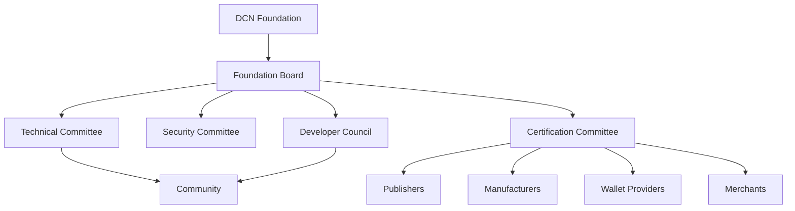

# Governance

> _The Governance Framework defines how the DCN Standard evolves over time. It establishes transparent processes for technical decision-making, specification updates, ecosystem participation, certification policies, and community collaboration while preserving the openness and interoperability of the standard._

***

## Introduction

An open standard requires more than technical documentation.

It requires a governance model that ensures:

* The specification evolves responsibly.
* Security vulnerabilities are addressed quickly.
* New technologies can be adopted.
* Backward compatibility is maintained.
* Every stakeholder has a voice.
* No single organization controls the future of the ecosystem.

The DCN Foundation is responsible for governing the **standard**, not controlling the **market**.

Wallet providers compete.

Publishers compete.

Manufacturers compete.

Blockchain networks compete.

The Foundation ensures that they remain interoperable through a shared specification.

***

## Purpose

The Governance Framework is designed to:

* Maintain the DCN Specification
* Approve protocol improvements
* Protect interoperability
* Coordinate ecosystem participants
* Manage certification policies
* Resolve technical issues
* Publish future versions of the standard
* Ensure long-term sustainability

***

## Governance Architecture



Each committee has a clearly defined responsibility while operating under the governance framework established by the Foundation.

***

## Governance Principles

The DCN Foundation follows six governance principles.

#### Open Participation

Organizations, developers, researchers, and ecosystem participants should be able to contribute to the evolution of the standard.

***

#### Transparency

Specifications, technical proposals, meeting outcomes, and published standards should be publicly available whenever appropriate.

***

#### Technical Merit

Protocol decisions should be based on security, interoperability, scalability, and technical excellence rather than commercial interests.

***

#### Neutrality

The Foundation does not favor:

* Any blockchain
* Any Publisher
* Any wallet
* Any manufacturer
* Any country
* Any commercial organization

***

#### Backward Compatibility

Where practical, new protocol versions should preserve compatibility with previous implementations.

Breaking changes should be introduced only when necessary and through a clearly defined versioning process.

***

#### Security First

Security considerations take precedence over feature expansion.

Every significant protocol change should undergo technical and security review before publication.

***

## Governance Responsibilities

The Foundation governs the standard by:

* Publishing technical specifications
* Maintaining protocol documentation
* Managing version releases
* Reviewing improvement proposals
* Coordinating interoperability testing
* Defining certification requirements
* Publishing reference implementations
* Managing security advisories

The Foundation does **not** manage commercial products or business operations of ecosystem participants.

***

## DCN Improvement Proposals (DIPs)

The DCN ecosystem adopts a formal proposal process known as the **DCN Improvement Proposal (DIP)**.

A DIP allows contributors to propose:

* New protocol features
* Security enhancements
* API improvements
* SDK enhancements
* Asset profile extensions
* Blockchain adapter updates
* Governance changes
* Editorial improvements

Every major change to the DCN Standard should be documented through a DIP.

***

## DIP Lifecycle


Each proposal progresses through multiple review stages before becoming part of the standard.

***

## Foundation Committees

### Foundation Board

Provides strategic direction, legal oversight, and long-term stewardship of the Foundation.

***

### Technical Committee

Responsible for:

* Protocol architecture
* SDK evolution
* API design
* Asset profiles
* Blockchain interoperability
* Technical specifications

***

### Security Committee

Responsible for:

* Cryptographic guidance
* Secure hardware requirements
* Vulnerability response
* Security advisories
* Threat modeling
* Authentication standards

***

### Certification Committee

Responsible for:

* Certification policies
* Compliance testing
* Reference test suites
* Certification renewals
* Ecosystem trust requirements

***

### Developer Council

Represents developers building:

* Wallets
* Merchant applications
* Publisher Platforms
* Blockchain adapters
* Verification Services

The council provides practical feedback based on real-world implementation experience.

***

## Version Governance

The Foundation manages protocol evolution using semantic versioning.

```
DCN 1.x

↓

DCN 2.x

↓

DCN 3.x
```

Major versions introduce significant capabilities.

Minor versions introduce backward-compatible improvements.

Patch versions address defects and clarifications.

***

## Decision Process

Protocol decisions generally follow this process:

1. Proposal submitted.
2. Community discussion.
3. Technical evaluation.
4. Security review.
5. Interoperability assessment.
6. Foundation approval.
7. Publication.

This structured approach promotes predictable and transparent evolution.

***

## Community Participation

The Foundation encourages contributions from:

* Individual developers
* Open-source communities
* Universities
* Security researchers
* Manufacturers
* Wallet providers
* Publishers
* Governments
* Standards organizations

Open participation strengthens the quality and resilience of the DCN Standard.

***

## Conflict Resolution

When competing proposals exist, evaluation should prioritize:

1. Security
2. Interoperability
3. Simplicity
4. Scalability
5. Backward compatibility
6. Long-term ecosystem benefit

The objective is to maximize ecosystem value rather than favor individual implementations.

***

## Governance Transparency

The Foundation should publish:

* Technical specifications
* Meeting summaries
* Approved DIPs
* Release notes
* Security advisories
* Certification updates
* Roadmaps
* Reference implementations

Transparency builds confidence across the ecosystem.

***

## Future Governance

As the ecosystem grows, governance may expand to include:

* Regional advisory councils
* Industry working groups
* Academic research partnerships
* National standards collaborations
* Cross-standard interoperability initiatives

The governance framework is designed to evolve while preserving the core principles of openness and neutrality.

***

## Design Principles

The Governance Framework follows five principles.

#### Open

Participation is encouraged from across the ecosystem.

#### Transparent

Decisions and standards are documented and publicly accessible.

#### Neutral

The Foundation remains independent of commercial interests.

#### Secure

Every protocol evolution prioritizes ecosystem security.

#### Sustainable

Governance is structured to support the DCN Standard for decades.

***

## Summary

The DCN Governance Framework provides the organizational and technical processes that guide the evolution of the DCN Standard.

Through open participation, transparent decision-making, structured improvement proposals, specialized committees, and security-focused oversight, the Foundation ensures that the ecosystem can continue to innovate while remaining interoperable, secure, and globally trusted.
