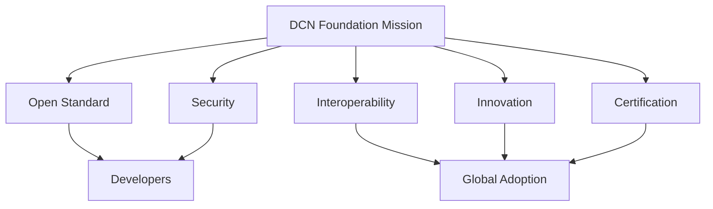

# Mission

> _The mission of the DCN Foundation is to establish and maintain the world's open standard for Physical Digital Assets by enabling secure, interoperable, and vendor-neutral infrastructure that bridges the physical and digital economies._

***

## Introduction

The DCN Foundation exists for one reason:

> **To ensure that Physical Digital Assets become an open global standard rather than a proprietary technology controlled by a single organization.**

Throughout history, the technologies that achieved global adoption shared a common characteristic—they were governed by open standards.

The Internet succeeded because no single company owned TCP/IP.

USB succeeded because manufacturers agreed on common specifications.

The Web succeeded because browsers implemented shared standards.

The DCN Foundation applies the same philosophy to Physical Digital Assets.

Its mission is not to compete with wallets, banks, manufacturers, governments, or blockchain networks.

Its mission is to enable them.

***

## Mission Statement

The official mission of the DCN Foundation is:

> **To develop, maintain, and promote an open, secure, interoperable, and globally accessible standard for Physical Digital Assets, empowering organizations worldwide to issue, manage, and verify trusted digital assets across every blockchain and industry.**

***

## Long-Term Vision

The Foundation's long-term vision extends beyond digital payments.

The objective is to make Physical Digital Assets a universal interface for digital value.

Future applications include:

* Digital money
* Stablecoins
* CBDCs
* Identity credentials
* Government documents
* Enterprise credentials
* Event tickets
* Transit systems
* Digital collectibles
* Tokenized real-world assets (RWAs)
* Healthcare credentials
* Education certificates

The Foundation's mission is to provide one common standard for all of these use cases.

***

## Core Objectives

The Foundation pursues several strategic objectives.

### 1. Establish a Global Standard

Create a universally recognized specification for Physical Digital Assets that can be adopted by organizations worldwide.

***

### 2. Enable Interoperability

Ensure that assets issued by different Publishers work seamlessly with compliant wallets, merchants, and verification services.

***

### 3. Promote Security

Continuously improve cryptographic standards, secure hardware requirements, authentication protocols, and certificate infrastructure.

***

### 4. Encourage Innovation

Allow organizations to develop new products without modifying the core protocol.

Innovation should occur **above** the standard, not by fragmenting it.

***

### 5. Build an Open Ecosystem

Support an ecosystem where:

* Publishers compete on products.
* Wallets compete on user experience.
* Manufacturers compete on quality.
* Blockchain networks compete on performance.

All while remaining interoperable through the DCN Standard.

***

## Mission Architecture



The mission connects technical standards with ecosystem growth and global adoption.

***

## Strategic Priorities

The Foundation focuses on six long-term priorities.

| Priority            | Goal                                             |
| ------------------- | ------------------------------------------------ |
| Standards           | Maintain the DCN Specification                   |
| Security            | Protect ecosystem trust                          |
| Certification       | Ensure compliance                                |
| Developer Ecosystem | Accelerate adoption                              |
| Education           | Promote understanding of Physical Digital Assets |
| Research            | Advance future versions of the standard          |

These priorities guide the Foundation's roadmap.

***

## Global Principles

The mission is built upon several universal principles.

#### Open

The specification is publicly available.

#### Neutral

No blockchain, company, or government receives preferential treatment.

#### Inclusive

Participation is open to organizations of all sizes.

#### Collaborative

Development is driven by community participation and technical expertise.

#### Sustainable

The standard is designed for decades of evolution.

***

## Ecosystem Commitment

The Foundation is committed to supporting every participant in the ecosystem.

```
DCN Foundation

↓

Developers

↓

Publishers

↓

Manufacturers

↓

Wallet Providers

↓

Merchants

↓

Governments

↓

End Users
```

Every participant benefits from a common, interoperable foundation.

***

## Research & Innovation

The Foundation promotes ongoing research in areas such as:

* Secure Hardware
* NFC technologies
* Cryptography
* Zero-Knowledge Proofs (ZKP)
* Decentralized Identity (DID)
* Verifiable Credentials (VC)
* Cross-chain interoperability
* Privacy-enhancing technologies
* AI-assisted security
* Post-quantum cryptography

Research ensures that the DCN Standard remains technically relevant as the industry evolves.

***

## Community Engagement

The Foundation encourages active participation through:

* Public technical discussions
* Open working groups
* Developer forums
* Reference implementations
* Hackathons
* Academic collaborations
* Security research programs
* Open documentation

Community involvement is essential for long-term success.

***

## Measuring Success

The Foundation measures success through ecosystem adoption rather than commercial metrics.

Examples include:

* Number of compliant Publishers
* Number of certified manufacturers
* Number of compatible wallets
* Number of participating merchants
* Number of supported blockchains
* Number of developers
* Number of Physical Digital Assets in circulation

Growth in these areas reflects the health of the ecosystem.

***

## Future Outlook

The Foundation envisions a future where:

* Physical Digital Assets are accepted globally.
* Every major blockchain supports the DCN Standard.
* Governments issue digital credentials using DCN.
* Banks issue interoperable digital cash products.
* Enterprises manage secure credentials through DCN.
* Consumers carry trusted Physical Digital Assets as naturally as they carry payment cards today.

This vision guides every technical and governance decision.

***

## Design Principles

The Foundation's mission follows five principles.

#### Open Standards

The specification remains publicly available.

#### Interoperability

Compatibility takes precedence over fragmentation.

#### Security

Trust is the foundation of every technical decision.

#### Innovation

The ecosystem should encourage new products and ideas.

#### Global Accessibility

The standard should be usable across industries, jurisdictions, and blockchain networks.

***

## Summary

The mission of the DCN Foundation is to create and maintain the world's open standard for Physical Digital Assets.

By promoting interoperability, security, developer participation, certification, and vendor neutrality, the Foundation provides the long-term vision and leadership required to establish Physical Digital Assets as a universal infrastructure for digital value, identity, and ownership.
