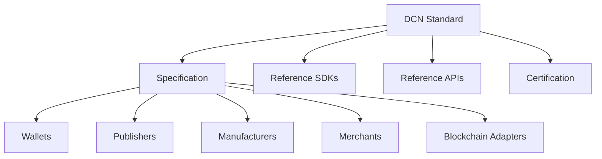

# Open Standards

> _The DCN Standard is an open, vendor-neutral specification designed to enable global interoperability for Physical Digital Assets. Any organization may build compatible hardware, software, wallets, merchant systems, Publisher platforms, or blockchain adapters by implementing the publicly available specification._

***

## Introduction

The long-term success of the DCN ecosystem depends on one fundamental principle:

> **The standard must remain open.**

History has repeatedly shown that technologies become global infrastructure when they are built on open standards.

Examples include:

* Internet (TCP/IP)
* World Wide Web (HTTP, HTML)
* USB
* Bluetooth
* Wi-Fi
* NFC
* QR Codes

None of these technologies belong to a single vendor.

Instead, they provide a common language that allows products from thousands of organizations to work together.

The DCN Standard follows the same philosophy.

The Foundation publishes the specification.

The ecosystem builds upon it.

***

## Purpose

The Open Standards framework is designed to:

* Promote interoperability
* Encourage innovation
* Prevent vendor lock-in
* Enable global participation
* Support long-term sustainability
* Foster open-source development
* Simplify ecosystem integration

***

## Open Standards Architecture



The specification is the common foundation shared by every implementation.

***

## What Is Open?

The DCN Foundation intends to openly publish technical specifications including:

* Protocol Specification
* Asset Format
* Authentication Protocol
* Payment Protocol
* Certificate Infrastructure
* SDK Specifications
* API Specifications
* Blockchain Adapter Interface
* Asset Profiles
* Security Guidelines
* Test Specifications

Organizations are free to implement these standards while remaining compliant with certification requirements.

***

## Vendor Neutrality

The DCN Standard does not favor:

* Wallet providers
* Hardware manufacturers
* Publishers
* Banks
* Governments
* Blockchain networks
* Cloud providers
* Operating systems

Every compliant implementation should be treated equally.

***

## Multi-Implementation Philosophy

The Foundation encourages multiple independent implementations.

Examples include:

```
Wallets

├── Wallet A
├── Wallet B
├── Wallet C

Publishers

├── Publisher A
├── Publisher B
├── Publisher C

Manufacturers

├── Vendor A
├── Vendor B
├── Vendor C
```

Competition occurs through innovation and quality rather than proprietary protocol changes.

***

## Open Reference Implementations

To accelerate adoption, the Foundation should publish reference implementations.

Potential projects include:

* Companion Wallet
* Merchant Application
* Publisher Platform
* Verification Service
* Blockchain Adapter
* Test Environment
* SDK Examples
* API Examples

These implementations serve as educational resources and interoperability references rather than mandatory software.

***

## Open APIs

All major interfaces should be publicly documented.

Examples include:

```
/api/v1/wallet

/api/v1/publisher

/api/v1/verification

/api/v1/registry

/api/v1/payments
```

Standardized APIs reduce integration effort across the ecosystem.

***

## Open SDKs

The Foundation should provide SDKs for multiple programming languages.

Example ecosystem:

```
Wallet SDK

Merchant SDK

Publisher SDK

Blockchain Adapter SDK

Core SDK
```

These SDKs encourage consistent implementations while reducing development complexity.

***

## Open Governance

The standard itself should evolve through an open governance process.

Contributors may submit:

* DCN Improvement Proposals (DIPs)
* Security reports
* Protocol enhancements
* Editorial improvements
* New blockchain adapters
* New asset profiles

All proposals should be reviewed using the governance framework defined by the Foundation.

***

## Intellectual Property

The Foundation should strive to ensure that the core DCN Specification can be implemented without unnecessary proprietary restrictions.

Key objectives include:

* Open technical documentation
* Transparent licensing
* Public protocol definitions
* Interoperable implementations
* Long-term ecosystem accessibility

Commercial products may remain proprietary while implementing the open standard.

***

## Interoperability

Open Standards ensure that:

* Every compliant wallet can interact with every compliant asset.
* Every merchant can accept every compliant Publisher.
* Every blockchain adapter follows the same interface.
* Every SDK behaves consistently.
* Every verification service returns standardized responses.

Interoperability is the primary objective of the DCN Standard.

***

## Community Contributions

The Foundation encourages contributions from:

* Individual developers
* Universities
* Open-source communities
* Security researchers
* Hardware manufacturers
* Wallet providers
* Governments
* Financial institutions
* Standards organizations

A diverse contributor base strengthens both technical quality and ecosystem resilience.

***

## Future Evolution

The Open Standards framework is designed to support future innovation.

Potential future additions include:

* Quantum-resistant cryptography
* Zero-Knowledge Proof (ZKP) standards
* Decentralized Identity (DID)
* Verifiable Credentials (VC)
* IoT device profiles
* AI agent interoperability
* Offline transaction standards
* Cross-chain trust federation

These additions can be incorporated while preserving compatibility with existing implementations.

***

## Benefits

Maintaining an open standard provides long-term advantages.

| Benefit                | Description                                |
| ---------------------- | ------------------------------------------ |
| Interoperability       | Products work together                     |
| Competition            | Innovation across vendors                  |
| Lower Integration Cost | Standardized interfaces                    |
| Security               | Public review of specifications            |
| Longevity              | Reduced dependency on individual companies |
| Global Adoption        | Accessible to organizations worldwide      |

***

## Design Principles

The Open Standards framework follows five principles.

#### Open

Specifications are publicly available.

#### Vendor Neutral

No organization controls implementation choices.

#### Interoperable

Independent implementations work together.

#### Extensible

The standard can evolve without fragmentation.

#### Community Driven

The ecosystem benefits from broad technical participation.

***

## Summary

The Open Standards framework is one of the defining characteristics of the DCN ecosystem.

By publishing open specifications, reference implementations, SDKs, APIs, governance processes, and interoperability requirements, the DCN Foundation enables organizations worldwide to build compatible products while preserving security, innovation, and long-term ecosystem sustainability.
