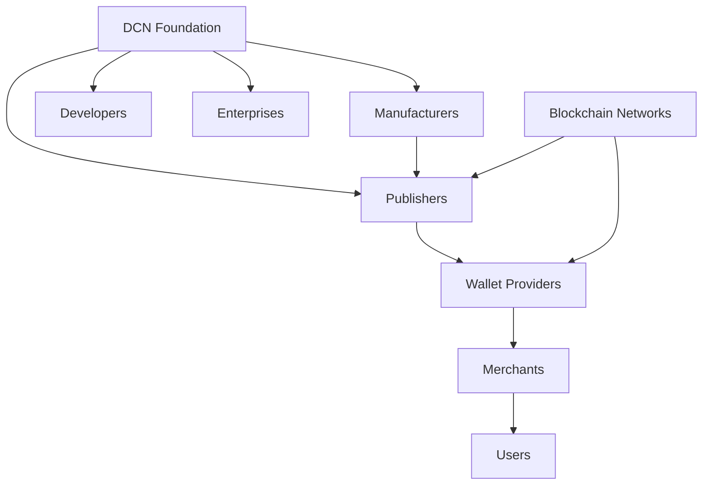

# 19. Business Model

> _The DCN Business Model defines how value is created, distributed, and sustained across the ecosystem. Rather than operating as a centralized payment company, the DCN Standard enables an open economy where manufacturers, publishers, developers, enterprises, merchants, and service providers build independent businesses on top of a shared infrastructure._

***

## Introduction

The DCN Standard is **not a business**.

It is **an ecosystem**.

Just as the Internet enabled thousands of successful companies without owning them, the DCN Standard creates a platform where organizations can build their own business models while remaining interoperable.

The DCN Foundation develops and governs the standard.

The ecosystem participants create products, services, applications, and commercial offerings.

This separation encourages innovation, competition, and long-term sustainability.

The DCN economy is built around multiple independent participants rather than a single centralized operator.

***

## Purpose

The DCN Business Model is designed to:

* Encourage ecosystem participation
* Enable sustainable businesses
* Promote innovation
* Support open competition
* Avoid vendor lock-in
* Create long-term economic incentives
* Accelerate global adoption

***

## Ecosystem Business Architecture

The Foundation provides the standard, while ecosystem participants create commercial value.

***

## Value Creation

The DCN ecosystem enables value through multiple activities.

| Participant         | Creates Value By                    |
| ------------------- | ----------------------------------- |
| Manufacturers       | Producing secure hardware           |
| Publishers          | Issuing Physical Digital Assets     |
| Developers          | Building software and services      |
| Enterprises         | Deploying business solutions        |
| Wallet Providers    | Delivering user experiences         |
| Merchants           | Accepting Physical Digital Assets   |
| Blockchain Networks | Providing settlement infrastructure |

Each participant contributes independently while benefiting from interoperability.

***

## Open Economic Model

Unlike proprietary payment networks, DCN does not require every transaction to flow through a central operator.

Instead:

* Publishers operate independently.
* Wallets compete independently.
* Manufacturers supply hardware independently.
* Developers build applications independently.
* Blockchain networks provide settlement independently.

The Foundation benefits from ecosystem growth rather than transaction ownership.

***

## Revenue Opportunities

Organizations may generate revenue from:

* Hardware manufacturing
* Asset issuance
* Wallet services
* Enterprise software
* Verification services
* Managed infrastructure
* SDK support
* Integration consulting
* Certification services
* Premium platform offerings

The DCN Standard supports many complementary business models rather than a single revenue source.

***

## Business Participants

This chapter explores four major commercial participants:

* **Manufacturers**
* **Publishers**
* **Developers**
* **Enterprises**

Each plays a distinct role in expanding the Physical Digital Asset ecosystem.

***

## Long-Term Vision

The objective of the DCN Business Model is to create a self-sustaining ecosystem where:

* Innovation is rewarded.
* Competition drives quality.
* Open standards reduce integration costs.
* Organizations remain interoperable.
* Users retain freedom of choice.

As adoption grows, the ecosystem becomes more valuable for every participant.

***

## Summary

The DCN Business Model transforms the standard into an open commercial ecosystem.

Rather than centralizing value creation, it enables manufacturers, publishers, developers, enterprises, merchants, and infrastructure providers to build independent businesses on top of a shared, interoperable foundation.

***

## In this chapter

* [Manufacturers](manufacturers.md)
* [Publishers](publishers.md)
* [Developers](developers.md)
* [Enterprises](enterprises.md)
