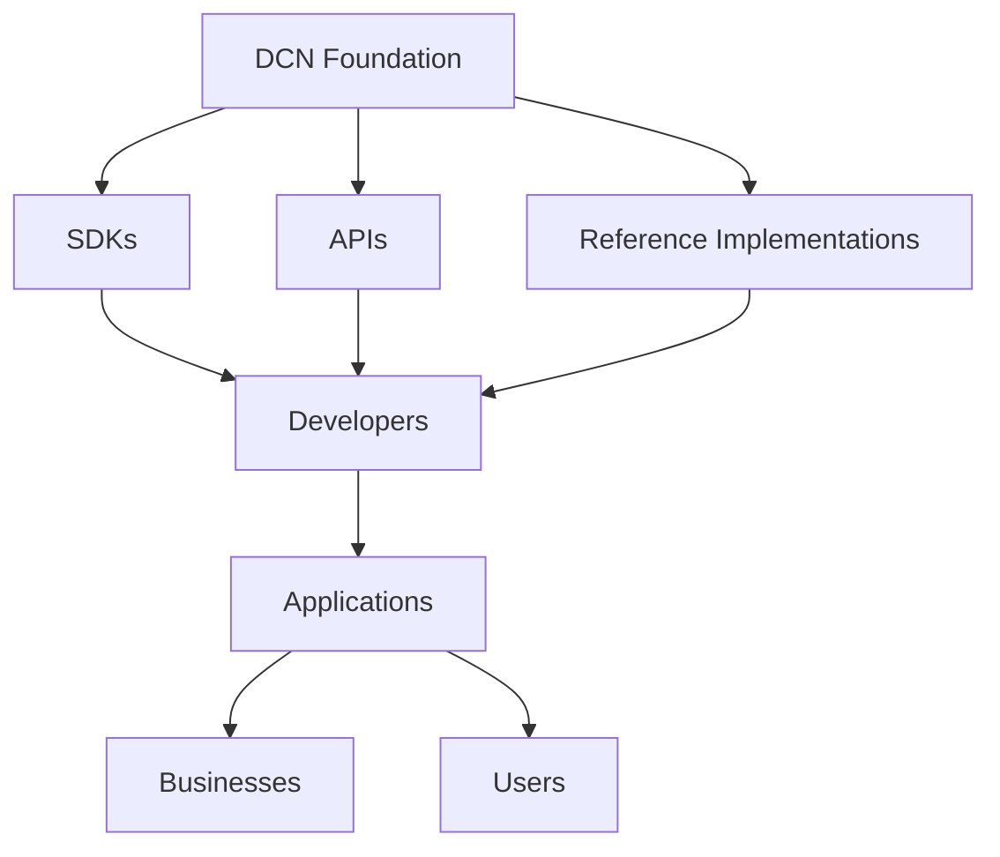

# Developers

> _Developers are the innovation layer of the DCN ecosystem. By building wallets, merchant applications, Publisher platforms, APIs, SDKs, blockchain adapters, enterprise solutions, and new Physical Digital Asset experiences, developers transform the DCN Standard into real-world products and services._

***

## Introduction

Every successful technology ecosystem is driven by developers.

The Internet grew because developers built websites.

Smartphones became indispensable because developers built applications.

Blockchain expanded because developers created wallets, exchanges, DeFi, NFTs, and Web3 applications.

The DCN ecosystem follows the same principle.

The DCN Foundation provides the standard.

Publishers issue products.

Manufacturers build hardware.

**Developers create everything in between.**

Developers are not simply API consumers.

They are ecosystem builders.

***

## Developer Economy

The DCN ecosystem creates an entirely new software category:

> **Physical Digital Asset Applications**

Instead of building applications only for digital wallets or blockchain networks, developers can build software that seamlessly bridges the physical and digital worlds.

This creates opportunities across:

* Finance
* Payments
* Identity
* Retail
* Healthcare
* Logistics
* Transportation
* Education
* Government
* Web3
* IoT

***

## Developer Ecosystem



The Foundation provides the platform.

Developers create innovation.

***

## What Can Developers Build?

The DCN Standard enables an extensive range of applications.

#### Consumer Applications

* Companion Wallets
* Mobile Wallets
* Desktop Wallets
* Family Wallets
* Multi-chain Wallets

***

#### Merchant Applications

* POS Systems
* Retail Checkout
* Restaurant Payments
* Hotel Systems
* Ticket Validation
* Self-Service Kiosks

***

#### Publisher Platforms

* Asset Issuance Platforms
* Stablecoin Platforms
* CBDC Platforms
* Identity Platforms
* Loyalty Platforms

***

#### Enterprise Applications

* Employee Access
* Asset Management
* Corporate Identity
* Expense Management
* Visitor Management

***

#### Government Applications

* National Identity
* Welfare Distribution
* Healthcare Credentials
* Public Transportation
* Digital Licensing

***

#### Web3 Applications

* NFT Platforms
* DAO Membership
* Physical NFTs
* Gaming Assets
* Tokenized RWAs
* Cross-chain Wallets

***

## Developer Revenue Models

Developers can monetize through many approaches.

| Revenue Model         | Description                  |
| --------------------- | ---------------------------- |
| SaaS Platforms        | Subscription-based software  |
| Mobile Apps           | Consumer applications        |
| Enterprise Licensing  | Corporate deployments        |
| API Services          | Paid API access              |
| SDK Extensions        | Commercial developer tools   |
| Integration Services  | Implementation consulting    |
| White-Label Solutions | Custom branded software      |
| Managed Hosting       | Cloud infrastructure         |
| Support & Maintenance | Enterprise support contracts |
| Marketplace Apps      | Paid ecosystem applications  |

The open standard encourages commercial innovation without requiring permission from a central platform operator.

***

## Development Stack

Developers can build using familiar technologies.

```
Frontend

├── Angular
├── React
├── Vue
├── Flutter
├── React Native

Backend

├── Node.js
├── Java
├── Go
├── Rust
├── Python
├── .NET

Infrastructure

├── Docker
├── Kubernetes
├── PostgreSQL
├── Redis
├── Kafka
└── Cloud Platforms
```

The DCN SDKs and APIs remain technology-agnostic.

***

## Extension Marketplace

A future DCN ecosystem may include a global extension marketplace.

Developers could publish:

* Wallet plugins
* Merchant plugins
* Publisher modules
* Blockchain adapters
* Analytics dashboards
* Identity providers
* AI assistants
* Payment connectors
* ERP integrations
* Compliance modules

Organizations can discover and deploy certified extensions without modifying the core platform.

***

## Open-Source Contributions

The Foundation encourages open-source development.

Potential contribution areas include:

* Wallet SDK
* Merchant SDK
* Publisher SDK
* Blockchain Adapters
* Test Suites
* Emulator Tools
* Developer CLI
* Documentation
* Sample Applications
* Security Libraries

Open-source contributions improve interoperability and accelerate adoption.

***

## Developer Portal

The DCN Developer Portal may provide:

```
Developer Portal

├── Documentation
├── SDK Downloads
├── API Reference
├── Interactive API Explorer
├── Code Samples
├── Tutorials
├── Test Sandbox
├── Certification Tools
├── Community Forum
└── Issue Tracker
```

The portal becomes the central resource for developers building on the DCN Standard.

***

## Example Startup Opportunities

The DCN ecosystem enables new startup categories.

Examples include:

* Wallet-as-a-Service
* Publisher-as-a-Service
* Merchant Gateway Providers
* Secure Provisioning Platforms
* Identity Verification Services
* Digital Ticketing Platforms
* Loyalty Infrastructure
* Cross-chain Payment Platforms
* Physical NFT Marketplaces
* Enterprise Credential Platforms

Each represents an independent business opportunity built on the same open standard.

***

## Network Effects

As more developers build applications:

* More wallets become available.
* More merchants join the ecosystem.
* More Publishers issue products.
* More enterprises adopt Physical Digital Assets.
* More blockchain networks integrate through adapters.

This creates a self-reinforcing innovation cycle that benefits the entire ecosystem.

***

## Future Developer Opportunities

Future versions of the DCN ecosystem may enable developers to build:

* AI Agent Wallets
* Autonomous Machine Payments
* Smart City Infrastructure
* IoT Asset Management
* Digital Twin Applications
* Quantum-Safe Identity Systems
* Decentralized Commerce Platforms
* Embedded Finance Solutions

The SDK and API architecture is intentionally designed to support future technologies.

***

## Design Principles

The Developer business model follows five principles.

#### Open

Any developer can build on the DCN Standard.

#### API First

Everything is accessible through standardized APIs and SDKs.

#### Technology Neutral

Developers are free to use their preferred programming languages and frameworks.

#### Extensible

Applications can evolve without modifying the core protocol.

#### Innovation Driven

Competitive advantage comes from product quality, user experience, and new services—not proprietary protocol changes.

***

## Summary

Developers are the innovation engine of the DCN ecosystem.

By building wallets, merchant systems, Publisher platforms, enterprise software, blockchain adapters, and entirely new Physical Digital Asset experiences, developers transform the DCN Standard into practical solutions that serve consumers, businesses, governments, and the global digital economy.
