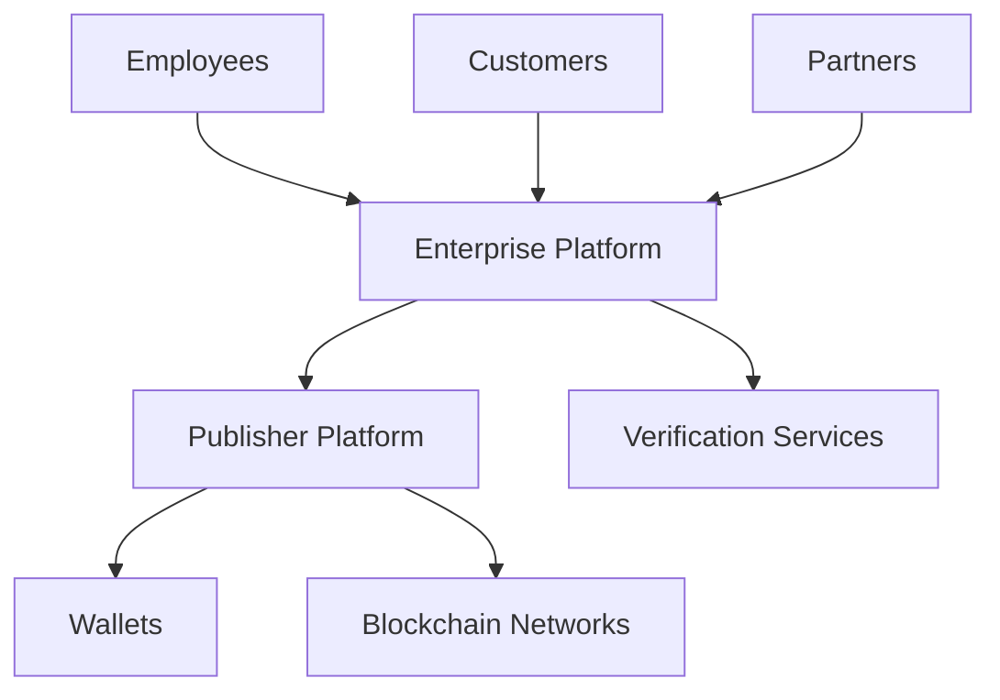
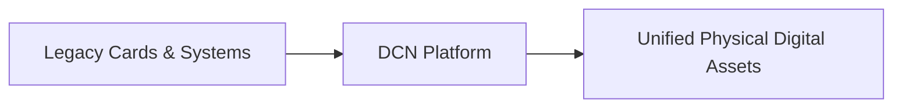

# Enterprises

> _Enterprises leverage the DCN Standard to digitize assets, identities, credentials, payments, and business processes through secure Physical Digital Assets. By adopting a common interoperable standard, organizations can modernize operations, reduce costs, improve security, and create entirely new digital business models._

***

## Introduction

For enterprises, the DCN Standard is far more than a payment technology.

It is a **business infrastructure**.

Organizations already issue millions of physical assets every year, including:

* Employee ID Cards
* Access Cards
* Corporate Payment Cards
* Gift Cards
* Loyalty Cards
* Equipment Tags
* Membership Cards
* Healthcare Cards
* Student IDs
* Transportation Passes

Traditionally, each of these systems operates independently, using different technologies, vendors, and management platforms.

The DCN Standard introduces a unified architecture where these physical assets become **secure, programmable, blockchain-enabled Physical Digital Assets**.

This enables enterprises to consolidate infrastructure while creating new customer experiences and operational efficiencies.

***

## Enterprise Architecture



The enterprise integrates its internal systems with the DCN ecosystem while maintaining control over business policies and customer relationships.

***

## Enterprise Use Cases

The DCN Standard supports a wide variety of enterprise applications.

#### Identity

* Employee Identification
* Contractor Credentials
* Visitor Management
* Partner Authentication

***

#### Payments

* Corporate Expense Cards
* Employee Benefits
* Fuel Cards
* Travel Cards
* Procurement Payments

***

#### Customer Engagement

* Membership Programs
* Loyalty Cards
* Gift Cards
* Promotional Campaigns
* VIP Access

***

#### Asset Management

* Equipment Identification
* Tool Tracking
* Product Authentication
* Warranty Management

***

#### Access Control

* Office Entry
* Data Center Access
* Secure Facility Authentication
* Restricted Area Permissions

***

#### Digital Ownership

* Certificates
* Product Passports
* Digital Warranties
* Tokenized Assets
* Digital Licenses

***

## Enterprise Business Benefits

Adopting the DCN Standard provides measurable business value.

| Benefit                   | Description                                      |
| ------------------------- | ------------------------------------------------ |
| Unified Infrastructure    | One platform for multiple asset types            |
| Reduced Integration Costs | Standardized APIs and SDKs                       |
| Enhanced Security         | Secure hardware and cryptographic verification   |
| Faster Product Launches   | Reusable publishing platform                     |
| Vendor Flexibility        | Avoid proprietary lock-in                        |
| Multi-Chain Support       | Deploy across different blockchain networks      |
| Global Interoperability   | Compatible with certified ecosystem participants |

***

## Enterprise Platform

A typical enterprise deployment may include:

```
Enterprise Platform

├── Identity Management
├── Asset Management
├── Payment Services
├── HR Integration
├── ERP Integration
├── CRM Integration
├── Compliance Engine
├── Analytics Dashboard
├── API Gateway
└── Administration Portal
```

These services integrate seamlessly with existing enterprise systems.

***

## Enterprise Revenue Opportunities

Enterprises can create new revenue streams through:

* Premium membership programs
* Digital loyalty ecosystems
* Subscription services
* Digital product authentication
* Tokenized customer rewards
* Marketplace integrations
* Embedded financial services
* API monetization

The DCN Standard transforms physical assets into programmable digital business channels.

***

## Enterprise Integration

The DCN Platform integrates with common enterprise systems.

Examples include:

* ERP platforms (SAP, Oracle, Microsoft Dynamics)
* CRM platforms
* HR systems
* Identity providers
* Payment gateways
* Customer portals
* Mobile applications
* Data warehouses

Standardized APIs simplify integration with existing infrastructure.

***

## Enterprise Deployment Models

Organizations can choose deployment models that match their operational requirements.

```
Deployment Options

├── On-Premise
├── Private Cloud
├── Public Cloud
├── Hybrid Cloud
└── Multi-Cloud
```

The DCN architecture supports deployment flexibility while maintaining interoperability.

***

## Industry Applications

The DCN Standard can be adopted across multiple sectors.

| Industry           | Example Applications                        |
| ------------------ | ------------------------------------------- |
| Banking            | Digital cash, payment cards                 |
| Retail             | Gift cards, loyalty, memberships            |
| Healthcare         | Patient credentials, insurance cards        |
| Education          | Student IDs, digital diplomas               |
| Manufacturing      | Product authentication, equipment tracking  |
| Hospitality        | Hotel keys, loyalty programs                |
| Transportation     | Transit passes, fleet cards                 |
| Energy             | Utility credentials, charging access        |
| Telecommunications | SIM-linked identity and payment products    |
| Government         | Citizen credentials, permits, welfare cards |

The same technical foundation supports diverse business requirements.

***

## Enterprise Marketplace

Future enterprise services may include:

* Identity-as-a-Service
* Publisher-as-a-Service
* Verification-as-a-Service
* Credential Management
* Compliance Services
* Digital Asset Management
* Secure Manufacturing Services
* Analytics-as-a-Service

These offerings allow enterprises to adopt the DCN ecosystem without building every component internally.

***

## Enterprise Transformation

The DCN Standard enables organizations to transition from isolated physical systems to a unified digital infrastructure.



Instead of maintaining separate technologies for identity, payments, loyalty, and credentials, enterprises can manage them through a common platform.

***

## Future Enterprise Opportunities

Future enterprise adoption may include:

* AI-powered workforce credentials
* Autonomous machine identities
* Digital twins for physical assets
* Cross-border corporate payments
* Tokenized supply chains
* Smart factories
* ESG and sustainability reporting
* Machine-to-machine (M2M) commerce

The DCN Standard provides the foundation for these emerging business models.

***

## Design Principles

The Enterprise business model follows five principles.

#### Interoperable

Enterprise systems integrate through open standards.

#### Secure

Cryptographic identity and secure hardware protect business assets.

#### Scalable

Supports organizations ranging from small businesses to multinational enterprises.

#### Flexible

Compatible with existing enterprise infrastructure and deployment models.

#### Future Ready

Designed to support evolving technologies and digital transformation initiatives.

***

## Summary

Enterprises are one of the largest adoption opportunities for the DCN ecosystem.

By leveraging interoperable Physical Digital Assets, standardized APIs, secure hardware, and blockchain-neutral infrastructure, organizations can modernize identity, payments, access control, loyalty, asset management, and customer engagement while creating new digital business models and reducing long-term operational complexity.
