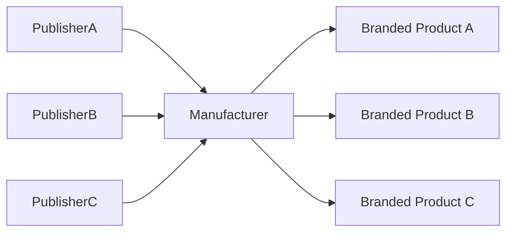

# Manufacturers

> _Manufacturers are responsible for producing the trusted physical infrastructure of the DCN ecosystem. By manufacturing certified Physical Digital Assets, Secure Hardware, NFC devices, and supporting components, they enable Publishers worldwide to deploy secure and interoperable digital asset products._

***

## Introduction

Every Physical Digital Asset begins with a manufacturer.

Before a Publisher can issue:

* Digital Crypto Notes
* Stablecoin Cards
* CBDCs
* Identity Credentials
* Gift Cards
* Transit Passes
* Enterprise Credentials

a trusted physical product must first exist.

Manufacturers transform the DCN Standard from a digital specification into real-world products.

Unlike traditional card manufacturers, DCN manufacturers produce **cryptographically secure digital asset devices** capable of interacting with blockchain networks and secure verification services.

This creates an entirely new manufacturing industry centered around **Physical Digital Assets**.

***

## Role in the Ecosystem

Manufacturers provide the physical foundation of the ecosystem.


The manufacturer is responsible for producing trusted hardware, while the Publisher creates the digital asset product.

***

## Manufacturing Opportunities

Manufacturers may produce a wide variety of DCN-compatible products.

Examples include:

#### Payment Products

* DCN-S Digital Cash
* DCN-R Reloadable Cards
* CBDC Cards
* Stablecoin Cards

#### Identity Products

* National Identity Cards
* Employee Credentials
* Student IDs
* Healthcare Cards

#### Commercial Products

* Gift Cards
* Loyalty Cards
* Membership Cards
* Hotel Keys

#### Infrastructure Products

* Transit Cards
* Toll Passes
* Access Credentials
* Utility Service Cards

#### Collectibles

* Limited Edition Crypto Notes
* Physical NFTs
* Tokenized Art
* Commemorative Digital Assets

The DCN Standard supports a broad range of product categories.

***

## Manufacturing Revenue Model

Manufacturers generate revenue through:

| Revenue Source             | Description                     |
| -------------------------- | ------------------------------- |
| Hardware Sales             | Sale of Physical Digital Assets |
| OEM Manufacturing          | Produce devices for Publishers  |
| Secure Element Integration | Certified hardware integration  |
| Product Customization      | Branding and personalization    |
| Provisioning Services      | Secure device personalization   |
| Logistics Services         | Distribution and fulfillment    |
| Managed Manufacturing      | End-to-end production services  |

Unlike traditional payment cards, Physical Digital Assets create recurring opportunities through ongoing ecosystem growth.

***

## Product Portfolio

A DCN manufacturer may offer:

```
Product Portfolio

├── DCN Plastic Cards
├── NFC Crypto Notes
├── Metal Cards
├── Wearables
├── Wristbands
├── Smart Tags
├── Key Fobs
├── Enterprise Badges
├── Government Credentials
└── Custom Form Factors
```

The same manufacturing infrastructure can serve multiple industries.

***

## Manufacturing Services

Beyond producing hardware, manufacturers may provide value-added services.

Examples include:

* Product design
* Industrial design
* Secure printing
* NFC antenna integration
* Secure Element integration
* Laser personalization
* Packaging
* Secure logistics
* Inventory management

These services enable Publishers to launch products more quickly.

***

## White-Label Manufacturing

Many Publishers may not operate manufacturing facilities.

Manufacturers can therefore offer white-label production.



The same manufacturing platform can support hundreds of independent Publishers.

***

## Manufacturing as a Service (MaaS)

The DCN ecosystem introduces a new commercial model:

**Manufacturing as a Service (MaaS)**

Typical workflow:

1. Publisher designs product.
2. Publisher submits manufacturing order.
3. Manufacturer produces certified hardware.
4. Devices are provisioned.
5. Products are delivered to the Publisher or directly to end users.

This enables Publishers to focus on financial products rather than manufacturing operations.

***

## Certification Benefits

Certified manufacturers gain several advantages.

* Trusted ecosystem recognition
* Access to global Publishers
* Participation in certification programs
* Improved interoperability
* Reduced integration effort
* Increased customer confidence

Certification becomes a competitive differentiator.

***

## Global Market Opportunities

Potential customers include:

* Banks
* Stablecoin issuers
* Governments
* Enterprises
* Universities
* Airlines
* Transit authorities
* Retail brands
* Gaming companies
* Digital asset platforms

As the DCN ecosystem grows, demand for certified manufacturing is expected to increase significantly.

***

## Business Example

Example manufacturer business model:

```
Company

DCN Secure Manufacturing Ltd.

Services

• OEM Production
• Secure Provisioning
• Product Personalization
• White-Label Manufacturing
• Logistics
• Certification Support

Customers

• Banks
• Governments
• Publishers
• Enterprises
```

A single manufacturer can support many independent Publishers simultaneously.

***

## Future Manufacturing Economy

Future manufacturers may specialize in:

* Eco-friendly materials
* Biodegradable NFC notes
* Flexible electronics
* Metal collectible assets
* Industrial IoT devices
* Government-grade credentials
* Luxury editions
* Smart packaging

Innovation at the manufacturing layer expands the overall DCN ecosystem.

***

## Economic Impact

Manufacturers benefit from:

* Recurring Publisher demand
* Large production volumes
* Global interoperability
* Standardized specifications
* Reduced custom engineering
* Multi-industry opportunities

The open standard lowers barriers to entry while increasing market reach.

***

## Design Principles

The Manufacturer business model follows five principles.

#### Open

Any qualified manufacturer can participate.

#### Certified

Trust is established through certification.

#### Scalable

Supports production from thousands to millions of devices.

#### Interoperable

Products work across the global DCN ecosystem.

#### Value Driven

Manufacturers compete through quality, innovation, efficiency, and service—not proprietary protocols.

***

## Summary

Manufacturers are the physical infrastructure providers of the DCN ecosystem.

By producing certified Physical Digital Assets, integrating Secure Hardware, offering provisioning and white-label manufacturing services, and supporting global Publishers, they enable the widespread adoption of interoperable Physical Digital Assets across payments, identity, government, enterprise, and emerging Web3 markets.
