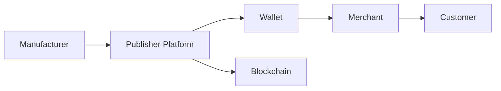
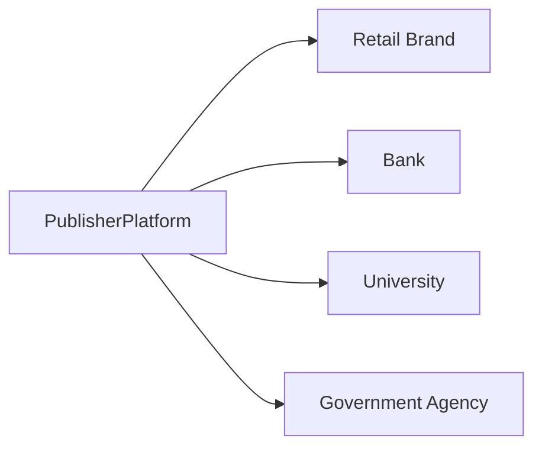

# Publishers

> _Publishers are organizations that create, issue, and manage Physical Digital Assets using the DCN Standard. They define products, establish trust policies, manage lifecycles, and deliver value-added services to consumers, enterprises, governments, and businesses._

***

## Introduction

Publishers are the **economic engine** of the DCN ecosystem.

If manufacturers build the physical products, **Publishers create the digital economy** built on top of them.

A Publisher can be:

* A Bank
* A FinTech
* A Stablecoin Issuer
* A Government
* A CBDC Operator
* An Exchange
* A Retail Brand
* A Telecom Company
* A Transport Authority
* A University
* An Enterprise
* A Web3 Company
* An Individual Creator

The DCN Standard intentionally lowers the barrier to entry so that **any qualified organization** can become a Publisher while remaining interoperable with the global ecosystem.

***

## The Publisher Economy

The DCN ecosystem introduces a completely new business category:

> **Physical Digital Asset Publishing**

Instead of issuing only:

* Plastic payment cards
* Gift cards
* NFC badges

Publishers can now issue **programmable, blockchain-connected Physical Digital Assets**.

Every Publisher owns:

* Its brand
* Its products
* Its policies
* Its customer relationships
* Its revenue model

while relying on the DCN Standard for interoperability.

***

## Publisher Architecture



The Publisher Platform acts as the operational center for issuing, managing, and supporting Physical Digital Assets.

***

## What Can a Publisher Issue?

The flexibility of the DCN Standard allows Publishers to create a wide range of products.

#### Financial Assets

* DCN-S (Stored Value)
* DCN-R (Reloadable)
* DCN-P (Programmable)
* Stablecoin Cards
* CBDCs
* Multi-currency Wallet Cards

#### Government Assets

* National IDs
* Digital Passports
* Driving Licenses
* Welfare Cards
* Healthcare Cards

#### Commercial Assets

* Gift Cards
* Loyalty Programs
* Membership Cards
* Promotional Campaign Cards
* Digital Coupons

#### Enterprise Assets

* Employee IDs
* Building Access Cards
* Expense Cards
* Corporate Credentials

#### Web3 Assets

* NFT Cards
* DAO Membership Cards
* Game Assets
* Tokenized RWAs
* Digital Collectibles

The same Publisher Platform can manage multiple product categories simultaneously.

***

## Publisher Revenue Model

Unlike traditional card issuers, Publishers can generate recurring revenue throughout the lifecycle of an asset.

| Revenue Stream        | Description                                 |
| --------------------- | ------------------------------------------- |
| Asset Issuance Fees   | Initial issuance of Physical Digital Assets |
| Reload Fees           | Funding reloadable assets                   |
| Transaction Fees      | Payment and transfer processing             |
| Subscription Plans    | Premium wallet or asset services            |
| Enterprise Licensing  | Corporate deployments                       |
| API Access            | Developer and partner integrations          |
| White-Label Platforms | Publishing infrastructure for third parties |
| Verification Services | Trust and validation APIs                   |
| Analytics Services    | Operational reporting and insights          |
| Custom Products       | Industry-specific solutions                 |

This diversified model enables sustainable business growth beyond one-time hardware sales.

***

## Publisher as a Platform

A modern Publisher is not simply an issuer—it is a **platform provider**.

```
Publisher Platform

├── Product Manager
├── Issuance Engine
├── Lifecycle Manager
├── Verification Service
├── Analytics Dashboard
├── Merchant Portal
├── Developer Portal
├── Customer Portal
├── Compliance Engine
└── API Gateway
```

Each service creates additional opportunities for value creation.

***

## White-Label Publishing

Organizations may launch products without building their own infrastructure.

Example:



One Publisher Platform can power hundreds of branded products.

***

## Publisher Marketplace

A future DCN ecosystem may include a global **Publisher Marketplace**.

Publishers could offer:

* Stablecoin products
* CBDC integrations
* Gift card solutions
* Identity credentials
* Loyalty programs
* Transit solutions
* Enterprise services

Customers and partners can discover, compare, and integrate these offerings through standardized APIs.

***

## Multi-Chain Publishing

A defining advantage of the DCN Standard is blockchain neutrality.

A single Publisher may issue assets across:

* Ethereum
* Polygon
* TON
* Solana
* Bitcoin-compatible layers
* CBDC networks
* Lycan Chain
* Future blockchain ecosystems

The Blockchain Adapter SDK manages network-specific implementation details, allowing Publishers to expand without redesigning their platforms.

***

## Global Market Opportunities

Potential Publisher customers include:

* Banks
* Stablecoin issuers
* Governments
* Enterprises
* Retail brands
* Universities
* Airlines
* Hotels
* Transit operators
* Gaming companies
* Web3 platforms

This diversity allows Publishers to expand into multiple industries using a common technical foundation.

***

## Example Business

```
Company

Global Digital Assets Ltd.

Products

• DCN Stablecoin Cards
• Corporate Expense Cards
• Gift Cards
• Event Tickets
• Identity Credentials

Revenue

• Issuance Fees
• Transaction Fees
• API Services
• Enterprise Licensing
• Analytics
```

A single Publisher Platform can support millions of assets and multiple business models.

***

## Network Effects

As more Publishers join the ecosystem:

* More products become available.
* More wallets support DCN.
* More merchants accept DCN assets.
* More manufacturers produce certified hardware.
* More developers build applications.

This creates a powerful network effect that benefits every participant.

***

## Future Publisher Services

Future Publisher Platforms may provide:

* AI-powered fraud detection
* Embedded finance services
* Tokenized real-world asset issuance
* Cross-border settlement
* Decentralized identity management
* Smart contract automation
* Digital twin management
* Regulatory reporting

These capabilities extend the value of the Publisher role without changing the core DCN Standard.

***

## Design Principles

The Publisher business model follows five principles.

#### Open

Any qualified organization can become a Publisher.

#### Scalable

Supports deployments from local businesses to national infrastructure.

#### Multi-Chain

Publishers can operate across multiple blockchain networks.

#### Service-Oriented

Revenue is generated through products, services, and ecosystem participation.

#### Interoperable

Every published asset remains compatible with the global DCN ecosystem.

***

## Summary

Publishers are the primary value creators within the DCN ecosystem.

By issuing Physical Digital Assets, operating trusted platforms, delivering lifecycle services, and building innovative products across finance, government, enterprise, and Web3, Publishers transform the DCN Standard into a sustainable and globally scalable digital economy.
