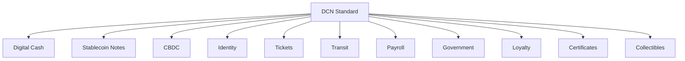

# 20. Use Cases

> _The DCN Standard is designed as a universal platform for Physical Digital Assets. Rather than supporting a single application, it provides a common infrastructure that enables digital money, identity, credentials, access, ownership, and programmable assets across industries and blockchain networks._

***

## Introduction

The true value of the DCN Standard is not the technology itself.

It is **what the technology enables**.

A Physical Digital Asset is much more than an NFC card or a digital wallet.

It is a **trusted physical interface** to digital value.

Using the same technical foundation, organizations can issue:

* Digital Cash
* Stablecoin Notes
* Central Bank Digital Currency (CBDC)
* Gift Cards
* Event Tickets
* Payroll Cards
* Government Benefit Cards
* Transit Passes
* Loyalty Cards
* Digital Certificates
* Digital Identity
* Digital Collectibles

All of these applications share the same:

* Secure Hardware
* Authentication Protocol
* Certificate Infrastructure
* Verification Services
* Wallet Architecture
* Publisher Platform
* Blockchain Adapter
* Lifecycle Management

This unified architecture dramatically reduces implementation complexity while enabling interoperability across industries.

***

## Why Multiple Use Cases?

Traditionally, every industry builds its own infrastructure.

For example:

* Payment cards use banking systems.
* Transit cards use transportation systems.
* Student IDs use university systems.
* Gift cards use retail platforms.
* Government IDs use dedicated identity infrastructure.

Each solution has:

* Different software
* Different hardware
* Different security models
* Different lifecycle management
* Different user experiences

The DCN Standard replaces these isolated systems with a **single interoperable platform**.

***

## Universal Platform



The same protocol supports a wide range of applications without modification.

***

## Shared Architecture

Every use case benefits from the same core platform.

```
Physical Digital Asset

↓

Wallet

↓

Verification

↓

Publisher

↓

Blockchain

↓

Business Application
```

Only the business logic changes.

The underlying infrastructure remains consistent.

***

## Common Capabilities

Every use case may leverage:

* Secure Element
* NFC Communication
* Cryptographic Authentication
* Certificate Validation
* Ownership Management
* Lifecycle Management
* Offline Verification (where supported)
* Multi-chain Settlement
* API Integration
* SDK Support

These capabilities are provided by the DCN ecosystem rather than reimplemented for each application.

***

## Industry Coverage

The DCN Standard supports adoption across many sectors.

| Industry           | Representative Use Cases         |
| ------------------ | -------------------------------- |
| Financial Services | Digital Cash, Stablecoins, CBDCs |
| Retail             | Gift Cards, Loyalty Programs     |
| Government         | Identity, Benefits, Licenses     |
| Transportation     | Transit Passes, Toll Systems     |
| Education          | Student IDs, Certificates        |
| Healthcare         | Patient Credentials              |
| Enterprise         | Payroll, Access Control          |
| Entertainment      | Event Tickets, Collectibles      |
| Web3               | Tokenized Assets, Physical NFTs  |

***

## Interoperability

A single Companion Wallet can manage multiple Physical Digital Assets.

Example:

```
Companion Wallet

├── Digital Cash
├── Stablecoin Note
├── Employee ID
├── Event Ticket
├── Transit Pass
├── Loyalty Card
├── Membership Card
└── Digital Certificate
```

Users no longer need separate applications for every service.

***

## Future Expansion

The DCN Standard is intentionally extensible.

Future applications may include:

* Machine-to-Machine Payments
* Autonomous Vehicle Credentials
* Smart City Infrastructure
* Medical Device Identity
* Carbon Credits
* Energy Tokens
* Supply Chain Passports
* AI Agent Credentials
* Digital Twins
* Quantum-Safe Credentials

New applications can be introduced without changing the underlying protocol.

***

## Relationship to Following Sections

This chapter explores twelve representative applications of the DCN Standard:

* Digital Cash
* Stablecoin Notes
* CBDCs
* Gift Cards
* Event Tickets
* Payroll
* Government Benefits
* Transit
* Loyalty
* Certificates
* Digital Identity
* Collectibles

Each use case demonstrates how a common technical foundation can support different industries while preserving interoperability.

***

## Design Principles

The DCN use case framework follows five principles.

#### Universal

One standard supports many applications.

#### Interoperable

Different use cases share the same infrastructure.

#### Secure

Every application benefits from the same security architecture.

#### Extensible

New use cases can be introduced without redesigning the protocol.

#### Industry Neutral

The standard is applicable across public and private sectors.

***

## Summary

The DCN Standard is a universal platform for Physical Digital Assets.

By providing a shared architecture for payments, identity, credentials, transportation, government services, enterprise applications, and digital ownership, it enables organizations to build interoperable solutions on a common foundation while reducing complexity, improving security, and accelerating global adoption.

***

#### In this Chapter

* Digital Cash
* Stablecoin Notes
* CBDCs
* Gift Cards
* Event Tickets
* Payroll
* Government Benefits
* Transit
* Loyalty
* Certificates
* Digital Identity
* Collectibles

## In this chapter

* [Digital Cash](digital-cash.md)
* [Stablecoin Notes](stablecoin-notes.md)
* [CBDCs](cbdcs.md)
* [Gift Cards](gift-cards.md)
* [Event Tickets](event-tickets.md)
* [Payroll](payroll.md)
* [Government Benefits](government-benefits.md)
* [Transit](transit.md)
* [Loyalty](loyalty.md)
* [Certificates](certificates.md)
* [Digital Identity](digital-identity.md)
* [Collectibles](collectibles.md)
