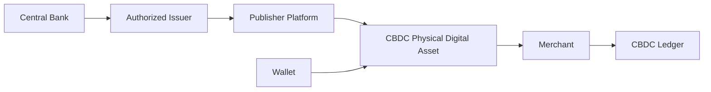

# CBDCs

> _The DCN Standard enables Central Bank Digital Currencies (CBDCs) to be issued as trusted Physical Digital Assets, allowing central banks and authorized financial institutions to provide secure, interoperable, and user-friendly digital cash while maintaining compliance with national monetary and regulatory frameworks._

***

## Introduction

Around the world, central banks are exploring **Central Bank Digital Currencies (CBDCs)** as the next evolution of sovereign money.

CBDCs combine the trust of central bank-issued currency with the efficiency of digital payment systems.

However, many proposed CBDC implementations remain dependent on:

* Mobile applications
* Internet connectivity
* Digital wallets
* QR code payments
* Online identity systems

These requirements may exclude users who:

* Do not own smartphones
* Have limited internet access
* Prefer physical payment methods
* Require simple user experiences

The DCN Standard introduces a new approach:

> **A CBDC can exist as a secure Physical Digital Asset while remaining fully connected to the underlying digital currency infrastructure.**

This allows digital sovereign money to be carried, transferred, and used with the familiarity of physical cash.

***

## Vision

The vision is to enable a CBDC that is:

* Secure
* Easy to use
* Cryptographically verifiable
* Interoperable
* Inclusive
* Compatible with existing payment infrastructure

Rather than replacing existing banking systems, the DCN Standard provides an additional physical interface for interacting with CBDCs.

***

## CBDC Architecture



The DCN Publisher Platform issues the Physical Digital Asset, while the underlying CBDC remains governed by the central bank's monetary infrastructure.

***

## Deployment Models

Different jurisdictions may adopt different operational models.

#### Direct Model

The central bank issues Physical Digital Assets directly to citizens.

***

#### Two-Tier Model

The central bank authorizes commercial banks or regulated payment institutions to issue CBDC-based Physical Digital Assets.

***

#### Hybrid Model

The central bank manages monetary issuance while licensed Publishers provide customer-facing products and services.

The DCN Standard supports all three models without prescribing monetary policy.

***

## Potential CBDC Products

A national deployment may include:

```
CBDC Products

├── Consumer Wallet Card
├── Digital Cash Note
├── Government Benefit Card
├── Payroll Card
├── Transit Card
├── Student Card
├── Senior Citizen Card
├── Emergency Relief Card
└── Business Treasury Card
```

Each product uses the same technical foundation while serving different public needs.

***

## Citizen Experience

A citizen using a CBDC Physical Digital Asset may:

1. Receive a government-issued or bank-issued CBDC card.
2. Add funds where permitted by policy.
3. Tap to pay at participating merchants.
4. View balances through a Companion Wallet.
5. Transfer ownership or recover the asset according to applicable rules.

The interaction is designed to be as simple as using physical cash or a payment card.

***

## Government Applications

CBDCs issued through the DCN Standard can support:

* Retail payments
* Public transport
* Welfare distribution
* Pension payments
* Emergency financial assistance
* Tax refunds
* Student allowances
* Agricultural subsidies
* Disaster relief programs

Each application can implement its own policy while using the same interoperable infrastructure.

***

## Programmable Policies

CBDC deployments may utilize **DCN-P (Programmable)** asset profiles to support policy-driven behavior.

Examples include:

* Spending limits
* Merchant category restrictions
* Time-limited benefit distribution
* Geographic usage controls
* Government-approved recovery procedures

The DCN Standard provides the technical capability, while policy decisions remain under the authority of the issuing institution.

***

## Financial Inclusion

One of the strongest advantages of Physical Digital Assets is accessibility.

Potential benefits include:

* Familiar physical interaction
* Reduced dependence on smartphones
* Simple merchant acceptance
* Support for elderly users
* Support for first-time digital payment users
* Broader participation in digital financial systems

These characteristics can complement national financial inclusion initiatives.

***

## Security

CBDC deployments inherit the complete DCN Security Architecture.

Security capabilities include:

* Secure Element
* Hardware Root of Trust
* Device Certificates
* Mutual Authentication
* Secure Messaging
* Certificate Validation
* Lifecycle Management
* Revocation Services

These mechanisms protect both citizens and issuing institutions against counterfeiting and unauthorized use.

***

## Integration

The DCN Standard integrates with existing national infrastructure.

Potential integrations include:

* Central banking systems
* Commercial banking platforms
* National identity services
* Government payment systems
* Merchant acquiring networks
* Digital wallets
* Regulatory reporting systems

Standardized APIs simplify interoperability across government agencies and financial institutions.

***

## Business & Operational Benefits

The DCN approach offers operational advantages.

| Benefit                  | Description                            |
| ------------------------ | -------------------------------------- |
| Familiar User Experience | Physical interaction similar to cash   |
| Interoperability         | Common standard across institutions    |
| Security                 | Hardware-backed trust                  |
| Flexibility              | Multiple deployment models             |
| Scalability              | National-scale infrastructure          |
| Extensibility            | Future policy and technology evolution |

***

## Example National Deployment

```
National CBDC Ecosystem

Central Bank

↓

Licensed Publishers

↓

Certified Manufacturers

↓

Commercial Banks

↓

Merchants

↓

Citizens
```

Each participant performs a defined role while remaining interoperable through the DCN Standard.

***

## Future Evolution

Future CBDC implementations may include:

* Offline payment capabilities
* Cross-border CBDC interoperability
* Multi-CBDC settlement
* Zero-Knowledge privacy mechanisms
* AI-assisted fraud detection
* Smart city integrations
* Machine-to-machine government payments

These innovations can be incorporated without changing the core DCN architecture.

***

## Design Principles

CBDC implementations using the DCN Standard follow five principles.

#### Sovereign

Currency issuance and monetary policy remain under the authority of the central bank.

#### Secure

Protected by certified hardware and cryptographic verification.

#### Inclusive

Designed to support broad public accessibility.

#### Interoperable

Works across compliant wallets, merchants, and Publisher platforms.

#### Policy Neutral

The DCN Standard defines technical capabilities, while monetary, legal, and regulatory policies remain the responsibility of each jurisdiction.

***

## Summary

The DCN Standard provides a secure and interoperable framework for representing Central Bank Digital Currencies as Physical Digital Assets.

By combining trusted hardware, standardized verification, flexible deployment models, and blockchain-neutral architecture, it enables central banks and authorized institutions to deliver digital sovereign money with the familiarity of physical cash while preserving security, scalability, and long-term interoperability.

> _The DCN Standard enables Central Bank Digital Currencies (CBDCs) to be issued as trusted Physical Digital Assets, allowing central banks and authorized financial institutions to provide secure, interoperable, and user-friendly digital cash while maintaining compliance with national monetary and regulatory frameworks._

***

## Introduction

Around the world, central banks are exploring **Central Bank Digital Currencies (CBDCs)** as the next evolution of sovereign money.

CBDCs combine the trust of central bank-issued currency with the efficiency of digital payment systems.

However, many proposed CBDC implementations remain dependent on:

* Mobile applications
* Internet connectivity
* Digital wallets
* QR code payments
* Online identity systems

These requirements may exclude users who:

* Do not own smartphones
* Have limited internet access
* Prefer physical payment methods
* Require simple user experiences

The DCN Standard introduces a new approach:

> **A CBDC can exist as a secure Physical Digital Asset while remaining fully connected to the underlying digital currency infrastructure.**

This allows digital sovereign money to be carried, transferred, and used with the familiarity of physical cash.

***

## Vision

The vision is to enable a CBDC that is:

* Secure
* Easy to use
* Cryptographically verifiable
* Interoperable
* Inclusive
* Compatible with existing payment infrastructure

Rather than replacing existing banking systems, the DCN Standard provides an additional physical interface for interacting with CBDCs.

***

## CBDC Architecture


The DCN Publisher Platform issues the Physical Digital Asset, while the underlying CBDC remains governed by the central bank's monetary infrastructure.

***

## Deployment Models

Different jurisdictions may adopt different operational models.

#### Direct Model

The central bank issues Physical Digital Assets directly to citizens.

***

#### Two-Tier Model

The central bank authorizes commercial banks or regulated payment institutions to issue CBDC-based Physical Digital Assets.

***

#### Hybrid Model

The central bank manages monetary issuance while licensed Publishers provide customer-facing products and services.

The DCN Standard supports all three models without prescribing monetary policy.

***

## Potential CBDC Products

A national deployment may include:

```
CBDC Products

├── Consumer Wallet Card
├── Digital Cash Note
├── Government Benefit Card
├── Payroll Card
├── Transit Card
├── Student Card
├── Senior Citizen Card
├── Emergency Relief Card
└── Business Treasury Card
```

Each product uses the same technical foundation while serving different public needs.

***

## Citizen Experience

A citizen using a CBDC Physical Digital Asset may:

1. Receive a government-issued or bank-issued CBDC card.
2. Add funds where permitted by policy.
3. Tap to pay at participating merchants.
4. View balances through a Companion Wallet.
5. Transfer ownership or recover the asset according to applicable rules.

The interaction is designed to be as simple as using physical cash or a payment card.

***

## Government Applications

CBDCs issued through the DCN Standard can support:

* Retail payments
* Public transport
* Welfare distribution
* Pension payments
* Emergency financial assistance
* Tax refunds
* Student allowances
* Agricultural subsidies
* Disaster relief programs

Each application can implement its own policy while using the same interoperable infrastructure.

***

## Programmable Policies

CBDC deployments may utilize **DCN-P (Programmable)** asset profiles to support policy-driven behavior.

Examples include:

* Spending limits
* Merchant category restrictions
* Time-limited benefit distribution
* Geographic usage controls
* Government-approved recovery procedures

The DCN Standard provides the technical capability, while policy decisions remain under the authority of the issuing institution.

***

## Financial Inclusion

One of the strongest advantages of Physical Digital Assets is accessibility.

Potential benefits include:

* Familiar physical interaction
* Reduced dependence on smartphones
* Simple merchant acceptance
* Support for elderly users
* Support for first-time digital payment users
* Broader participation in digital financial systems

These characteristics can complement national financial inclusion initiatives.

***

## Security

CBDC deployments inherit the complete DCN Security Architecture.

Security capabilities include:

* Secure Element
* Hardware Root of Trust
* Device Certificates
* Mutual Authentication
* Secure Messaging
* Certificate Validation
* Lifecycle Management
* Revocation Services

These mechanisms protect both citizens and issuing institutions against counterfeiting and unauthorized use.

***

## Integration

The DCN Standard integrates with existing national infrastructure.

Potential integrations include:

* Central banking systems
* Commercial banking platforms
* National identity services
* Government payment systems
* Merchant acquiring networks
* Digital wallets
* Regulatory reporting systems

Standardized APIs simplify interoperability across government agencies and financial institutions.

***

## Business & Operational Benefits

The DCN approach offers operational advantages.

| Benefit                  | Description                            |
| ------------------------ | -------------------------------------- |
| Familiar User Experience | Physical interaction similar to cash   |
| Interoperability         | Common standard across institutions    |
| Security                 | Hardware-backed trust                  |
| Flexibility              | Multiple deployment models             |
| Scalability              | National-scale infrastructure          |
| Extensibility            | Future policy and technology evolution |

***

## Example National Deployment

```
National CBDC Ecosystem

Central Bank

↓

Licensed Publishers

↓

Certified Manufacturers

↓

Commercial Banks

↓

Merchants

↓

Citizens
```

Each participant performs a defined role while remaining interoperable through the DCN Standard.

***

## Future Evolution

Future CBDC implementations may include:

* Offline payment capabilities
* Cross-border CBDC interoperability
* Multi-CBDC settlement
* Zero-Knowledge privacy mechanisms
* AI-assisted fraud detection
* Smart city integrations
* Machine-to-machine government payments

These innovations can be incorporated without changing the core DCN architecture.

***

## Design Principles

CBDC implementations using the DCN Standard follow five principles.

#### Sovereign

Currency issuance and monetary policy remain under the authority of the central bank.

#### Secure

Protected by certified hardware and cryptographic verification.

#### Inclusive

Designed to support broad public accessibility.

#### Interoperable

Works across compliant wallets, merchants, and Publisher platforms.

#### Policy Neutral

The DCN Standard defines technical capabilities, while monetary, legal, and regulatory policies remain the responsibility of each jurisdiction.

***

## Summary

The DCN Standard provides a secure and interoperable framework for representing Central Bank Digital Currencies as Physical Digital Assets.

By combining trusted hardware, standardized verification, flexible deployment models, and blockchain-neutral architecture, it enables central banks and authorized institutions to deliver digital sovereign money with the familiarity of physical cash while preserving security, scalability, and long-term interoperability.
