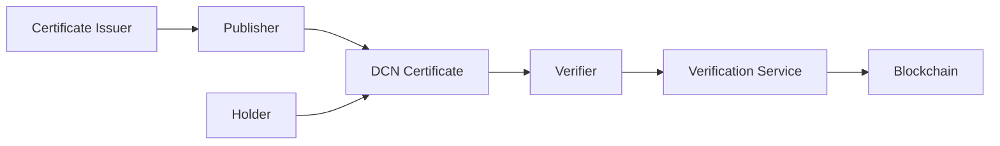
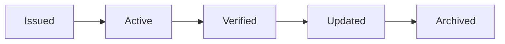
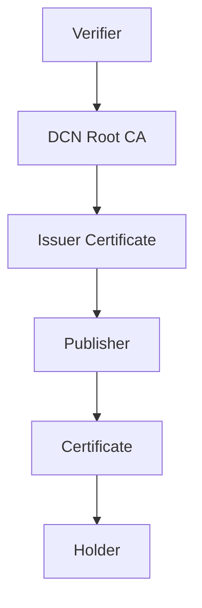

# Certificates

> _The DCN Standard enables certificates to become secure, verifiable Physical Digital Assets. Academic credentials, professional certifications, product authenticity documents, warranties, compliance records, and legal documents can be cryptographically protected, instantly verified, and securely carried in physical form while remaining linked to trusted digital records._

***

## Introduction

Certificates are used throughout society to establish trust.

Examples include:

* University Degrees
* Professional Certifications
* Training Certificates
* Product Authenticity Certificates
* Warranty Certificates
* Birth Certificates
* Marriage Certificates
* Export Certificates
* Quality Certifications
* Compliance Documents
* Ownership Certificates

Most certificates today exist as:

* Paper documents
* PDF files
* Plastic cards
* QR codes
* Centralized databases

These methods face several challenges:

* Forgery
* Counterfeit documents
* Difficult verification
* Lost paperwork
* Expensive manual validation
* Fragmented issuing systems

The DCN Standard transforms certificates into **trusted Physical Digital Assets** secured by cryptography rather than printed security features.

***

## Vision

A certificate should be:

* Authentic
* Tamper-evident
* Easy to verify
* Globally interoperable
* Securely owned
* Difficult to forge
* Permanently traceable
* Instantly trusted

Verification should take seconds rather than days.

***

## Certificate Architecture



The issuer creates the credential, while the DCN ecosystem manages trust, verification, and lifecycle operations.

***

## Types of Certificates

The DCN Standard supports many certificate categories.

#### Academic

* University Degrees
* Diplomas
* Student Transcripts
* Course Completion Certificates

***

#### Professional

* Medical Licenses
* Engineering Certifications
* Legal Qualifications
* IT Certifications
* Trade Licenses

***

#### Commercial

* Warranty Certificates
* Product Authenticity
* Ownership Certificates
* Service Contracts

***

#### Government

* Birth Certificates
* Marriage Certificates
* Land Ownership Records
* Business Registrations

***

#### Industrial

* ISO Certifications
* Manufacturing Compliance
* Inspection Reports
* Calibration Certificates

***

## Certificate Lifecycle



Additional lifecycle states include:

* Suspended
* Revoked
* Expired
* Reissued

Lifecycle management ensures every certificate remains trustworthy throughout its existence.

***

## Certificate Metadata

A certificate may securely contain or reference:

* Certificate ID
* Issuing Organization
* Holder Information
* Issue Date
* Expiry Date
* Verification Status
* Digital Signature
* Certificate Version
* Issuer Certificate Chain

Sensitive information may remain encrypted or selectively disclosed according to Publisher policies.

***

## Verification Process

A verifier performs the following steps:

1. Tap the Physical Digital Asset.
2. Authenticate the Secure Element.
3. Validate the device certificate.
4. Verify the issuer certificate.
5. Check revocation status.
6. Confirm certificate validity.
7. Display trusted verification results.

The process typically completes within seconds.

***

## Certificate Trust Chain



Every certificate derives trust from the DCN Certificate Infrastructure.

***

## Enterprise Applications

Organizations can issue certificates for:

* Employee Training
* Equipment Inspection
* Product Warranty
* Factory Compliance
* Vendor Qualification
* Internal Authorization
* Security Clearance
* Digital Contracts

The same infrastructure supports multiple enterprise workflows.

***

## Government Applications

Governments may issue:

* Digital Birth Certificates
* Vehicle Registration
* Business Licenses
* Property Ownership Records
* Tax Certificates
* Public Service Credentials

Each credential remains cryptographically verifiable throughout its lifecycle.

***

## Product Authenticity

Manufacturers can attach certificates to products.

Examples include:

```
Luxury Watch

↓

DCN Certificate

↓

Authenticity Verified

↓

Ownership History

↓

Warranty Status
```

Consumers instantly verify authenticity before purchasing.

***

## Security

Certificates inherit the complete DCN Security Architecture.

Security mechanisms include:

* Secure Element
* Hardware Root of Trust
* Mutual Authentication
* Digital Signatures
* Certificate Chain Validation
* Secure Messaging
* Revocation Services
* Ownership Verification

These protections significantly reduce certificate fraud.

***

## Business Benefits

Organizations gain:

| Benefit                    | Description                     |
| -------------------------- | ------------------------------- |
| Fraud Reduction            | Cryptographic authenticity      |
| Faster Verification        | Instant validation              |
| Lower Administrative Cost  | Digital verification            |
| Global Trust               | Standardized certificate format |
| Lifecycle Management       | Centralized certificate control |
| Better Customer Confidence | Easy authenticity verification  |

***

## Example Products

```
Certificate Portfolio

├── University Degree
├── Medical License
├── Product Warranty
├── Vehicle Certificate
├── Property Certificate
├── Export Certificate
├── Equipment Inspection
├── Professional Membership
└── Digital Contract Certificate
```

One Publisher Platform can manage certificates across multiple industries.

***

## Future Evolution

Future certificate capabilities may include:

* Zero-Knowledge Proof verification
* Self-sovereign credentials
* Verifiable Credentials (VC)
* Decentralized Identifier (DID) integration
* AI-assisted compliance validation
* Cross-border recognition
* Smart contract-linked certificates
* Machine-verifiable industrial credentials

The DCN Standard is designed to support these future innovations.

***

## Design Principles

Certificate implementations follow five principles.

#### Authentic

Every certificate is cryptographically verifiable.

#### Secure

Protected through certified hardware and digital signatures.

#### Interoperable

Accepted across compliant wallets, verification services, and Publisher platforms.

#### Tamper Resistant

Unauthorized modification invalidates trust.

#### Long-Lived

Designed for credentials that may remain valid for decades.

***

## Summary

The DCN Standard transforms certificates into trusted Physical Digital Assets.

By combining secure hardware, certificate infrastructure, cryptographic verification, lifecycle management, and interoperable APIs, governments, enterprises, educational institutions, manufacturers, and professional organizations can issue credentials that are globally verifiable, resistant to fraud, and easy to manage throughout their lifetime.
