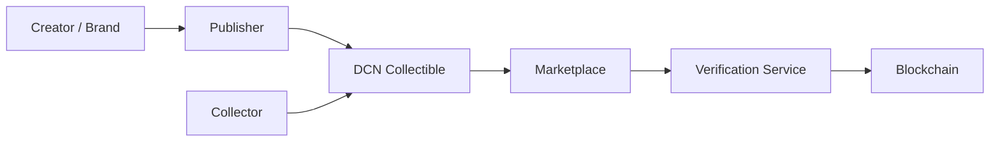
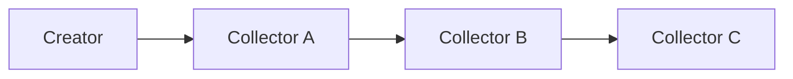

# Collectibles

> _The DCN Standard enables Digital Collectibles to exist as secure Physical Digital Assets. By combining authenticated physical products with blockchain ownership, cryptographic verification, and programmable experiences, collectibles become more valuable, interactive, and resistant to counterfeiting while creating new opportunities for creators, brands, and collectors._

***

## Introduction

Collectibles have always held both emotional and financial value.

Examples include:

* Limited Edition Coins
* Trading Cards
* Sports Memorabilia
* Luxury Watches
* Art Pieces
* Comics
* Stamps
* Concert Memorabilia
* Movie Merchandise
* Gaming Items

In recent years, digital collectibles and NFTs introduced verifiable digital ownership.

However, many collectors still value **physical ownership**.

The DCN Standard bridges these worlds.

A collectible becomes both:

* A physical object
* A blockchain-verified digital asset

This creates an entirely new category known as **Physical Digital Collectibles**.

***

## Vision

The goal is to create collectibles that are:

* Authentic
* Scarce
* Verifiable
* Interactive
* Transferable
* Blockchain-backed
* Tamper-resistant
* Globally tradable

Collectors should be able to verify authenticity with a simple tap while preserving the emotional value of owning a physical item.

***

## Collectible Architecture



Every collectible has both a physical presence and a trusted digital identity.

***

## Types of Collectibles

The DCN Standard supports many collectible categories.

#### Art

* Physical NFT artwork
* Limited edition prints
* Digital sculptures

***

#### Entertainment

* Movie memorabilia
* Music collectibles
* Concert souvenirs

***

#### Sports

* Player cards
* Championship editions
* Signed merchandise

***

#### Gaming

* Character cards
* Weapon cards
* Tournament rewards
* Physical game assets

***

#### Luxury

* Watches
* Jewelry
* Handbags
* Fashion accessories

***

#### Historical

* Commemorative coins
* National celebrations
* Museum editions
* Cultural artifacts

***

## DCN-C Asset Profile

Collectibles are primarily implemented using the **DCN-C (Collectible)** asset profile.

DCN-C supports:

* Limited edition issuance
* Unique serial numbers
* Immutable provenance
* Ownership history
* Authentication
* Optional spendable value
* Creator royalties (where supported by the underlying blockchain and marketplace)

This profile is specifically designed for high-value collectible assets.

***

## Ownership & Provenance

Each collectible maintains a secure ownership history.



The provenance record helps establish authenticity, rarity, and historical ownership.

***

## Authentication

Collectors verify authenticity by:

1. Tapping the collectible.
2. Authenticating the Secure Element.
3. Verifying the device certificate.
4. Validating the Publisher certificate.
5. Checking ownership history.
6. Confirming authenticity.

Verification requires only seconds and significantly reduces counterfeit risk.

***

## Marketplace Integration

Collectibles can be traded through compatible marketplaces.

Potential marketplace capabilities include:

* Ownership verification
* Authenticity verification
* Transfer initiation
* Escrow integration
* Royalty management
* Auction support
* Collection management

The DCN Standard provides the technical foundation while marketplaces define commercial models.

***

## Interactive Experiences

Physical Digital Collectibles can unlock additional experiences.

Examples include:

* Exclusive digital artwork
* VIP community access
* Behind-the-scenes content
* Game rewards
* Membership privileges
* Limited event invitations
* Digital certificates of authenticity
* Creator messages

A simple NFC tap transforms the collectible into an interactive experience.

***

## Luxury Goods Authentication

Luxury brands can use DCN Collectibles to combat counterfeiting.

Examples include:

```
Luxury Watch

↓

Tap Product

↓

Verify Authenticity

↓

Ownership History

↓

Warranty Status

↓

Service History
```

This enhances customer confidence while protecting brand reputation.

***

## Business Opportunities

The DCN Collectible ecosystem enables new business models for:

* Artists
* Luxury brands
* Sports organizations
* Music labels
* Game studios
* Museums
* Auction houses
* Fashion companies
* Entertainment companies
* Creator communities

Each can issue authenticated Physical Digital Collectibles while remaining interoperable with the DCN ecosystem.

***

## Example Product Portfolio

```
Collectible Portfolio

├── Limited Edition Crypto Note
├── Physical NFT Card
├── Luxury Watch Certificate
├── Sports Championship Card
├── Concert Memorabilia
├── Museum Artifact Pass
├── Gaming Collectible
├── DAO Membership Collectible
└── Anniversary Commemorative Note
```

A Publisher Platform can manage multiple collectible series and creator partnerships.

***

## Future Evolution

Future collectible capabilities may include:

* AI-generated personalized collectibles
* Dynamic collectible content
* Augmented Reality (AR) experiences
* Digital twin synchronization
* Cross-game interoperability
* Fractional ownership
* Metaverse integration
* Smart museum exhibits

The DCN Standard provides a future-ready platform for the evolution of digital ownership.

***

## Design Principles

Collectible implementations follow five principles.

#### Authentic

Every collectible is cryptographically verifiable.

#### Scarce

Supports controlled issuance and limited editions.

#### Interactive

Bridges physical ownership with digital experiences.

#### Transferable

Ownership can be securely transferred and recorded.

#### Interoperable

Compatible with compliant wallets, marketplaces, Publisher platforms, and verification services.

***

## Summary

The DCN Standard transforms collectibles into authenticated Physical Digital Assets.

By combining secure hardware, blockchain-backed ownership, cryptographic verification, provenance tracking, and programmable experiences, creators and brands can offer trusted collectibles that preserve physical ownership while unlocking the benefits of the digital economy.
