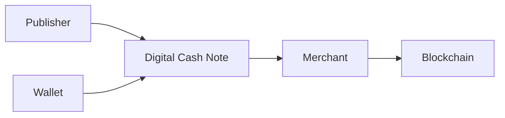

# Digital Cash

> _Digital Cash is the foundational use case of the DCN Standard. It enables blockchain-based money to exist in a secure physical form, allowing users to hold, carry, transfer, and spend digital value with the familiarity and simplicity of traditional cash while retaining the security and programmability of digital assets._

***

## Introduction

Cash has remained one of the most successful financial instruments in history because it possesses several unique characteristics:

* It is easy to carry.
* It can be exchanged directly between people.
* It works without requiring technical knowledge.
* It is universally understood.
* It provides an intuitive user experience.

Cryptocurrencies introduced digital ownership and decentralized settlement, but they also introduced complexity:

* Wallet installation
* Seed phrase management
* Long wallet addresses
* QR code scanning
* Network selection
* Gas fees
* Transaction confirmation

For many people, these requirements create barriers to adoption.

The DCN Standard bridges this gap by introducing **Digital Cash**—cryptographic money that can be securely represented as a Physical Digital Asset.

***

## Vision

The goal is not to replace blockchain.

The goal is to make blockchain money **feel like cash**.

A Digital Cash note should allow users to:

* Hold value physically
* Verify authenticity instantly
* Transfer ownership securely
* Spend with a simple tap
* Reload where permitted
* Recover ownership according to Publisher policy

The underlying blockchain remains invisible to the user.

***

## Digital Cash Architecture



The Physical Digital Asset acts as the trusted interface between the user and the blockchain network.

***

## Characteristics

Digital Cash combines the strengths of physical money and digital assets.

| Physical Cash        | Digital Cash (DCN)         |
| -------------------- | -------------------------- |
| Physical object      | Physical Digital Asset     |
| Printed security     | Cryptographic security     |
| Visual authenticity  | Cryptographic authenticity |
| Manual exchange      | NFC tap interaction        |
| Difficult to recover | Policy-based recovery      |
| Single currency      | Multi-asset support        |

This creates a familiar user experience while preserving digital trust.

***

## User Experience

A typical payment is intentionally simple.

1. Customer taps the Digital Cash note.
2. Merchant verifies authenticity.
3. Payment is authorized.
4. Settlement occurs on the configured blockchain.
5. Both parties receive confirmation.

The experience is designed to resemble using physical cash rather than operating blockchain software.

***

## Supported Asset Models

Digital Cash may be implemented using multiple DCN asset profiles.

#### DCN-S (Stored Value)

A fixed denomination, such as 10, 20, 50, 100, or 500 units.

Ideal for cash-like usage.

***

#### DCN-R (Reloadable)

A reusable Physical Digital Asset that can be funded multiple times.

Suitable for everyday spending.

***

#### DCN-P (Programmable)

Supports spending rules such as:

* Merchant restrictions
* Geographic limits
* Spending limits
* Time-based validity

***

## Denomination Examples

Examples of Digital Cash products include:

```
Digital Cash

10 Units

20 Units

50 Units

100 Units

500 Units

1000 Units

Reloadable Wallet
```

Publishers determine denominations according to their product strategy.

***

## Offline Considerations

Certain Digital Cash deployments may support limited offline functionality.

Possible models include:

* Offline authenticity verification
* Delayed settlement
* Limited-value transactions
* Risk-managed offline spending

Offline behavior is defined by the Publisher and supported blockchain capabilities.

***

## Security

Digital Cash benefits from the complete DCN Security Architecture.

Security mechanisms include:

* Secure Element
* Hardware Root of Trust
* Device Certificates
* Mutual Authentication
* Challenge–Response Protocol
* Secure Messaging
* Certificate Validation
* Revocation Services

These protections significantly reduce the risks associated with counterfeit or cloned assets.

***

## Business Opportunities

Digital Cash enables new products for:

* Banks
* Stablecoin issuers
* Exchanges
* Payment providers
* Governments
* Telecom operators
* Retail networks
* Community currencies

Each organization can issue Digital Cash while remaining interoperable with the DCN ecosystem.

***

## Advantages Over Traditional Crypto Payments

| Traditional Crypto            | DCN Digital Cash                      |
| ----------------------------- | ------------------------------------- |
| Wallet address required       | Tap the note                          |
| QR code scanning              | NFC interaction                       |
| Complex onboarding            | Familiar physical experience          |
| Wallet-specific UX            | Standardized user experience          |
| Blockchain knowledge required | Blockchain abstracted by the platform |
| Multiple wallet applications  | One Companion Wallet for many assets  |

The objective is to reduce complexity without compromising decentralization or security.

***

## Example Use Cases

Digital Cash can be applied to:

* Retail purchases
* Peer-to-peer payments
* Tourist payments
* Campus payments
* Festival payments
* Community currencies
* Humanitarian aid
* Cross-border remittances

The same technical foundation supports diverse economic environments.

***

## Future Evolution

Future versions of Digital Cash may include:

* Privacy-enhancing payment modes
* Offline peer-to-peer transfers
* Programmable spending policies
* AI-assisted fraud prevention
* Cross-chain settlement
* Quantum-resistant cryptography

These enhancements will build upon the existing DCN architecture while maintaining interoperability.

***

## Design Principles

Digital Cash follows five principles.

#### Familiar

The experience resembles physical cash.

#### Secure

Protected by cryptographic hardware and verification.

#### Portable

Easy to carry and use in everyday life.

#### Interoperable

Compatible across compliant wallets, merchants, and Publishers.

#### Blockchain Neutral

Can operate on any supported blockchain through the Blockchain Adapter SDK.

***

## Summary

Digital Cash represents the foundational application of the DCN Standard.

By combining the simplicity of physical cash with the security, programmability, and interoperability of blockchain technology, Digital Cash enables a new generation of trusted Physical Digital Assets that can be carried, transferred, and spent naturally while remaining fully integrated with the global digital asset ecosystem.
