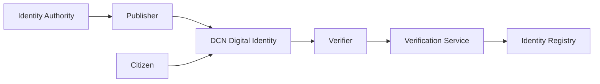
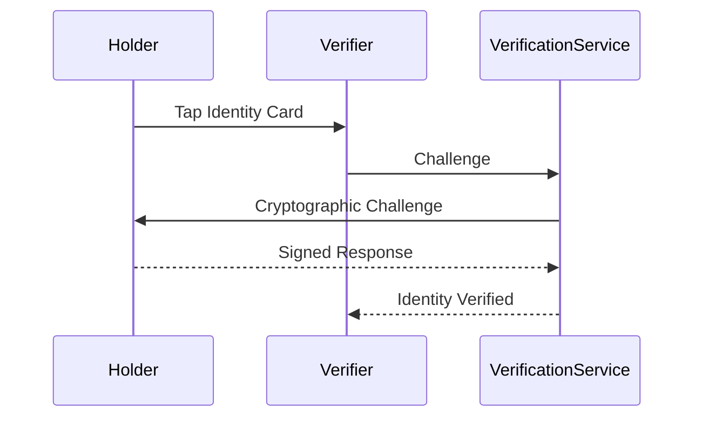

# Digital Identity

> _The DCN Standard enables trusted Digital Identity through secure Physical Digital Assets. By combining cryptographic identity, Secure Hardware, verifiable credentials, and interoperable authentication, individuals, organizations, and governments can establish a secure, privacy-preserving identity that works seamlessly across physical and digital environments._

***

## Introduction

Identity is the foundation of modern society.

Every day, people prove who they are to:

* Governments
* Banks
* Employers
* Universities
* Hospitals
* Airports
* Hotels
* Retailers
* Online platforms
* Enterprises

Today's identity systems are fragmented.

A person may carry:

* National ID Card
* Driver's License
* Employee Badge
* Student ID
* Healthcare Card
* Access Card
* Banking Credentials
* Multiple Digital Accounts

Each identity is managed separately, often with different technologies, databases, and security models.

The DCN Standard introduces a **unified Physical Digital Identity** that securely bridges physical identity and digital services.

***

## Vision

The vision is simple:

> **One trusted identity, usable everywhere, controlled by its owner, verified instantly, and protected by cryptography.**

The DCN Digital Identity is not just another identity card.

It is a programmable, interoperable, and cryptographically secure identity platform.

***

## Digital Identity Architecture



The issuing authority establishes trust, while verification services validate identity without requiring manual document inspection.

***

## Identity Components

A Digital Identity may securely contain or reference:

* Identity Identifier
* Public Key
* Device Certificate
* Issuer Certificate
* Holder Credentials
* Authentication Keys
* Biometric References
* Access Permissions
* Credential Metadata

Sensitive information may remain encrypted and disclosed only when authorized.

***

## Identity Types

The DCN Standard supports many identity categories.

#### Government Identity

* National Identity Card
* Citizen ID
* Passport Companion
* Residency Card

***

#### Enterprise Identity

* Employee Badge
* Contractor Credential
* Vendor Access Card

***

#### Education Identity

* Student ID
* Faculty Credential
* Alumni Membership

***

#### Healthcare Identity

* Patient Credential
* Medical Professional ID
* Insurance Identity

***

#### Financial Identity

* Banking Customer Credential
* KYC Identity
* Financial Membership

***

#### Digital Identity

* Decentralized Identity (DID)
* Web3 Identity
* DAO Membership
* Digital Citizen Identity

***

## Authentication

The identity authentication process is cryptographic.



Authentication is based on cryptographic proof rather than visual inspection.

***

## Selective Disclosure

Privacy is a fundamental design goal.

Instead of revealing an entire identity, the holder may disclose only the required information.

Examples:

* Age verification without revealing birth date
* Student status without revealing academic history
* Employment status without revealing salary
* Residency verification without revealing full address

Future implementations may leverage Zero-Knowledge Proofs (ZKPs) and Verifiable Credentials (VCs) to further enhance privacy.

***

## Multi-Credential Identity

One Physical Digital Asset may securely manage multiple credentials.

```
Digital Identity

├── National ID
├── Driver License
├── Employee Badge
├── Student ID
├── Healthcare Card
├── Banking Credential
├── Professional License
└── Travel Credential
```

Users benefit from one trusted identity platform instead of multiple independent cards.

***

## Enterprise Applications

Organizations may use Digital Identity for:

* Employee authentication
* Building access
* Device login
* VPN access
* Digital document signing
* Time and attendance
* Contractor verification
* Visitor management

Identity becomes a unified security platform across physical and digital environments.

***

## Government Applications

Governments may deploy Digital Identity for:

* Citizen authentication
* Digital public services
* Elections (subject to legal frameworks)
* Welfare programs
* Healthcare access
* Tax services
* Digital licensing
* Border management

The DCN Standard provides the technical infrastructure while governments define legal and policy frameworks.

***

## Security

Digital Identity inherits the complete DCN Security Architecture.

Security capabilities include:

* Secure Element
* Hardware Root of Trust
* Mutual Authentication
* Device Certificates
* Secure Messaging
* Certificate Validation
* Ownership Verification
* Lifecycle Management
* Revocation Services

These mechanisms help protect identities from cloning, impersonation, and unauthorized use.

***

## Business Benefits

Organizations gain:

| Benefit                 | Description                         |
| ----------------------- | ----------------------------------- |
| Strong Authentication   | Cryptographic identity verification |
| Reduced Fraud           | Hardware-backed credentials         |
| Privacy Protection      | Controlled data disclosure          |
| Lower Operational Costs | Automated verification              |
| Better User Experience  | Tap-to-authenticate interaction     |
| Interoperability        | Standardized identity platform      |

***

## Example Products

```
Identity Portfolio

├── National ID
├── Employee Badge
├── Student ID
├── Healthcare Credential
├── Banking Identity
├── Travel Pass
├── Professional License
└── Web3 Identity Card
```

A single Publisher Platform can issue multiple identity products across different sectors.

***

## Future Evolution

Future Digital Identity capabilities may include:

* Decentralized Identifiers (DIDs)
* Verifiable Credentials (VCs)
* Zero-Knowledge Proof authentication
* Biometric authentication
* AI-powered risk analysis
* Self-sovereign identity (SSI)
* Cross-border identity federation
* Machine and IoT identities

The DCN Standard is designed to evolve alongside emerging identity technologies.

***

## Design Principles

Digital Identity implementations follow five principles.

#### Secure

Protected through certified hardware and cryptographic authentication.

#### Privacy Preserving

Supports selective disclosure and user-controlled data sharing.

#### Interoperable

Works across compliant wallets, verifiers, and identity providers.

#### User Controlled

Individuals retain control over how their identity is presented, subject to applicable policies.

#### Future Ready

Designed to integrate with evolving identity frameworks such as DID, VC, and privacy-enhancing technologies.

***

## Summary

The DCN Standard transforms identity into a secure, interoperable Physical Digital Asset.

By combining trusted hardware, certificate infrastructure, cryptographic authentication, selective disclosure, and standardized verification, Digital Identity becomes a universal platform for governments, enterprises, financial institutions, educational organizations, and Web3 ecosystems, enabling trusted interactions across both physical and digital environments.
